# Fouc AI Native 知识库与协同编辑器 · 实施与验收计划

> 本表由 `knowledgebase-tasks.json` 生成。修改任务和证据后运行 `node scripts/verify-knowledge-tasks.mjs --write`。

设计依据：[知识库权威设计](../../docs/product/V1/design/knowledgebase/fouc-knowledgebase-product-design.md)。共 99 项，已验收 80 项。已验收表示任务表中保留了当时的验证摘要，不代表本次重新执行全部验收。

## 实施约束

- 目标覆盖整个设计文档，不以 MVP、界面样机或仅单元测试替代最终产品。
- 任务 dependencies 是硬前置；仅当前置全部验收后开始实现。无依赖关系且文件所有权分离的任务可以并行。
- 勾选表示任务曾按所列命令与观察验收；任务表保留验证摘要，后续变更需更新进度并重新验证相关能力。
- 共享领域→基础设施/权限/服务→API/协同→客户端/AI/MCP→端到端，禁止底层依赖前端或高层流程。
- 正文唯一权威为 Y.Doc/doc_state，元数据/ACL/评论唯一权威为 Postgres；IndexedDB/SQLite 仅离线副本。
- 当前唯一 schema 初始化，不做旧开发格式 migration/adapter/双轨；旧知识库开发数据按明确表范围清理。
- 撤权、断继承和子树移动的重算窗口必须 fail closed；不能假定旧权限总比新权限严格。
- Web 保持 Next 静态导出边界，动态服务在 backend；桌面构建依任务需要单独验证。
- 真实服务或模型不可用时，相关集成任务不勾选；独立的其他 DAG 节点继续推进。

## 可开始的任务

- U07 数据库看板视图
- U09 图片/音频/视频/文件/嵌入 NodeView
- J05 划词改写/翻译/总结与 /ai 续写
- J06 侧栏 Agent 对话与可点击引用
- J07 持久 AI 长任务与审批恢复
- K03 MCP 外部 Agent 一致性验收
- Z01 旧知识库实现与开发数据清理
- Z04 协作/离线/恢复端到端验收
- U11 数据库日历视图

## 拓扑排序任务表

| 验收 | ID | 任务 / 交付物 | 硬前置 | 独立验收标准 | 验证摘要 |
| --- | --- | --- | --- | --- | --- |
| [x] 已验收 | F00 | 知识库任务表、依赖 DAG 与进度校验 .spec/tasks/knowledgebase-tasks.json、.spec/tasks/fouc-knowledgebase-tasks.md; scripts/verify-knowledge-tasks.mjs | — | 任务 ID 唯一、依赖存在且无环；已验收任务保留验证摘要，任务表与 JSON 同步 | 42 节覆盖、DAG 与追踪规则通过 当前 99 项任务、80 项历史已验收状态；DAG、依赖和表格同步验证通过 |
| [x] 已验收 | F01 | 工作区依赖边界与分层验证入口 package.json; shared/package.json; scripts/verify-knowledge-boundaries.mjs | F00 | 共享包/前端/后端各自 typecheck；共享领域无浏览器或服务端运行时耦合；现有测试仍通过 | 三层类型、架构边界及回归通过 |
| [x] 已验收 | C01 | 领域实体、权限、事件与 API 输入契约 shared/src/knowledge/contracts/ | F01 | 运行时校验 UUID、workspace 作用域、页面类型、属性、主体和事件；错误输入被拒绝；前后端复用 | 7 组领域契约行为用例与两层类型检查通过 |
| [x] 已验收 | E01 | 一方块注册表与共享 ProseMirror Schema shared/src/knowledge/schema/ | F01 | 所有设计块类型可构造和序列化；通过一个定义注册新块；React NodeView 不进入共享包 | 27 种块、同源 Schema 与安全序列化 15 测试通过 |
| [x] 已验收 | E02 | blockId 完整性与粘贴来源插件 shared/src/knowledge/schema/block-id.ts | E01 | 新建、拆分、合并、复制、跨页粘贴、嵌套和协作重复均满足 ID 规则；服务端可检测修复 | 真实 ProseMirror 事务/剪贴板/服务端修复 15 项测试通过 |
| [x] 已验收 | M01 | 标准 Markdown 双向管线 shared/src/knowledge/markdown/ | E02 | GFM、嵌套块、指令、公式、wiki 链接、marks 与所有一方块往返不丢语义；明确不支持输入报错 | 55 项真实 remark 往返测试；27 块、全部 marks、嵌套、保真元数据与显式错误 |
| [x] 已验收 | M02 | AI 方言锚点与媒体派生文本 shared/src/knowledge/markdown/ | M01, C01 | 同一管线开关产生 blockId 锚点；容器子块和媒体文本完整；可按锚点读取且引用稳定 | 同一管线可信 AI 锚点与只读派生隔离，157 项回归通过 |
| [x] 已验收 | P01 | 主体展开与纯权限继承计算 backend/server/src/modules/knowledge/permissions/ | C01 | 四级权限、用户/群组/workspace/link、继承中断、teamspace 根默认合并用行为用例覆盖 | 权限继承/四级主体/撤权窗口 6 组行为测试通过 |
| [x] 已验收 | F02 | 模型任务档位与安全配置契约 shared/src/knowledge/contracts/models.ts; backend/server/src/modules/knowledge/ai/config.ts | C01 | fast/smart/embed/rerank/vision，平台/BYOK/Ollama 层级解析；密钥只留服务端；模型/维度验证 | 模型档位/来源与密钥归属 3 组测试通过 |
| [x] 已验收 | D01 | Postgres 当前唯一 schema 与约束 backend/server/src/platform/database/knowledge/ | C01, F02 | Drizzle 当前表模型与初始化 SQL 包含全部表/租户外键/ltree/vector/索引；静态 schema 约束测试及类型检查通过；真实执行单独由 D03 验收 | 24 张租户表与 4 张认证表；约束与 SQL 漂移静态验收通过，真实初始化另行验收 |
| [x] 已验收 | I01 | Postgres/Redis/S3 基础服务与健康检查 compose.knowledge.yaml; .env.example | F01 | 真实 ParadeDB（ltree/pg_search/pgvector）、Redis、MinIO 启动可访问；凭据仅环境注入；五类服务完整装配留给 Z03 | 真实 ParadeDB 扩展/分词/索引、Redis 认证读写、S3 签名读写及持续运行通过 |
| [x] 已验收 | D02 | 请求级租户事务与强制 RLS backend/server/src/platform/database/knowledge/tenant.ts | D01, I01 | SET LOCAL/set_config 随事务回收；非超级用户跨租户 SELECT/INSERT/UPDATE/DELETE 均拒绝，连接池无上下文泄漏 | 真实两租户全表隔离、事务/连接复用与异常清理 19 项测试通过 |
| [x] 已验收 | D03 | 真实数据库初始化与隔离集成测试 backend/server/scripts/database.ts; backend/server/src/platform/database/knowledge/*.test.ts | D01, D02, I01 | 在真实 ParadeDB 创建新库、执行全部表/索引/RLS；两个租户恶意访问测试通过 | 真实主库 28 表/24 FORCE RLS ready；46 测试/1307 断言通过、初始化回滚与最小权限 |
| [x] 已验收 | R01 | 后端角色配置与生命周期 backend/server/src/modules/knowledge/runtime/ | C01 | ROLE=api/collab/worker/mcp/all 严格解析；必需配置校验；同一进程生命周期可启停且失败清理资源；业务用 Node API | 配置与角色生命周期 5 组测试通过 |
| [x] 已验收 | A01 | Better Auth 邮箱与会话 backend/server/src/platform/identity/ | D03, R01 | 注册/登录/登出/邮箱验证、会话撤销真实往返；cookie/CORS 配置对 Web 与桌面有效 | 真实 PG+HTTP 邮箱验证与会话撤销、Cookie/CORS/CSRF；15 测试/167 断言 |
| [x] 已验收 | O01 | 个人/团队 Workspace 与成员群组 backend/server/src/modules/knowledge/organization/ | A01, D03 | 个人和团队走同一逻辑；owner/admin/member/guest 与群组加入移除可操作且越权失败；成员邀请及身份绑定通过真实流程 | 真实 HTTP/PG/RLS 116 测试、2747 断言；并发最后 owner、一次性邀请及锁等待期间自然过期均验证 |
| [x] 已验收 | O03 | Teamspace 服务与根默认权限 backend/server/src/modules/knowledge/organization/teamspaces.ts | O01 | 空间 CRUD 与 owner/admin 授权、根默认级别持久化；个人和团队共享逻辑；权限计算可读取根默认值 | 真实 HTTP/PG Teamspace CRUD、四级/null根默认权限、并发非空保护与会话过期；组织/P01回归44项399断言 |
| [x] 已验收 | Q01 | 事务 Outbox 与 graphile-worker 调度 backend/server/src/modules/knowledge/workers/ | D03, R01 | 业务写与 outbox 原子提交；重试、去重、崩溃恢复不丢任务；Worker 生命周期停止干净 | 11 项真实 PG 原子入队、幂等、重试和终止进程恢复验收 |
| [x] 已验收 | P02 | 有效权限物化、失效围栏与索引同步 backend/server/src/modules/knowledge/permissions/ | P01, O03, Q01 | 授权/移动/断继承批量子树重算；撤权立即阻止旧 ACL 泄漏；GIN 主体数组与 block_index 同步；群组变更无需逐页重算 | 真实队列/RLS 54 项测试（新增 10 项集成/71 断言）：子树重算、fail-closed 围栏、索引同步、群组即时生效、teamspace 根默认、事件合并与跨租户全部通过 |
| [x] 已验收 | A03 | PAT 与服务端请求身份 backend/server/src/modules/knowledge/access/tokens.ts | A01 | PAT 哈希存储、范围/到期/撤销生效；session/PAT 归一到同一发起者上下文，禁止客户端伪造身份 | 23 项 PAT 专项、38 项真实认证回归通过，活态身份与范围隔离 |
| [x] 已验收 | A00 | Hono tRPC 服务端上下文与错误边界 backend/server/src/modules/knowledge/api/ | C01, R01, A03 | tRPC 挂载 Hono；session/PAT 与 workspace 上下文注入；输入校验、结构化错误、无权/未认证拒绝；不依赖客户端 | Hono/tRPC 真实 Session/PAT/PG网络认证、RLS、取消回滚、同前缀路由隔离；A00/PAT组合46项487断言，类型入口浏览器bundle为空 |
| [x] 已验收 | P03 | 权限一致的页面授权接口 backend/server/src/modules/knowledge/permissions/; backend/server/src/modules/knowledge/api/ | P02, A03, A00 | 查看/评论/编辑/full 动作逐一授权；API/WS/AI 共用入口；无权限目标不可通过 ID 猜测访问 | authorizePageAccess 唯一入口 + tRPC page.access 逐动作授权；48 项真实 HTTP/队列/RLS 测试，四类拒绝不可区分，围栏期 fail closed |
| [x] 已验收 | T01 | 页面树服务与分数排序 backend/server/src/modules/knowledge/pages/ | P03 | UUID 离线可建、ltree 子树移动、分数排序、回收恢复；禁止循环/越权移动/跨租户父子；失败事务回滚 | 23 项测试/2273 断言(17 项真实 PG 集成):UUID 幂等建页、ltree 单事务子树移动+路径推导、base-36 分数排序相邻插入零重排、回收/恢复经真实 rebuild 验证、循环/跨 teamspace/跨租户全拒、失败全量回滚与 4 连接并发收敛 |
| [x] 已验收 | AS01 | S3 工作区资源服务与预签名 backend/server/src/modules/knowledge/assets/ | P03, I01, Q01 | 按 workspace/hash 寻址、秒传不泄漏跨租户存在性；上传确认校验哈希/大小/类型；下载授权；asset.created 原子且真实 S3 往返 | 13 项测试(9 项真实 MinIO 往返+一次性 RLS 库):workspace/hash 寻址秒传、确认校验哈希/大小/类型、下载授权与方法绑定签名、asset.created 同事务原子、跨租户互不可见 |
| [x] 已验收 | B01 | Hocuspocus v4 鉴权与只读连接 backend/server/src/modules/knowledge/collaboration/ | P03, R01, E02 | WS 校验会话/PAT/page scope；view/comment 连接禁止正文写入；GC 开启；拒绝未授权文档和 workspace 频道 | 官方 provider 协议客户端 6 项测试:会话/PAT 按 scope 鉴权、view/comment 原生只读强制(syncStatus 拒写)、GC 开启、匿名/越权/围栏/频道名统一 permission-denied、Bun 生产装配双适配 |
| [x] 已验收 | B02 | Y.Doc 权威持久化与原子 Outbox backend/server/src/modules/knowledge/collaboration/persistence.ts | B01, Q01 | 从 doc_state 加载，2 秒防抖/最长 10 秒落库；state/vector/outbox 同事务；崩溃重连内容不丢 | 4 项持久化集成测试 + 6 项 B01 回归全过:doc_state 唯一权威、2s/10s 防抖实测、state/vector/doc.changed 同事务、重启恢复与 maxDebounce 强制落库 |
| [x] 已验收 | U01 | TanStack Query 与 tRPC 客户端数据边界 src/features/knowledge/data/ | A00 | 类型安全调用；workspace Query keys 隔离；取消/错误/失效一致；Web SaaS/私有部署地址及桌面 sidecar 端点配置真实可用 | AppRouter 类型推导客户端 + workspace 键隔离 + 取消/错误归一/失效 + 四路径端点解析；29 项测试/125 断言、类型/lint/边界全过，浏览器 bundle 无后端运行时 |
| [x] 已验收 | A02 | OAuth 与 OIDC/SSO 身份 backend/server/src/platform/identity/ | A01 | 真实或标准测试 IdP 完整回调/PKCE/state/nonce；账号身份映射一致；错误可恢复 | 79 项真实 HTTP/PG 测试全通过（A02 新增 41 项）；Node 24 冒烟真实 OIDC/OAuth 回调、单次 state、身份映射与错误恢复通过 |
| [x] 已验收 | A04 | 登录、注册、SSO 与会话恢复界面 src/features/identity/ | A02, A03, U01 | 邮箱登录/注册/验证、OAuth/SSO、登出、会话过期恢复闭环；加载/错误/键盘焦点清晰；Web 与桌面共用 | 95 项测试/383 断言、lint 零告警、三路由浏览器 200;A01 受理文案/重发冷却/验证四态、22 个 OAuth 错误码中文映射、登出、returnTo 会话恢复、端点复用 U01 |
| [x] 已验收 | U02 | 应用壳与知识库新模型接入 src/features/knowledge/knowledge-page.tsx; src/shell/ | U01, T01, A04 | 替换旧知识库文本 CRUD UI；复用设计 tokens/侧栏；选择/导航/空状态真实联动；无旧模型适配双轨 | 211 项测试/923 断言:旧 textarea+30 秒轮询 UI 全删除零残留,四道真实闸门状态机(13 phase)、三栏舞台+页面树(WAI-ARIA roving)、B06 事件失效装配;浏览器实测诚实态与拦截桩布局,修两处实测缺陷 |
| [x] 已验收 | M03 | Obsidian 仓库导入导出 backend/server/src/modules/knowledge/import-export/; src/features/knowledge/ | M01, T01, AS01, B02, U02 | 目录、附件、frontmatter、wiki/块链接可往返；多页导入有进度与逐项失败反馈 | 52 项 M03 测试(全目录 64/0):目录树映射、同名兄弟去重、wikilink/嵌入/媒体指令往返(导出→再导入→再导出不动点)、frontmatter、AS01 附件入湖、幂等重放、越权拒绝、逐项失败进进度事件;修复前任骨架 4 个真实缺陷 |
| [x] 已验收 | T02 | 数据库页面及类型化行属性 backend/server/src/modules/knowledge/databases/ | T01 | database/row 均为 page；每行可独立 Y.Doc/权限；schema/属性验证、筛选排序和分页正确 | 18 项测试/161 断言连跑 4 次一致:database/row 均 page 且独立授权、九种列类型验证、筛选/排序/游标分页 fail closed、列变更语义;另修复 pg like_escape 通配符不转义缺陷 |
| [x] 已验收 | M04 | Notion 导出导入 backend/server/src/modules/knowledge/import-export/ | M01, T02, AS01, B02, U02 | HTML/Markdown/CSV、目录与附件导入真实样本；页面链接正确映射，无静默丢失 | 12 项测试/62 断言全绿(修复前 8/4):figure.quote 行内聚合、code figure 元素化(解析器 pre 吞并修复)、multiSelect 单格拆分信号、行链接断言下钻;HTML/Markdown/CSV 三路径 + 目录外壳两遍父归属 + wikilink/asset/断链映射无静默丢失 |
| [x] 已验收 | O02 | Workspace/成员/Teamspace 组织界面 backend/server/src/modules/knowledge/organization/; src/features/knowledge/organization/ | O03, U01 | 空间创建、切换、成员/群组管理闭环；空/加载/无权/失败状态清晰；根默认权限生效 | 32 项测试/160 断言、lint/类型/边界全过;空间/成员/群组/Teamspace 面板闭环、四态+乐观回滚、根默认权限重算提示;13 张状态截图归档为视觉证据 |
| [x] 已验收 | U03 | 页面树操作与乐观反馈 src/features/knowledge/navigation/ | U02, T01 | 新建、重命名、图标/封面、嵌套移动/排序、删除恢复、键盘导航；失败恢复且提示明确 | 272 项前端测试(新增 32):全操作集+权限门、拖拽/Alt+方向分数移动、回收恢复闭环、乐观精确回滚+结构化 toast+B06 收敛(真实 QueryClient 单测)、行内 spinner/空态/错误态;浏览器 7 场景截图核验 |
| [x] 已验收 | U04 | 本地元数据操作队列 src/features/knowledge/collaboration/metadata-queue.ts | U03 | UUID 操作持久化，离线乐观、重连按序提交；循环/无权失败回滚；重复重试不重复创建 | 6 项测试/29 断言:离线入队持久化+新实例按序重放、transient 保留/永久拒绝回滚继续、重复 operationId 去重、重试原样载荷、损坏 storage 清空、online 事件续传;失败分类复用 isRetryableKnowledgeError,乐观/回滚复用 U03 代数 |
| [x] 已验收 | B03 | Redis 多节点广播 backend/server/src/modules/knowledge/collaboration/ | B02, I01 | 两节点客户端并发更新实时收敛；断连恢复；无二次业务正文存储 | 30 项 collaboration 全套(含 B01/B02/B06/V01 回归):两节点双向 16ms 收敛、断连重连 state-vector 并集无丢失、redis-origin 跳过 store+Redlock 单写者防二次落库、WRONGPASS 认证与 reconnecting/autoResubscribe 断线恢复 |
| [x] 已验收 | B04 | Web y-indexeddb 文档生命周期 src/features/knowledge/collaboration/ | B02 | 离线先加载本地 Y.Doc 可编辑；state vector 交换后收敛；切页清理 provider/监听；状态区分本地保存与云同步 | 21 项测试(含协议级 fake-WebSocket 集成与 fake-indexeddb 真实持久化):离线先渲染可编辑、重连 SV 双向收敛、destroy 三层清理无泄漏、local-only/syncing/synced/offline/error 状态机;另有真实监听器+RLS 库+TCP WS 的全栈冒烟 |
| [x] 已验收 | B05 | 桌面 SQLite 离线 Yjs 副本 backend/device/src/storage/knowledge-documents.ts; src/features/knowledge/collaboration/ | B02 | sidecar 持久化 Yjs 更新/状态；重启/离线/重连收敛；Rust 不写知识库业务；与服务端正文权威清晰 | store 字节级 round-trip/重启存活/隔离 + 真实监听器离线编辑跨重启恢复与云端状态 CRDT 合并不覆盖;桌面装配同 Hocuspocus 内核、SQLite 后端 |
| [x] 已验收 | B06 | 工作区无状态事件与缓存失效 backend/server/src/modules/knowledge/collaboration/events.ts; src/features/knowledge/collaboration/ | B02, U01 | ws:workspaceId 频道校验成员身份；树/评论/通知/行事件只失效相关 Query；重连补拉 | 后端 5 项(成员 403/队列投递/隔离/双通道并存)+前端 4 项(9 事件映射/URL/重连补拉/容错)全过;B01/B02 10 项回归绿;频道无状态,重连失效全命名空间 |
| [x] 已验收 | E03 | Tiptap 编辑器 React 容器与状态 src/features/knowledge/editor/ | E02, B04, U02 | 替换 textarea，Y.Doc 驱动唯一正文；Client Boundary 懒加载；加载/离线/同步/只读/错误闭环；无 SSR 水合异常 | editor 20 项/122 断言+全套回归:shared PM schema 逐字节一致、Y.Doc 唯一正文(刷新经 y-indexeddb 回归实测)、Client Boundary 懒加载+首屏隔离测试钉死、六态指示+只读/无权/鉴权横幅闭环、无水合异常;修复 E02 修复事务逃逸撤销栈的集成缺陷;浏览器 7 场景核验 |
| [x] 已验收 | B07 | Awareness 人/Agent 光标与在线成员 src/features/knowledge/collaboration/awareness.ts; src/features/knowledge/editor/ | B04, E03 | user/color/cursor/selection/kind 完整；两客户端能见光标、AI 正在编辑状态；断开自动移除 | bun test B07 套件 16 pass / 0 fail：契约形态 schema 校验、双 Editor 光标/选区互见、Agent blockId 光标兼容渲染与正在编辑脉冲、状态移除与销毁清理、惰性挂接、page-provider 生命周期 整仓 bunx tsc --noEmit --incremental false 0 错误；B07 文件 eslint clean |
| [x] 已验收 | B00 | 共享 CRDT 事务来源与撤销内核 shared/src/knowledge/collaboration/ | E02 | 定义 human/agent/mcp/restore 来源；Yjs UndoManager 按来源和任务隔离，跨文档更新收敛；不依赖 React 或网络 provider | 本地/任务来源、XML 人工内容保护与副本收敛 11 项测试通过 |
| [x] 已验收 | B08 | 本地撤销与 Agent 事务隔离 shared/src/knowledge/schema/; src/features/knowledge/collaboration/ | B04, B00 | 本地 UndoManager 不撤其他人/Agent；任务 origin 独立，AI 整个任务可单独撤销 | 28 项 collaboration 测试(21 回归+7 新增)+B00 内核回归:本地栈不撤他人/Agent、任务 origin 整体一次撤销/恢复、destroy 清理、离线撤销可用;撤销事务正确进 cloudPending |
| [x] 已验收 | E04 | 基础块快捷输入与键盘编辑 src/features/knowledge/editor/ | E03 | 段落、标题、列表、待办、引用、代码、公式可鼠标/键盘插入编辑；输入规则、格式菜单可访问 | 编辑器全树 104 项测试/601 断言(E04 48 项):7 类输入规则、Enter/Backspace/Tab/块移动键盘语义、IME 合成守卫、格式命令 toggle 与菜单模型;装配进 editor-surface 与工具栏;scratch 草稿清零 |
| [x] 已验收 | E05 | 表格、分栏和 Callout NodeView src/features/knowledge/editor/blocks/ | E03 | 嵌套编辑/增删/拖拽/键盘不损坏 blockId；表格编辑、分栏自适应、callout 风格精致；共享 schema 一致 | bun test blocks 套件 31 pass / 0 fail（表格命令 23 + 实例 8，覆盖 blockId 完整性/嵌套编辑/拖拽粘贴副本） 整仓 bunx tsc --noEmit --incremental false 0 错误；blocks 目录 eslint clean |
| [x] 已验收 | E06 | Slash 菜单与 Markdown/HTML 粘贴 src/features/knowledge/editor/commands/ | E04, M01 | 菜单由注册表生成、检索、方向键/回车/Esc；Markdown/HTML/纯文本识别；不执行不安全 HTML | bun test commands 套件 48 pass / 0 fail：注册表菜单对齐、每条目真实插入、过滤排序、方向键/回车/Esc、Markdown/HTML/纯文本识别、危险 HTML 中和、内部粘贴不回归 整仓 bunx tsc --noEmit --incremental false 0 错误；commands 目录 eslint clean |
| [x] 已验收 | S01 | 建议 insert/delete marks 与事务转换 shared/src/knowledge/schema/suggestions/ | E02 | 插入带 mark、删除保留内容；接受/拒绝按 suggestionId 原子执行；范围/嵌套/替换/撤销正确 | 建议编辑/嵌套块/原子审阅与真实 Yjs 往返 11 项测试通过 |
| [x] 已验收 | S02 | 建议模式 UI 与批量审阅 src/features/knowledge/editor/review/ | S01, E03, B08 | 人/AI 同一路径；作者/时间/来源可见；逐条/全部接受拒绝；只读不允许修改；长文滚动定位 | 36 项测试/137 断言 + 真实双 peer 运行时 13 项:建议标记(绿插/红删/块框/作者徽标)、审阅侧栏单条与全部接受拒绝(S01 单事务=单 undo 步)、定位滚动、自动开栏/Esc、只读禁用矩阵、远程建议实时入列;key 撞名回归修复 |
| [x] 已验收 | V01 | 自动、结束会话与手动检查点 backend/server/src/modules/knowledge/collaboration/checkpoints.ts | B02, Q01 | 超过 10 分钟且有编辑、结束会话、命名版本按策略写；无变化不重复；作者集合正确；GC 保持开启 | 6 项真实监听器测试:自动检查点挂存储钩空闲零写、会话结束 state-vector 比对、手动命名幂等(label 附既有快照)、双用户 authors 聚合、GC 后快照不含已删内容;另发现并记录 B02 lastContext 空上下文缺陷 |
| [x] 已验收 | V02 | 块与行内历史差异算法 shared/src/knowledge/history/ | M01, C01 | 新增/删除/移动/修改块与行内差异可解释；ID 用于稳定比对；空页/相邻版本正确 | 20 项 Bun/Node 双运行时 diff 测试，166 项共享回归；120排列移动最小性、120文本重建、27块Markdown快照往返 |
| [x] 已验收 | V03 | 历史面板与协作安全恢复 src/features/knowledge/history/; backend/server/src/modules/knowledge/collaboration/ | V01, V02, E03, B08 | 预览版本、作者、命名；恢复通过新 Y.Doc 事务且可撤销；另一在线编辑者不中断 | 后端 3 项集成(命名版本+作者归因+PM 预览+ACL 403/跨租户)+恢复语义(客户端单 PM 事务,第二编辑者不中断继续编辑)+前端 8 项(单步恢复事务/预览序列化/错误映射)+编辑器装配后全树 104/0 回归;checkpoints 扩展经 listener 可选参数挂载 |
| [x] 已验收 | N01 | 评论线程持久化与权限 backend/server/src/modules/knowledge/comments/ | P03, Q01 | 创建/回复/解决/重开/删除有独立生命周期；仅 comment+ 可写；通知 Outbox 原子且 workspace 隔离 | 6 组真实集成测试(58 断言):线程生命周期状态机、view 级五写路径全拒/comment+ 走通、通知+outbox 同事务原子(回滚零残留)、回收页即时拒绝、跨租户 NOT_FOUND 不可区分 |
| [x] 已验收 | N02 | CRDT 评论锚点与侧栏 src/features/knowledge/editor/comments/ | N01, E03, B06 | 选区 comment mark 绑定 threadId；协作插删锚点不漂；孤立锚点状态可解释；线程/正文跳转 | 前端 30 项(双编辑器 CRDT 锚点收敛/删除传播/五态装饰/分组侧栏/只读矩阵)+后端 7+4 项(真实 RLS+HTTP 边界 ACL fail-closed/幂等创建);comment tRPC 过程挂载后 8711 实活 401 鉴权可达;实时链路 comment.changed→B06→失效验证 |
| [x] 已验收 | N03 | 通知收件箱 src/features/knowledge/notifications/; backend/server/src/modules/knowledge/notifications/ | N01, B06, U02 | 评论通知收件人权限过滤、已读操作、实时更新与跳转；无重复跨租户消息 | 后端 11 项(收件箱权限双重过滤 fail closed、已读幂等、keyset 分页、跨租户隔离、HTTP 映射、outbox→hub 精确一次实时投递)+前端 16 项(传输契约/桥/失效键/视图模型);runtime 已接线通知路由 |
| [x] 已验收 | L01 | 页面/块链接与反向引用派生 backend/server/src/modules/knowledge/search/backlinks.ts | M02, B02, T01 | 页面链接、blockReference 可解析稳定 ID；正文变化更新 backlink；无权限来源不泄漏 | 6 项真实队列/RLS 测试:显式 pageId 优先/标题精确/块锚解析、悬链零落表零泄漏、doc.changed 消费幂等(FOR UPDATE 串行)、入链经 P03 谓词过滤、损坏 doc_state 留队重试不阻塞 |
| [x] 已验收 | L02 | 实时只读块引用 NodeView src/features/knowledge/editor/blocks/block-reference.tsx | L01, E03 | 按需加载来源 Y.Doc；更改实时反映；点击原文高亮；无权/删除/循环引用有明确状态并释放连接 | bun test L02 前端 25 pass / 0 fail：引用计数缓存/失败重试、定位器嵌套命中、状态真值表、实时更新/删除翻转、循环短路不连接、点击载荷、flash 定位、open-target 一次性语义 后端 backlinks 集成 8 pass / 0 fail（真实 Postgres）：blockReference 有效成行、悬链不落行、非法 blockId 跳过；backend bun run typecheck clean |
| [x] 已验收 | P04 | 分享链接权限与失效 backend/server/src/modules/knowledge/sharing/ | P03 | link 主体令牌哈希、到期/撤销/级别限制；页面及附件同权；访问不能获得 workspace 全部成员主体；授权接口有集成证据 | 12 项测试(140 断言,真实会话/队列/RLS):令牌只存 SHA-256+恒时比较、到期/撤销/降级即时 fail closed、link 主体恰为 {link:id} 不扩 workspace、越权创建/跨租户/重建窗口全拒 |
| [x] 已验收 | U05 | 权限、继承与分享管理界面 src/features/knowledge/sharing/ | P04, U02 | 用户/组/workspace 授权、继承开关、有效权限解释；完整保存/撤销失败反馈；非 full 禁止操作 | 4 项测试/26 断言:级别序/主体解析、授予不超操作者+workspace 主体校验、有效权限四源解释链、变更计划去重与拒绝;面板含继承开关重算说明、链接令牌一次性展示、非 edit+ 全禁用 |
| [x] 已验收 | U06 | 数据库表格视图 src/features/knowledge/databases/ | T02, E03, U02 | 类型化列增删改、行属性编辑、筛选/排序/打开行正文；加载/无权/空/错误及键盘完整 | 65 项测试/248 断言:7 类列渲染编辑、列增删改(两步删确认)、行属性乐观回滚、契约化筛选排序(操作符按类型裁剪)、四态、完整键盘契约(方向/Tab 环绕/Enter/Esc/Home/End);全仓 tsc 清零+eslint 干净;未挂载过程诚实 NOT_FOUND |
| [ ] 待实施 | U07 | 数据库看板视图 src/features/knowledge/databases/ | U06 | 同一组行按状态分组，拖动改属性；无状态/无权限/空状态正确；打开同一行页面；失败乐观回滚 | — |
| [x] 已验收 | G01 | AI SDK 统一模型网关 backend/server/src/modules/knowledge/ai/gateway/ | F02, D03 | 所有模型调用经统一入口；云/BYOK/Ollama、流、取消、异常可控；无任意工具越权路径 | 官方 AI SDK 网关、21 项 Bun / 16 项 Node 测试；真实 GLM 平台/流式/PG 加密 BYOK 撤销与真实 Ollama 生成/流式/384 维向量通过；密钥与正文不入日志。 |
| [x] 已验收 | G02 | OpenTelemetry 与 AI 用量 backend/server/src/modules/knowledge/observability/ | G01 | 每次真实调用记录 token/耗时/模型/workspace/任务与 trace；日志无 key；错误调用可追踪 | 观测模块 5 项 Bun + 5 项 Node 测试;真实 PG 记账(token 未报告存 null)、OTLP collector 实收 trace 与 usage 行关联、密钥零泄漏、独立短事务先于结果提交 |
| [x] 已验收 | H01 | 块索引增量投影 backend/server/src/modules/knowledge/search/indexer.ts | M02, B02, P02, Q01, L01 | 遍历嵌套块、hash 差量增改删、修复 ID、更新 backlink；重跑幂等；短块带标题路径 | 13 项测试(L01 回归含):嵌套块全遍历(skip 容器不重复)、sha256 差量真零 DML、E02 规则修复 blockId 并回写 doc_state、与 backlinks 并发收敛(FOR UPDATE+同事务补算)、幂等重跑、title_path 标题路径列;权限投影经 P02 端口联动 |
| [x] 已验收 | H02 | 向量批量生成与模型换代 backend/server/src/modules/knowledge/search/embeddings.ts | H01, G01 | 仅变化块调用；embed_model/维度隔离；后台重建完成原子切换，失败保持旧索引可用 | 22 项 search 全套测试:embedded_hash 血缘仅变化块调用(改1增1恰1批2值)、模型/维度隔离、重建单事务原子切换失败回退旧索引可查、批次限速与队列重试收敛;真实 Ollama 384 维 3 次调用记账,云嵌入端点已探明未耗成本 |
| [x] 已验收 | H03 | BM25 中英文检索 backend/server/src/modules/knowledge/search/keyword.ts | H01, D03 | pg_search/jieba 与 ICU 配置真实查询验证；workspace/principals 在排名前过滤；返回可引用块 | 19 项测试(6 新增+13 回归):真实 pg_search jieba 中文命中/英文前缀扩展/混合析取、EXPLAIN 实证权限过滤先于排名、可引用块结构(pageId/blockId/titlePath/snippet/score)入 shared 契约、分页一致、回收页即空 |
| [x] 已验收 | H04 | 向量/RRF/重排统一检索 backend/server/src/modules/knowledge/search/service.ts | H02, H03 | HNSW 限当前模型、各取 50/RRF 常数60/前20重排；查询前授权；API/AI/MCP 共用结果结构 | 28 项 search 全套(6 新增+22 回归):HNSW 限当前模型(维度错实测防护)、两腿各 50→RRF k=60 与手算逐一吻合→前 20 真实 GLM rerank 精排(端点实测探明)、授权谓词两腿先于名次、HybridSearchHit 统一契约供 API/AI/MCP |
| [x] 已验收 | H05 | 搜索 UI 与块引用导航 src/features/knowledge/search/ | H04, U02 | 关键词/语义混合查询、过滤/取消/空状态、键盘导航、引用预览；点击打开准确块并高亮 | 4 项测试/19 断言:queryId 丢弃迟到响应、空/错误相位、键盘两端钳制与 Enter/Esc 语义、降级文案;面板含标题路径/来源徽标/严格响应校验,点击回调 pageId+blockId |
| [x] 已验收 | U08 | 浏览器哈希上传与进度控制 src/features/knowledge/assets/ | AS01, U02 | 浏览器 SHA256、预签名直传、完整性确认闭环；秒传/进度/取消/重试/错误均有反馈；通过真实后端与 S3 验证 | 53 项测试/242 断言:流式 SHA-256 NIST 向量与跨块边界、秒传/授权/契约拒绝状态机、取消×3相位、重试哈希复用、真实 MinIO SigV4 PUT→GET 回读复哈希闭环;组件 happy-dom 事件闭环;eslint 0/0 |
| [ ] 待实施 | U09 | 图片/音频/视频/文件/嵌入 NodeView src/features/knowledge/editor/blocks/media/ | U08, E03 | 插入 asset:hash，上传进度/取消/失败重试，媒体懒加载；安全嵌入；替代文本、下载与键盘可用 | — |
| [x] 已验收 | W01 | 无状态 Media Worker HTTP 服务 services/media-worker/ | C01, R01 | FastAPI 健康/解析接口有资源上限与任务取消；请求携带短期资源，不访问 DB/队列；CPU/GPU 配置可解析；真实模型解析分别 W02/W03 验收 | 27 Python、7 Bun/Node 客户端用例与真实 HTTP/子进程取消；隐藏服务常驻 |
| [x] 已验收 | W02 | Whisper 音视频时间戳转写 services/media-worker/ | W01 | 真实音视频样本生成带时间戳分段文本；模型可配置；失败、超时与重试可观察 | CPU Whisper 真实音频/MP4及签名S3链路；33 Python+8客户端，失败/超时/取消/重试 |
| [x] 已验收 | W03 | Docling PDF/Office 解析 services/media-worker/ | W01 | 真实 PDF/Office 表格/图片/标题解析成结构化 Markdown；空/损坏样本报错清楚 | 真实 MinIO→HTTP→Docling 四格式标题/表格/PNG、空/损坏/期限/重试/取消通过；56 Python + 9 Bun + 9 Node 测试 |
| [x] 已验收 | W04 | 图片视觉描述与 OCR backend/server/src/modules/knowledge/workers/vision.ts | AS01, G01 | 真实图片经 vision 档生成描述/OCR；结果写 asset.derived；权限与模型用量可追踪 | 28 项测试(workers 15+assets 13 回归):真实 PNG 经真实 MinIO+队列+网关 vision 档(glm-5.3-flash 原生图文)生成描述、真实 tokens 落 ai_usage;失败/限流/缺配置结构化重试;幂等重放不重复调用 |
| [x] 已验收 | J02 | 共用只读 Agent 工具 backend/server/src/modules/knowledge/ai/tools/ | H04, M02, T02, L01 | search/read_page/query_database/list_pages/get_backlinks 同发起者授权；range/filter/sort 有验证、引用准确 | 13 项真实工具测试+search/databases/契约回归:五只读工具同一发起者授权(A03 范围+zod 输入双防线,principals 永不出现在输入)、range 越界拒绝、回收/无权不可区分;注册表供 J04/K01 共用 |
| [x] 已验收 | W05 | 媒体派生任务编排与重索引 backend/server/src/modules/knowledge/workers/media.ts | W02, W03, W04, H01, H04, J02 | graphile-worker 调用无状态 HTTP；幂等派生结果写库并索引引用块；图片/录音/PDF 可搜索且 AI 可读 | 3 项集成测试/11 断言(真实 MinIO+graphile+outbox):presigned GET 转写幂等落库、引用页 doc.changed 重索引、插图成资产入 S3、永久失败安全码;mime 集合镜像服务端 contracts.py |
| [ ] 待实施 | U10 | 媒体派生内容与处理状态 UI src/features/knowledge/assets/ | W05, U09 | 排队/处理中/成功/失败可见；OCR/时间戳转录/解析预览、重试；引用点击定位片段 | — |
| [x] 已验收 | J01 | 上下文组装与引用校验 backend/server/src/modules/knowledge/ai/context.ts | M02, H04 | 规则→大纲→邻块→检索→历史顺序；预算超限从检索尾部截断；回答 blockId 引用校验与权限过滤 | 40 项 ai 测试(6 新增):五腿顺序组装(规则→大纲→焦点邻块→检索→历史)、UTF-8 预算仅检索腿尾整条剔除、引用校验折叠无权/不存在/回收为同一 invalid;契约入 shared |
| [x] 已验收 | J03 | CRDT 建议写入 Agent 工具 backend/server/src/modules/knowledge/ai/tools/ | J02, S01, B01, B00 | insert/replace/delete/create/update_properties 权限一致；openDirectConnection+agent:taskId；新 ID/建议默认；无 SQL 正文双写 | 19 项工具测试(6 新增)+69 项回归:三正文工具按 S01 语义 Y 层定点建议落稿(openDirectConnection agent actor/无宿主等价兜底,无 SQL 双写)、新 blockId、审阅前原文保留;create/update_properties 走 T01 服务与 P03 授权 |
| [x] 已验收 | B09 | 服务端 Agent Awareness 发布 backend/server/src/modules/knowledge/collaboration/agent-awareness.ts | B01, B00 | 服务端 direct connection 以 Agent 身份发布 cursor/selection/正在编辑状态；任务结束和异常清理，协议客户端能接收 | 真实监听器+官方 provider 客户端 3 项测试:agent 状态(含 taskId/kind/cursor)实时可见、stop/abort 清理幂等、非 page 文档名拒绝 |
| [x] 已验收 | J04 | 逐块流式 AI 与任务撤销 backend/server/src/modules/knowledge/ai/streaming.ts | J03, G01, B09, J01 | 完整块到达即写共享 Y.Doc；Awareness 显示 Agent 光标；取消后部分结果可审阅；整体任务撤销不影响人编辑 | 57 项后端/228 断言(切分器单元、逐块写入+awareness、取消保留、整体撤销隔离、撤权 fail closed、tRPC 边界、headless 回退、真实 Ollama e2e)+前端 5 项;修复切分器三处缺陷;主会话装配 runtime 真实网关并修复 agent/mcp 作者语法违约为共享 origin 构造器 |
| [ ] 待实施 | J05 | 划词改写/翻译/总结与 /ai 续写 src/features/knowledge/ai/inline/ | J04, S02, E06 | 选区和邻块作为上下文，建议回原处；流式/取消/失败/重试/直接应用；键盘入口完整 | — |
| [ ] 待实施 | J06 | 侧栏 Agent 对话与可点击引用 src/features/knowledge/ai/chat/ | J04, H05 | 工具调用状态、流式回答和引用跳转高亮；会话历史/取消/错误；无权引用不泄漏 | — |
| [ ] 待实施 | J07 | 持久 AI 长任务与审批恢复 backend/server/src/modules/knowledge/ai/tasks/ | J03, Q01, G02, J01 | 整理空间/周报可执行；running/awaiting_approval/done/failed state 持久化；重启续跑不重复写；审批身份校验 | — |
| [ ] 待实施 | J08 | AI 块提示、范围与定时生成 src/features/knowledge/editor/blocks/ai-block.tsx; backend/server/src/modules/knowledge/ai/ | J07, E03, S02 | 保存提示/范围、手动/定时执行、建议回块内容；授权重检；取消与失败反馈 | — |
| [ ] 待实施 | J09 | AI 模型设置、用量与任务中心 UI src/features/knowledge/ai/settings/; src/features/knowledge/ai/tasks/ | J07, G02, U02 | 档位/平台/BYOK/Ollama 配置可保存验证；安全显示密钥；用量、步骤、审批、重试与撤销完整 | — |
| [x] 已验收 | K01 | MCP Streamable HTTP 服务 backend/server/src/modules/knowledge/mcp/ | J03, R01 | 标准 SDK client 初始化/工具发现/调用/取消可运行；复用工具层；mcp:clientName 来源进入建议 | 官方 SDK 双端 3 项集成测试:initialize/10 工具发现/真实调用/取消信号、写建议 mcp:clientName 来源标注、匿名与低权 PAT 拒绝;会话式传输逐请求重验 |
| [x] 已验收 | K02 | MCP OAuth 2.1 与 PAT 授权 backend/server/src/modules/knowledge/mcp/auth/ | K01, A02, A03 | 发现/注册/授权/PKCE/token/撤销标准流程，scope/audience 验证；PAT 可用；无认证拒绝工具 | 99 项测试/1730 断言(auth 87 + mcp 12):RFC 7636 向量、redirect 规则、注册 schema、HMAC 轮转;端到端 401→PRM→AS→注册→成员同意→PKCE 换 PAT→listTools→code 单次性→RFC 7009 撤销即 401;实活 8711 验证 PRM/AS 元数据与 9727 挑战;常量时间比较、逐请求查库吊销 |
| [ ] 待实施 | K03 | MCP 外部 Agent 一致性验收 backend/server/scripts/verify-knowledge-mcp.ts | K02, J04, S02 | 真实标准 MCP client 读写/越权/撤权/取消；建议出现在编辑器，可接受拒绝；来源标注正确 | — |
| [ ] 待实施 | Z01 | 旧知识库实现与开发数据清理 backend/device/src/storage/; backend/device/src/api/server.ts; shared/src/index.ts; src/features/knowledge/ | U02, B05, M03, M04 | 删除 SQLite 正文/旧 REST/轮询/旧种子，仅保留 Yjs 本地副本；明确清理限定知识库开发表，其他业务不受影响 | — |
| [ ] 待实施 | Z02 | Node 与 Bun 同构后端验证 backend/server/src/modules/knowledge/runtime/; backend/server/scripts/ | K01, B03, J07, W05 | API/collab/worker/mcp 分角色/all 在两运行时冒烟通过；没有 Bun 专属业务依赖；桌面桥独立 | — |
| [ ] 待实施 | Z03 | 私有部署与角色横向扩展验收 compose.knowledge.yaml; docs/knowledge-deployment.md | Z02, K02, W05 | 全栈真实冷启动、重启、健康检查；2 collab/2 api/worker 并发；五类组件且不增加独立队列/搜索服务 | — |
| [ ] 待实施 | Z04 | 协作/离线/恢复端到端验收 qa/knowledge/; .spec/tasks/knowledgebase-tasks.json 中的验证摘要 | E06, S02, V03, N02, L02, B03, B05, B06, B07, B08, U04 | 多浏览器并发、离线新建/编辑/移动失败回滚、重连、崩溃、版本恢复；Y.Doc 收敛和本地撤销隔离 | — |
| [ ] 待实施 | U11 | 数据库日历视图 src/features/knowledge/databases/calendar-view.tsx | U06 | 同一组行按日期展示、切换月份与拖动更新日期；时区/无日期/无权状态正确；行正文不复制；失败乐观回滚 | — |
| [ ] 待实施 | Z05 | 权限与多租户对抗验收 backend/server/src/modules/knowledge/**/*.test.ts; qa/knowledge/ | P04, H04, K03, N03, U07, U10, J09, U11 | API/WS/search/asset/AI/MCP/数据库视图越权、群组移除、分享撤销、大子树 ACL 刷新窗口均无泄漏 | — |
| [ ] 待实施 | Z06 | 全部块与导入导出端到端验收 qa/knowledge/; .spec/tasks/knowledgebase-tasks.json 中的验证摘要 | M03, M04, E05, E06, U09, J08, L02, N02, S02 | 每类块创建/编辑/复制/重排/Markdown 往返，Notion/Obsidian 样本、ID 稳定与多媒体 UI 逐项验收 | — |
| [ ] 待实施 | Z07 | AI、检索与多模态真实链路验收 .spec/tasks/knowledgebase-tasks.json 中的验证摘要 | J05, J06, J08, J09, K03, H05, U10 | 真实模型/媒体/中英文查询证据；引用可达、默认建议、逐块流/审批/任务撤销/换向量模型全部通过 | — |
| [ ] 待实施 | Z08 | 大文档性能、键盘与视觉打磨 src/features/knowledge/; qa/knowledge/ | Z04, Z06, Z07, O02, U05, U07, U11 | 长文增量渲染/媒体懒加载量测；桌面/窄屏/亮暗主题、键盘焦点/读屏/空错状态人工截图验收；无无效交互 | — |
| [ ] 待实施 | Z09 | 完整覆盖审计与最终交付 .spec/tasks/fouc-knowledgebase-tasks.md; .spec/tasks/knowledgebase-tasks.json 中的验证摘要 | Z01, Z03, Z05, Z08 | 所有任务验收并勾选；逐章实际代码/运行证据一致；验证静态导出、既有业务回归、Git 提交；Web dev 常驻；桌面构建按明确要求执行 | — |

## 完整任务 DAG

箭头从前置任务指向使用它的后续任务；此图与任务表来自同一份依赖数据。

```mermaid
flowchart TD
  F00["F00 知识库任务表、依赖 DAG 与进度校验"]
  F01["F01 工作区依赖边界与分层验证入口"]
  C01["C01 领域实体、权限、事件与 API 输入契约"]
  E01["E01 一方块注册表与共享 ProseMirror Schema"]
  E02["E02 blockId 完整性与粘贴来源插件"]
  M01["M01 标准 Markdown 双向管线"]
  M02["M02 AI 方言锚点与媒体派生文本"]
  P01["P01 主体展开与纯权限继承计算"]
  F02["F02 模型任务档位与安全配置契约"]
  D01["D01 Postgres 当前唯一 schema 与约束"]
  I01["I01 Postgres/Redis/S3 基础服务与健康检查"]
  D02["D02 请求级租户事务与强制 RLS"]
  D03["D03 真实数据库初始化与隔离集成测试"]
  R01["R01 后端角色配置与生命周期"]
  A01["A01 Better Auth 邮箱与会话"]
  O01["O01 个人/团队 Workspace 与成员群组"]
  O03["O03 Teamspace 服务与根默认权限"]
  Q01["Q01 事务 Outbox 与 graphile-worker 调度"]
  P02["P02 有效权限物化、失效围栏与索引同步"]
  A03["A03 PAT 与服务端请求身份"]
  A00["A00 Hono tRPC 服务端上下文与错误边界"]
  P03["P03 权限一致的页面授权接口"]
  T01["T01 页面树服务与分数排序"]
  AS01["AS01 S3 工作区资源服务与预签名"]
  B01["B01 Hocuspocus v4 鉴权与只读连接"]
  B02["B02 Y.Doc 权威持久化与原子 Outbox"]
  U01["U01 TanStack Query 与 tRPC 客户端数据边界"]
  A02["A02 OAuth 与 OIDC/SSO 身份"]
  A04["A04 登录、注册、SSO 与会话恢复界面"]
  U02["U02 应用壳与知识库新模型接入"]
  M03["M03 Obsidian 仓库导入导出"]
  T02["T02 数据库页面及类型化行属性"]
  M04["M04 Notion 导出导入"]
  O02["O02 Workspace/成员/Teamspace 组织界面"]
  U03["U03 页面树操作与乐观反馈"]
  U04["U04 本地元数据操作队列"]
  B03["B03 Redis 多节点广播"]
  B04["B04 Web y-indexeddb 文档生命周期"]
  B05["B05 桌面 SQLite 离线 Yjs 副本"]
  B06["B06 工作区无状态事件与缓存失效"]
  E03["E03 Tiptap 编辑器 React 容器与状态"]
  B07["B07 Awareness 人/Agent 光标与在线成员"]
  B00["B00 共享 CRDT 事务来源与撤销内核"]
  B08["B08 本地撤销与 Agent 事务隔离"]
  E04["E04 基础块快捷输入与键盘编辑"]
  E05["E05 表格、分栏和 Callout NodeView"]
  E06["E06 Slash 菜单与 Markdown/HTML 粘贴"]
  S01["S01 建议 insert/delete marks 与事务转换"]
  S02["S02 建议模式 UI 与批量审阅"]
  V01["V01 自动、结束会话与手动检查点"]
  V02["V02 块与行内历史差异算法"]
  V03["V03 历史面板与协作安全恢复"]
  N01["N01 评论线程持久化与权限"]
  N02["N02 CRDT 评论锚点与侧栏"]
  N03["N03 通知收件箱"]
  L01["L01 页面/块链接与反向引用派生"]
  L02["L02 实时只读块引用 NodeView"]
  P04["P04 分享链接权限与失效"]
  U05["U05 权限、继承与分享管理界面"]
  U06["U06 数据库表格视图"]
  U07["U07 数据库看板视图"]
  G01["G01 AI SDK 统一模型网关"]
  G02["G02 OpenTelemetry 与 AI 用量"]
  H01["H01 块索引增量投影"]
  H02["H02 向量批量生成与模型换代"]
  H03["H03 BM25 中英文检索"]
  H04["H04 向量/RRF/重排统一检索"]
  H05["H05 搜索 UI 与块引用导航"]
  U08["U08 浏览器哈希上传与进度控制"]
  U09["U09 图片/音频/视频/文件/嵌入 NodeView"]
  W01["W01 无状态 Media Worker HTTP 服务"]
  W02["W02 Whisper 音视频时间戳转写"]
  W03["W03 Docling PDF/Office 解析"]
  W04["W04 图片视觉描述与 OCR"]
  J02["J02 共用只读 Agent 工具"]
  W05["W05 媒体派生任务编排与重索引"]
  U10["U10 媒体派生内容与处理状态 UI"]
  J01["J01 上下文组装与引用校验"]
  J03["J03 CRDT 建议写入 Agent 工具"]
  B09["B09 服务端 Agent Awareness 发布"]
  J04["J04 逐块流式 AI 与任务撤销"]
  J05["J05 划词改写/翻译/总结与 /ai 续写"]
  J06["J06 侧栏 Agent 对话与可点击引用"]
  J07["J07 持久 AI 长任务与审批恢复"]
  J08["J08 AI 块提示、范围与定时生成"]
  J09["J09 AI 模型设置、用量与任务中心 UI"]
  K01["K01 MCP Streamable HTTP 服务"]
  K02["K02 MCP OAuth 2.1 与 PAT 授权"]
  K03["K03 MCP 外部 Agent 一致性验收"]
  Z01["Z01 旧知识库实现与开发数据清理"]
  Z02["Z02 Node 与 Bun 同构后端验证"]
  Z03["Z03 私有部署与角色横向扩展验收"]
  Z04["Z04 协作/离线/恢复端到端验收"]
  U11["U11 数据库日历视图"]
  Z05["Z05 权限与多租户对抗验收"]
  Z06["Z06 全部块与导入导出端到端验收"]
  Z07["Z07 AI、检索与多模态真实链路验收"]
  Z08["Z08 大文档性能、键盘与视觉打磨"]
  Z09["Z09 完整覆盖审计与最终交付"]
  F00 --> F01
  F01 --> C01
  F01 --> E01
  E01 --> E02
  E02 --> M01
  M01 --> M02
  C01 --> M02
  C01 --> P01
  C01 --> F02
  C01 --> D01
  F02 --> D01
  F01 --> I01
  D01 --> D02
  I01 --> D02
  D01 --> D03
  D02 --> D03
  I01 --> D03
  C01 --> R01
  D03 --> A01
  R01 --> A01
  A01 --> O01
  D03 --> O01
  O01 --> O03
  D03 --> Q01
  R01 --> Q01
  P01 --> P02
  O03 --> P02
  Q01 --> P02
  A01 --> A03
  C01 --> A00
  R01 --> A00
  A03 --> A00
  P02 --> P03
  A03 --> P03
  A00 --> P03
  P03 --> T01
  P03 --> AS01
  I01 --> AS01
  Q01 --> AS01
  P03 --> B01
  R01 --> B01
  E02 --> B01
  B01 --> B02
  Q01 --> B02
  A00 --> U01
  A01 --> A02
  A02 --> A04
  A03 --> A04
  U01 --> A04
  U01 --> U02
  T01 --> U02
  A04 --> U02
  M01 --> M03
  T01 --> M03
  AS01 --> M03
  B02 --> M03
  U02 --> M03
  T01 --> T02
  M01 --> M04
  T02 --> M04
  AS01 --> M04
  B02 --> M04
  U02 --> M04
  O03 --> O02
  U01 --> O02
  U02 --> U03
  T01 --> U03
  U03 --> U04
  B02 --> B03
  I01 --> B03
  B02 --> B04
  B02 --> B05
  B02 --> B06
  U01 --> B06
  E02 --> E03
  B04 --> E03
  U02 --> E03
  B04 --> B07
  E03 --> B07
  E02 --> B00
  B04 --> B08
  B00 --> B08
  E03 --> E04
  E03 --> E05
  E04 --> E06
  M01 --> E06
  E02 --> S01
  S01 --> S02
  E03 --> S02
  B08 --> S02
  B02 --> V01
  Q01 --> V01
  M01 --> V02
  C01 --> V02
  V01 --> V03
  V02 --> V03
  E03 --> V03
  B08 --> V03
  P03 --> N01
  Q01 --> N01
  N01 --> N02
  E03 --> N02
  B06 --> N02
  N01 --> N03
  B06 --> N03
  U02 --> N03
  M02 --> L01
  B02 --> L01
  T01 --> L01
  L01 --> L02
  E03 --> L02
  P03 --> P04
  P04 --> U05
  U02 --> U05
  T02 --> U06
  E03 --> U06
  U02 --> U06
  U06 --> U07
  F02 --> G01
  D03 --> G01
  G01 --> G02
  M02 --> H01
  B02 --> H01
  P02 --> H01
  Q01 --> H01
  L01 --> H01
  H01 --> H02
  G01 --> H02
  H01 --> H03
  D03 --> H03
  H02 --> H04
  H03 --> H04
  H04 --> H05
  U02 --> H05
  AS01 --> U08
  U02 --> U08
  U08 --> U09
  E03 --> U09
  C01 --> W01
  R01 --> W01
  W01 --> W02
  W01 --> W03
  AS01 --> W04
  G01 --> W04
  H04 --> J02
  M02 --> J02
  T02 --> J02
  L01 --> J02
  W02 --> W05
  W03 --> W05
  W04 --> W05
  H01 --> W05
  H04 --> W05
  J02 --> W05
  W05 --> U10
  U09 --> U10
  M02 --> J01
  H04 --> J01
  J02 --> J03
  S01 --> J03
  B01 --> J03
  B00 --> J03
  B01 --> B09
  B00 --> B09
  J03 --> J04
  G01 --> J04
  B09 --> J04
  J01 --> J04
  J04 --> J05
  S02 --> J05
  E06 --> J05
  J04 --> J06
  H05 --> J06
  J03 --> J07
  Q01 --> J07
  G02 --> J07
  J01 --> J07
  J07 --> J08
  E03 --> J08
  S02 --> J08
  J07 --> J09
  G02 --> J09
  U02 --> J09
  J03 --> K01
  R01 --> K01
  K01 --> K02
  A02 --> K02
  A03 --> K02
  K02 --> K03
  J04 --> K03
  S02 --> K03
  U02 --> Z01
  B05 --> Z01
  M03 --> Z01
  M04 --> Z01
  K01 --> Z02
  B03 --> Z02
  J07 --> Z02
  W05 --> Z02
  Z02 --> Z03
  K02 --> Z03
  W05 --> Z03
  E06 --> Z04
  S02 --> Z04
  V03 --> Z04
  N02 --> Z04
  L02 --> Z04
  B03 --> Z04
  B05 --> Z04
  B06 --> Z04
  B07 --> Z04
  B08 --> Z04
  U04 --> Z04
  U06 --> U11
  P04 --> Z05
  H04 --> Z05
  K03 --> Z05
  N03 --> Z05
  U07 --> Z05
  U10 --> Z05
  J09 --> Z05
  U11 --> Z05
  M03 --> Z06
  M04 --> Z06
  E05 --> Z06
  E06 --> Z06
  U09 --> Z06
  J08 --> Z06
  L02 --> Z06
  N02 --> Z06
  S02 --> Z06
  J05 --> Z07
  J06 --> Z07
  J08 --> Z07
  J09 --> Z07
  K03 --> Z07
  H05 --> Z07
  U10 --> Z07
  Z04 --> Z08
  Z06 --> Z08
  Z07 --> Z08
  O02 --> Z08
  U05 --> Z08
  U07 --> Z08
  U11 --> Z08
  Z01 --> Z09
  Z03 --> Z09
  Z05 --> Z09
  Z08 --> Z09
  style F00 fill:#e4f4e9,stroke:#42845c
  style F01 fill:#e4f4e9,stroke:#42845c
  style C01 fill:#e4f4e9,stroke:#42845c
  style E01 fill:#e4f4e9,stroke:#42845c
  style E02 fill:#e4f4e9,stroke:#42845c
  style M01 fill:#e4f4e9,stroke:#42845c
  style M02 fill:#e4f4e9,stroke:#42845c
  style P01 fill:#e4f4e9,stroke:#42845c
  style F02 fill:#e4f4e9,stroke:#42845c
  style D01 fill:#e4f4e9,stroke:#42845c
  style I01 fill:#e4f4e9,stroke:#42845c
  style D02 fill:#e4f4e9,stroke:#42845c
  style D03 fill:#e4f4e9,stroke:#42845c
  style R01 fill:#e4f4e9,stroke:#42845c
  style A01 fill:#e4f4e9,stroke:#42845c
  style O01 fill:#e4f4e9,stroke:#42845c
  style O03 fill:#e4f4e9,stroke:#42845c
  style Q01 fill:#e4f4e9,stroke:#42845c
  style P02 fill:#e4f4e9,stroke:#42845c
  style A03 fill:#e4f4e9,stroke:#42845c
  style A00 fill:#e4f4e9,stroke:#42845c
  style P03 fill:#e4f4e9,stroke:#42845c
  style T01 fill:#e4f4e9,stroke:#42845c
  style AS01 fill:#e4f4e9,stroke:#42845c
  style B01 fill:#e4f4e9,stroke:#42845c
  style B02 fill:#e4f4e9,stroke:#42845c
  style U01 fill:#e4f4e9,stroke:#42845c
  style A02 fill:#e4f4e9,stroke:#42845c
  style A04 fill:#e4f4e9,stroke:#42845c
  style U02 fill:#e4f4e9,stroke:#42845c
  style M03 fill:#e4f4e9,stroke:#42845c
  style T02 fill:#e4f4e9,stroke:#42845c
  style M04 fill:#e4f4e9,stroke:#42845c
  style O02 fill:#e4f4e9,stroke:#42845c
  style U03 fill:#e4f4e9,stroke:#42845c
  style U04 fill:#e4f4e9,stroke:#42845c
  style B03 fill:#e4f4e9,stroke:#42845c
  style B04 fill:#e4f4e9,stroke:#42845c
  style B05 fill:#e4f4e9,stroke:#42845c
  style B06 fill:#e4f4e9,stroke:#42845c
  style E03 fill:#e4f4e9,stroke:#42845c
  style B07 fill:#e4f4e9,stroke:#42845c
  style B00 fill:#e4f4e9,stroke:#42845c
  style B08 fill:#e4f4e9,stroke:#42845c
  style E04 fill:#e4f4e9,stroke:#42845c
  style E05 fill:#e4f4e9,stroke:#42845c
  style E06 fill:#e4f4e9,stroke:#42845c
  style S01 fill:#e4f4e9,stroke:#42845c
  style S02 fill:#e4f4e9,stroke:#42845c
  style V01 fill:#e4f4e9,stroke:#42845c
  style V02 fill:#e4f4e9,stroke:#42845c
  style V03 fill:#e4f4e9,stroke:#42845c
  style N01 fill:#e4f4e9,stroke:#42845c
  style N02 fill:#e4f4e9,stroke:#42845c
  style N03 fill:#e4f4e9,stroke:#42845c
  style L01 fill:#e4f4e9,stroke:#42845c
  style L02 fill:#e4f4e9,stroke:#42845c
  style P04 fill:#e4f4e9,stroke:#42845c
  style U05 fill:#e4f4e9,stroke:#42845c
  style U06 fill:#e4f4e9,stroke:#42845c
  style G01 fill:#e4f4e9,stroke:#42845c
  style G02 fill:#e4f4e9,stroke:#42845c
  style H01 fill:#e4f4e9,stroke:#42845c
  style H02 fill:#e4f4e9,stroke:#42845c
  style H03 fill:#e4f4e9,stroke:#42845c
  style H04 fill:#e4f4e9,stroke:#42845c
  style H05 fill:#e4f4e9,stroke:#42845c
  style U08 fill:#e4f4e9,stroke:#42845c
  style W01 fill:#e4f4e9,stroke:#42845c
  style W02 fill:#e4f4e9,stroke:#42845c
  style W03 fill:#e4f4e9,stroke:#42845c
  style W04 fill:#e4f4e9,stroke:#42845c
  style J02 fill:#e4f4e9,stroke:#42845c
  style W05 fill:#e4f4e9,stroke:#42845c
  style J01 fill:#e4f4e9,stroke:#42845c
  style J03 fill:#e4f4e9,stroke:#42845c
  style B09 fill:#e4f4e9,stroke:#42845c
  style J04 fill:#e4f4e9,stroke:#42845c
  style K01 fill:#e4f4e9,stroke:#42845c
  style K02 fill:#e4f4e9,stroke:#42845c
```

## 验收纪律

“已实现待验收”不会勾选。类型检查不能替代真实多客户端协同、RLS、多节点广播、模型调用或媒体解析。后续验收在任务表保留命令与观察摘要；最终 Z09 必须逐项复核当前代码和运行证据。

任务表验证器只证明追踪结构完整，不能证明功能已实现；功能完成以各任务列出的独立验收和最终端到端审计为准。
