# Fouc AI Native 知识库与协同编辑器 · 实施与验收计划

> 本表由 `knowledgebase-tasks.json` 生成。修改任务和证据后运行 `node scripts/verify-knowledge-tasks.mjs --write`。

设计依据：[原始设计文档](../../docs/product/V1/design/knowledgebase/fouc-knowledgebase-product-design.md)。共 99 项，已验收 7 项。

## 实施约束

- 目标覆盖整个设计文档，不以 MVP、界面样机或仅单元测试替代最终产品。
- 任务 dependencies 是硬前置；仅当前置全部验收后开始实现。无依赖关系且文件所有权分离的任务可以并行。
- 勾选只表示已验收；必须记录命令、真实观察、证据路径、适用范围与未验证边界。
- 共享领域→基础设施/权限/服务→API/协同→客户端/AI/MCP→端到端，禁止底层依赖前端或高层流程。
- 正文唯一权威为 Y.Doc/doc_state，元数据/ACL/评论唯一权威为 Postgres；IndexedDB/SQLite 仅离线副本。
- 当前唯一 schema 初始化，不做旧开发格式 migration/adapter/双轨；旧知识库开发数据按明确表范围清理。
- 撤权、断继承和子树移动的重算窗口必须 fail closed；不能假定旧权限总比新权限严格。
- Web 保持 Next 静态导出边界，动态服务在 backend；本会话保持 dev 常驻且不构建 Tauri。
- 真实服务或模型不可用时，相关集成任务不勾选；独立的其他 DAG 节点继续推进。

## 当前基线

- frontend：Next 16.3.3 dev :3000 正在运行；原知识库 textarea + 30 秒 REST 轮询。
- backend：原知识库 SQLite project/document/tag/version 文本 CRUD，无 CRDT/Postgres/auth/权限/索引链路。
- environment：pnpm 10.29.3、Bun 1.4.0、Node 24.16.0 可用；Windows 暂未发现 Docker/Postgres/Redis/S3，WSL 待核查。
- preservedChanges：next-env.d.ts 是任务开始前已有的开发生成变更，不纳入功能提交。

## 可开始的任务

- W01 无状态 Media Worker HTTP 服务

## 拓扑排序任务表

| 验收 | ID | 任务 / 交付物 | 设计章节 | 硬前置 | 独立验收标准 | 证据 |
| --- | --- | --- | --- | --- | --- | --- |
| [x] 已验收 | F00 | 设计覆盖矩阵、任务 DAG 与验收账本 core/tasks/knowledgebase-*; scripts/verify-knowledge-tasks.mjs | §0 / §0.1 / §0.2 / §10 | — | 全部设计章节有任务；ID 唯一、依赖存在、无环；已验收任务有证据且前置已验收 | [42 节覆盖、DAG 与追踪规则通过](../../core/tasks/knowledgebase-acceptance/2026-09-26-foundation.md) |
| [x] 已验收 | F01 | 工作区依赖边界与分层验证入口 package.json; shared/package.json; scripts/verify-knowledge-boundaries.mjs | §1 / §10 | F00 | 共享包/前端/后端各自 typecheck；共享领域无浏览器或服务端运行时耦合；现有测试仍通过 | [三层类型、架构边界及回归通过](../../core/tasks/knowledgebase-acceptance/2026-09-26-foundation.md) |
| [x] 已验收 | C01 | 领域实体、权限、事件与 API 输入契约 shared/src/knowledge/contracts/ | §3 / §3.1 / §3.2 / §3.3 / §6.1 | F01 | 运行时校验 UUID、workspace 作用域、页面类型、属性、主体和事件；错误输入被拒绝；前后端复用 | [7 组领域契约行为用例与两层类型检查通过](../../core/tasks/knowledgebase-acceptance/2026-09-26-foundation.md) |
| [x] 已验收 | E01 | 一方块注册表与共享 ProseMirror Schema shared/src/knowledge/schema/ | §4 / §4.1 / §4.2 / §10 | F01 | 所有设计块类型可构造和序列化；通过一个定义注册新块；React NodeView 不进入共享包 | [27 种块、同源 Schema 与安全序列化 15 测试通过](../../core/tasks/knowledgebase-acceptance/2026-09-26-foundation.md) |
| [ ] 进行中 | E02 | blockId 完整性与粘贴来源插件 shared/src/knowledge/schema/block-id.ts | §4.3 / §12 | E01 | 新建、拆分、合并、复制、跨页粘贴、嵌套和协作重复均满足 ID 规则；服务端可检测修复 | — |
| [ ] 待实施 | M01 | 标准 Markdown 双向管线 shared/src/knowledge/markdown/ | §4.4 | E02 | GFM、嵌套块、指令、公式、wiki 链接、marks 与所有一方块往返不丢语义；明确不支持输入报错 | — |
| [ ] 待实施 | M02 | AI 方言锚点与媒体派生文本 shared/src/knowledge/markdown/ | §4.4 / §7.1 / §9.6 | M01, C01 | 同一管线开关产生 blockId 锚点；容器子块和媒体文本完整；可按锚点读取且引用稳定 | — |
| [x] 已验收 | P01 | 主体展开与纯权限继承计算 backend/src/knowledge/permissions/ | §6 / §6.1 / §6.2 | C01 | 四级权限、用户/群组/workspace/link、继承中断、teamspace 根默认合并用行为用例覆盖 | [权限继承/四级主体/撤权窗口 6 组行为测试通过](../../core/tasks/knowledgebase-acceptance/2026-09-26-foundation.md) |
| [ ] 进行中 | D01 | Postgres 当前唯一 schema 与约束 backend/src/database/knowledge/ | §3.1 / §3.2 / §3.3 / §10 | C01 | Drizzle 当前表模型与初始化 SQL 包含全部表/租户外键/ltree/vector/索引；静态 schema 约束测试及类型检查通过；真实执行单独由 D03 验收 | — |
| [ ] 进行中 | I01 | Postgres/Redis/S3 基础服务与健康检查 compose.knowledge.yaml; .env.example | §2 / §11 | F01 | 真实 ParadeDB（ltree/pg_search/pgvector）、Redis、MinIO 启动可访问；凭据仅环境注入；五类服务完整装配留给 Z03 | — |
| [ ] 待实施 | D02 | 请求级租户事务与强制 RLS backend/src/database/knowledge/tenant.ts | §3.2 / §6.2 | D01, I01 | SET LOCAL/set_config 随事务回收；非超级用户跨租户 SELECT/INSERT/UPDATE/DELETE 均拒绝，连接池无上下文泄漏 | — |
| [ ] 待实施 | D03 | 真实数据库初始化与隔离集成测试 backend/scripts/knowledge-db.ts; backend/src/database/knowledge/*.test.ts | §3.2 / §11 / §12 | D01, D02, I01 | 在真实 ParadeDB 创建新库、执行全部表/索引/RLS；两个租户恶意访问测试通过 | — |
| [x] 已验收 | R01 | 后端角色配置与生命周期 backend/src/knowledge/runtime/ | §1 / §2 / §10 | C01 | ROLE=api/collab/worker/mcp/all 严格解析；必需配置校验；同一进程生命周期可启停且失败清理资源；业务用 Node API | [配置与角色生命周期 5 组测试通过](../../core/tasks/knowledgebase-acceptance/2026-09-26-foundation.md) |
| [ ] 待实施 | A01 | Better Auth 邮箱与会话 backend/src/knowledge/auth/ | §1 / §6 | D03, R01 | 注册/登录/登出/邮箱验证、会话撤销真实往返；cookie/CORS 配置对 Web 与桌面有效 | — |
| [ ] 待实施 | O01 | 个人/团队 Workspace 与成员群组 backend/src/knowledge/organization/ | §3.3 / §6.1 | A01, D03 | 个人和团队走同一逻辑；owner/admin/member/guest 与群组加入移除可操作且越权失败；成员邀请及身份绑定通过真实流程 | — |
| [ ] 待实施 | O03 | Teamspace 服务与根默认权限 backend/src/knowledge/organization/teamspaces.ts | §3.3 / §6.1 | O01 | 空间 CRUD 与 owner/admin 授权、根默认级别持久化；个人和团队共享逻辑；权限计算可读取根默认值 | — |
| [ ] 待实施 | Q01 | 事务 Outbox 与 graphile-worker 调度 backend/src/knowledge/workers/ | §2 / §3.2 / §5.1 / §7.1 | D03, R01 | 业务写与 outbox 原子提交；重试、去重、崩溃恢复不丢任务；Worker 生命周期停止干净 | — |
| [ ] 待实施 | P02 | 有效权限物化、失效围栏与索引同步 backend/src/knowledge/permissions/ | §6.2 / §12 | P01, O03, Q01 | 授权/移动/断继承批量子树重算；撤权立即阻止旧 ACL 泄漏；GIN 主体数组与 block_index 同步；群组变更无需逐页重算 | — |
| [ ] 待实施 | A03 | PAT 与服务端请求身份 backend/src/knowledge/auth/tokens.ts | §1 / §6 / §9.5 | A01 | PAT 哈希存储、范围/到期/撤销生效；session/PAT 归一到同一发起者上下文，禁止客户端伪造身份 | — |
| [ ] 待实施 | A00 | Hono tRPC 服务端上下文与错误边界 backend/src/api/knowledge/ | §1 / §2 / §10 | C01, R01, A03 | tRPC 挂载 Hono；session/PAT 与 workspace 上下文注入；输入校验、结构化错误、无权/未认证拒绝；不依赖客户端 | — |
| [ ] 待实施 | P03 | 权限一致的页面授权接口 backend/src/knowledge/permissions/; backend/src/api/knowledge/ | §6.1 / §6.2 | P02, A03, A00 | 查看/评论/编辑/full 动作逐一授权；API/WS/AI 共用入口；无权限目标不可通过 ID 猜测访问 | — |
| [ ] 待实施 | T01 | 页面树服务与分数排序 backend/src/knowledge/pages/ | §3.3 / §5.4 | P03 | UUID 离线可建、ltree 子树移动、分数排序、回收恢复；禁止循环/越权移动/跨租户父子；失败事务回滚 | — |
| [ ] 待实施 | AS01 | S3 工作区资源服务与预签名 backend/src/knowledge/assets/ | §8 / §8.1 | P03, I01, Q01 | 按 workspace/hash 寻址、秒传不泄漏跨租户存在性；上传确认校验哈希/大小/类型；下载授权；asset.created 原子且真实 S3 往返 | — |
| [ ] 待实施 | B01 | Hocuspocus v4 鉴权与只读连接 backend/src/knowledge/collaboration/ | §5 / §5.1 / §6.2 | P03, R01, E02 | WS 校验会话/PAT/page scope；view/comment 连接禁止正文写入；GC 开启；拒绝未授权文档和 workspace 频道 | — |
| [ ] 待实施 | B02 | Y.Doc 权威持久化与原子 Outbox backend/src/knowledge/collaboration/persistence.ts | §3.1 / §5.1 | B01, Q01 | 从 doc_state 加载，2 秒防抖/最长 10 秒落库；state/vector/outbox 同事务；崩溃重连内容不丢 | — |
| [ ] 待实施 | U01 | TanStack Query 与 tRPC 客户端数据边界 src/features/knowledge/data/ | §1 / §2 / §10 | A00 | 类型安全调用；workspace Query keys 隔离；取消/错误/失效一致；Web SaaS/私有部署地址及桌面 sidecar 端点配置真实可用 | — |
| [ ] 待实施 | A02 | OAuth 与 OIDC/SSO 身份 backend/src/knowledge/auth/ | §1 / §6 | A01 | 真实或标准测试 IdP 完整回调/PKCE/state/nonce；账号身份映射一致；错误可恢复 | — |
| [ ] 待实施 | A04 | 登录、注册、SSO 与会话恢复界面 src/features/knowledge/auth/ | §1 / §6 | A02, A03, U01 | 邮箱登录/注册/验证、OAuth/SSO、登出、会话过期恢复闭环；加载/错误/键盘焦点清晰；Web 与桌面共用 | — |
| [ ] 待实施 | U02 | 应用壳与知识库新模型接入 src/features/knowledge/knowledge-page.tsx; src/shell/ | §0.1 / §3.3 / §10 | U01, T01, A04 | 替换旧知识库文本 CRUD UI；复用设计 tokens/侧栏；选择/导航/空状态真实联动；无旧模型适配双轨 | — |
| [ ] 待实施 | M03 | Obsidian 仓库导入导出 backend/src/knowledge/import-export/; src/features/knowledge/ | §4.4 | M01, T01, AS01, B02, U02 | 目录、附件、frontmatter、wiki/块链接可往返；多页导入有进度与逐项失败反馈 | — |
| [ ] 待实施 | T02 | 数据库页面及类型化行属性 backend/src/knowledge/databases/ | §3.3 / §9.2 | T01 | database/row 均为 page；每行可独立 Y.Doc/权限；schema/属性验证、筛选排序和分页正确 | — |
| [ ] 待实施 | M04 | Notion 导出导入 backend/src/knowledge/import-export/ | §4.4 | M01, T02, AS01, B02, U02 | HTML/Markdown/CSV、目录与附件导入真实样本；页面链接正确映射，无静默丢失 | — |
| [ ] 待实施 | O02 | Workspace/成员/Teamspace 组织界面 backend/src/knowledge/organization/; src/features/knowledge/organization/ | §3.3 / §6.1 | O03, U01 | 空间创建、切换、成员/群组管理闭环；空/加载/无权/失败状态清晰；根默认权限生效 | — |
| [ ] 待实施 | U03 | 页面树操作与乐观反馈 src/features/knowledge/navigation/ | §3.3 / §5.4 | U02, T01 | 新建、重命名、图标/封面、嵌套移动/排序、删除恢复、键盘导航；失败恢复且提示明确 | — |
| [ ] 待实施 | U04 | 本地元数据操作队列 src/features/knowledge/collaboration/metadata-queue.ts | §5.4 | U03 | UUID 操作持久化，离线乐观、重连按序提交；循环/无权失败回滚；重复重试不重复创建 | — |
| [ ] 待实施 | B03 | Redis 多节点广播 backend/src/knowledge/collaboration/ | §2 / §5.1 / §11 | B02, I01 | 两节点客户端并发更新实时收敛；断连恢复；无二次业务正文存储 | — |
| [ ] 待实施 | B04 | Web y-indexeddb 文档生命周期 src/features/knowledge/collaboration/ | §3.1 / §5.1 / §5.4 | B02 | 离线先加载本地 Y.Doc 可编辑；state vector 交换后收敛；切页清理 provider/监听；状态区分本地保存与云同步 | — |
| [ ] 待实施 | B05 | 桌面 SQLite 离线 Yjs 副本 backend/src/store/knowledge-documents.ts; src/features/knowledge/collaboration/ | §3.1 / §5.1 / §10 | B02 | sidecar 持久化 Yjs 更新/状态；重启/离线/重连收敛；Rust 不写知识库业务；与服务端正文权威清晰 | — |
| [ ] 待实施 | B06 | 工作区无状态事件与缓存失效 backend/src/knowledge/collaboration/events.ts; src/features/knowledge/collaboration/ | §5.3 | B02, U01 | ws:workspaceId 频道校验成员身份；树/评论/通知/行事件只失效相关 Query；重连补拉 | — |
| [ ] 待实施 | E03 | Tiptap 编辑器 React 容器与状态 src/features/knowledge/editor/ | §4.1 / §10 | E02, B04, U02 | 替换 textarea，Y.Doc 驱动唯一正文；Client Boundary 懒加载；加载/离线/同步/只读/错误闭环；无 SSR 水合异常 | — |
| [ ] 待实施 | B07 | Awareness 人/Agent 光标与在线成员 src/features/knowledge/collaboration/awareness.ts; src/features/knowledge/editor/ | §5.5 / §9.3 | B04, E03 | user/color/cursor/selection/kind 完整；两客户端能见光标、AI 正在编辑状态；断开自动移除 | — |
| [ ] 待实施 | B00 | 共享 CRDT 事务来源与撤销内核 shared/src/knowledge/collaboration/ | §5.4 / §9.3 | E02 | 定义 human/agent/mcp/restore 来源；Yjs UndoManager 按来源和任务隔离，跨文档更新收敛；不依赖 React 或网络 provider | — |
| [ ] 待实施 | B08 | 本地撤销与 Agent 事务隔离 shared/src/knowledge/schema/; src/features/knowledge/collaboration/ | §5.4 / §9.3 | B04, B00 | 本地 UndoManager 不撤其他人/Agent；任务 origin 独立，AI 整个任务可单独撤销 | — |
| [ ] 待实施 | E04 | 基础块快捷输入与键盘编辑 src/features/knowledge/editor/ | §4.1 / §4.4 | E03 | 段落、标题、列表、待办、引用、代码、公式可鼠标/键盘插入编辑；输入规则、格式菜单可访问 | — |
| [ ] 待实施 | E05 | 表格、分栏和 Callout NodeView src/features/knowledge/editor/blocks/ | §4.1 / §4.2 | E03 | 嵌套编辑/增删/拖拽/键盘不损坏 blockId；表格编辑、分栏自适应、callout 风格精致；共享 schema 一致 | — |
| [ ] 待实施 | E06 | Slash 菜单与 Markdown/HTML 粘贴 src/features/knowledge/editor/commands/ | §4.2 / §4.4 / §9.4 | E04, M01 | 菜单由注册表生成、检索、方向键/回车/Esc；Markdown/HTML/纯文本识别；不执行不安全 HTML | — |
| [ ] 待实施 | S01 | 建议 insert/delete marks 与事务转换 shared/src/knowledge/schema/suggestions/ | §4.5 | E02 | 插入带 mark、删除保留内容；接受/拒绝按 suggestionId 原子执行；范围/嵌套/替换/撤销正确 | — |
| [ ] 待实施 | S02 | 建议模式 UI 与批量审阅 src/features/knowledge/editor/review/ | §4.5 / §9.3 | S01, E03, B08 | 人/AI 同一路径；作者/时间/来源可见；逐条/全部接受拒绝；只读不允许修改；长文滚动定位 | — |
| [ ] 待实施 | V01 | 自动、结束会话与手动检查点 backend/src/knowledge/collaboration/checkpoints.ts | §5.2 | B02, Q01 | 超过 10 分钟且有编辑、结束会话、命名版本按策略写；无变化不重复；作者集合正确；GC 保持开启 | — |
| [ ] 待实施 | V02 | 块与行内历史差异算法 shared/src/knowledge/history/ | §5.2 | M01, C01 | 新增/删除/移动/修改块与行内差异可解释；ID 用于稳定比对；空页/相邻版本正确 | — |
| [ ] 待实施 | V03 | 历史面板与协作安全恢复 src/features/knowledge/history/; backend/src/knowledge/collaboration/ | §5.2 | V01, V02, E03, B08 | 预览版本、作者、命名；恢复通过新 Y.Doc 事务且可撤销；另一在线编辑者不中断 | — |
| [ ] 待实施 | N01 | 评论线程持久化与权限 backend/src/knowledge/comments/ | §4.6 | P03, Q01 | 创建/回复/解决/重开/删除有独立生命周期；仅 comment+ 可写；通知 Outbox 原子且 workspace 隔离 | — |
| [ ] 待实施 | N02 | CRDT 评论锚点与侧栏 src/features/knowledge/editor/comments/ | §4.6 / §5.3 | N01, E03, B06 | 选区 comment mark 绑定 threadId；协作插删锚点不漂；孤立锚点状态可解释；线程/正文跳转 | — |
| [ ] 待实施 | N03 | 通知收件箱 src/features/knowledge/notifications/; backend/src/knowledge/notifications/ | §4.6 / §5.3 | N01, B06, U02 | 评论通知收件人权限过滤、已读操作、实时更新与跳转；无重复跨租户消息 | — |
| [ ] 待实施 | L01 | 页面/块链接与反向引用派生 backend/src/knowledge/search/backlinks.ts | §4.6 / §7.1 | M02, B02, T01 | 页面链接、blockReference 可解析稳定 ID；正文变化更新 backlink；无权限来源不泄漏 | — |
| [ ] 待实施 | L02 | 实时只读块引用 NodeView src/features/knowledge/editor/blocks/block-reference.tsx | §4.6 | L01, E03 | 按需加载来源 Y.Doc；更改实时反映；点击原文高亮；无权/删除/循环引用有明确状态并释放连接 | — |
| [ ] 待实施 | P04 | 分享链接权限与失效 backend/src/knowledge/sharing/ | §6.1 / §9.5 | P03 | link 主体令牌哈希、到期/撤销/级别限制；页面及附件同权；访问不能获得 workspace 全部成员主体；授权接口有集成证据 | — |
| [ ] 待实施 | U05 | 权限、继承与分享管理界面 src/features/knowledge/sharing/ | §6 | P04, U02 | 用户/组/workspace 授权、继承开关、有效权限解释；完整保存/撤销失败反馈；非 full 禁止操作 | — |
| [ ] 待实施 | U06 | 数据库表格视图 src/features/knowledge/databases/ | §3.3 | T02, E03, U02 | 类型化列增删改、行属性编辑、筛选/排序/打开行正文；加载/无权/空/错误及键盘完整 | — |
| [ ] 待实施 | U07 | 数据库看板视图 src/features/knowledge/databases/ | §3.3 | U06 | 同一组行按状态分组，拖动改属性；无状态/无权限/空状态正确；打开同一行页面；失败乐观回滚 | — |
| [x] 已验收 | F02 | 模型任务档位与安全配置契约 shared/src/knowledge/contracts/models.ts; backend/src/knowledge/ai/config.ts | §9.1 | C01 | fast/smart/embed/rerank/vision，平台/BYOK/Ollama 层级解析；密钥只留服务端；模型/维度验证 | [模型档位/来源与密钥归属 3 组测试通过](../../core/tasks/knowledgebase-acceptance/2026-09-26-foundation.md) |
| [ ] 待实施 | G01 | AI SDK 统一模型网关 backend/src/knowledge/ai/gateway/ | §9.1 | F02, D03 | 所有模型调用经统一入口；云/BYOK/Ollama、流、取消、异常可控；无任意工具越权路径 | — |
| [ ] 待实施 | G02 | OpenTelemetry 与 AI 用量 backend/src/knowledge/observability/ | §9.1 / §1 | G01 | 每次真实调用记录 token/耗时/模型/workspace/任务与 trace；日志无 key；错误调用可追踪 | — |
| [ ] 待实施 | H01 | 块索引增量投影 backend/src/knowledge/search/indexer.ts | §7.1 / §12 | M02, B02, P02, Q01, L01 | 遍历嵌套块、hash 差量增改删、修复 ID、更新 backlink；重跑幂等；短块带标题路径 | — |
| [ ] 待实施 | H02 | 向量批量生成与模型换代 backend/src/knowledge/search/embeddings.ts | §7.1 / §12 | H01, G01 | 仅变化块调用；embed_model/维度隔离；后台重建完成原子切换，失败保持旧索引可用 | — |
| [ ] 待实施 | H03 | BM25 中英文检索 backend/src/knowledge/search/keyword.ts | §7.2 / §7.3 | H01, D03 | pg_search/jieba 与 ICU 配置真实查询验证；workspace/principals 在排名前过滤；返回可引用块 | — |
| [ ] 待实施 | H04 | 向量/RRF/重排统一检索 backend/src/knowledge/search/service.ts | §7.2 | H02, H03 | HNSW 限当前模型、各取 50/RRF 常数60/前20重排；查询前授权；API/AI/MCP 共用结果结构 | — |
| [ ] 待实施 | H05 | 搜索 UI 与块引用导航 src/features/knowledge/search/ | §7.2 / §9.4 | H04, U02 | 关键词/语义混合查询、过滤/取消/空状态、键盘导航、引用预览；点击打开准确块并高亮 | — |
| [ ] 待实施 | U08 | 浏览器哈希上传与进度控制 src/features/knowledge/assets/ | §8 / §8.1 | AS01, U02 | 浏览器 SHA256、预签名直传、完整性确认闭环；秒传/进度/取消/重试/错误均有反馈；通过真实后端与 S3 验证 | — |
| [ ] 待实施 | U09 | 图片/音频/视频/文件/嵌入 NodeView src/features/knowledge/editor/blocks/media/ | §4.1 / §8.1 / §12 | U08, E03 | 插入 asset:hash，上传进度/取消/失败重试，媒体懒加载；安全嵌入；替代文本、下载与键盘可用 | — |
| [ ] 待实施 | W01 | 无状态 Media Worker HTTP 服务 services/media-worker/ | §8.2 / §11 | C01, R01 | FastAPI 健康/解析接口有资源上限与任务取消；请求携带短期资源，不访问 DB/队列；CPU/GPU 配置可解析；真实模型解析分别 W02/W03 验收 | — |
| [ ] 待实施 | W02 | Whisper 音视频时间戳转写 services/media-worker/ | §8.2 | W01 | 真实音视频样本生成带时间戳分段文本；模型可配置；失败、超时与重试可观察 | — |
| [ ] 待实施 | W03 | Docling PDF/Office 解析 services/media-worker/ | §8.2 | W01 | 真实 PDF/Office 表格/图片/标题解析成结构化 Markdown；空/损坏样本报错清楚 | — |
| [ ] 待实施 | W04 | 图片视觉描述与 OCR backend/src/knowledge/workers/vision.ts | §8.2 | AS01, G01 | 真实图片经 vision 档生成描述/OCR；结果写 asset.derived；权限与模型用量可追踪 | — |
| [ ] 待实施 | J02 | 共用只读 Agent 工具 backend/src/knowledge/ai/tools/ | §9.2 / §9.5 | H04, M02, T02, L01 | search/read_page/query_database/list_pages/get_backlinks 同发起者授权；range/filter/sort 有验证、引用准确 | — |
| [ ] 待实施 | W05 | 媒体派生任务编排与重索引 backend/src/knowledge/workers/media.ts | §8.2 / §7.1 | W02, W03, W04, H01, H04, J02 | graphile-worker 调用无状态 HTTP；幂等派生结果写库并索引引用块；图片/录音/PDF 可搜索且 AI 可读 | — |
| [ ] 待实施 | U10 | 媒体派生内容与处理状态 UI src/features/knowledge/assets/ | §8.2 | W05, U09 | 排队/处理中/成功/失败可见；OCR/时间戳转录/解析预览、重试；引用点击定位片段 | — |
| [ ] 待实施 | J01 | 上下文组装与引用校验 backend/src/knowledge/ai/context.ts | §9.6 | M02, H04 | 规则→大纲→邻块→检索→历史顺序；预算超限从检索尾部截断；回答 blockId 引用校验与权限过滤 | — |
| [ ] 待实施 | J03 | CRDT 建议写入 Agent 工具 backend/src/knowledge/ai/tools/ | §9.2 / §9.3 | J02, S01, B01, B00 | insert/replace/delete/create/update_properties 权限一致；openDirectConnection+agent:taskId；新 ID/建议默认；无 SQL 正文双写 | — |
| [ ] 待实施 | B09 | 服务端 Agent Awareness 发布 backend/src/knowledge/collaboration/agent-awareness.ts | §5.5 / §9.3 | B01, B00 | 服务端 direct connection 以 Agent 身份发布 cursor/selection/正在编辑状态；任务结束和异常清理，协议客户端能接收 | — |
| [ ] 待实施 | J04 | 逐块流式 AI 与任务撤销 backend/src/knowledge/ai/streaming.ts | §9.3 | J03, G01, B09, J01 | 完整块到达即写共享 Y.Doc；Awareness 显示 Agent 光标；取消后部分结果可审阅；整体任务撤销不影响人编辑 | — |
| [ ] 待实施 | J05 | 划词改写/翻译/总结与 /ai 续写 src/features/knowledge/ai/inline/ | §9.4 | J04, S02, E06 | 选区和邻块作为上下文，建议回原处；流式/取消/失败/重试/直接应用；键盘入口完整 | — |
| [ ] 待实施 | J06 | 侧栏 Agent 对话与可点击引用 src/features/knowledge/ai/chat/ | §9.4 | J04, H05 | 工具调用状态、流式回答和引用跳转高亮；会话历史/取消/错误；无权引用不泄漏 | — |
| [ ] 待实施 | J07 | 持久 AI 长任务与审批恢复 backend/src/knowledge/ai/tasks/ | §9.4 | J03, Q01, G02, J01 | 整理空间/周报可执行；running/awaiting_approval/done/failed state 持久化；重启续跑不重复写；审批身份校验 | — |
| [ ] 待实施 | J08 | AI 块提示、范围与定时生成 src/features/knowledge/editor/blocks/ai-block.tsx; backend/src/knowledge/ai/ | §4.1 / §9.4 | J07, E03, S02 | 保存提示/范围、手动/定时执行、建议回块内容；授权重检；取消与失败反馈 | — |
| [ ] 待实施 | J09 | AI 模型设置、用量与任务中心 UI src/features/knowledge/ai/settings/; src/features/knowledge/ai/tasks/ | §9.1 / §9.4 | J07, G02, U02 | 档位/平台/BYOK/Ollama 配置可保存验证；安全显示密钥；用量、步骤、审批、重试与撤销完整 | — |
| [ ] 待实施 | K01 | MCP Streamable HTTP 服务 backend/src/knowledge/mcp/ | §9.5 | J03, R01 | 标准 SDK client 初始化/工具发现/调用/取消可运行；复用工具层；mcp:clientName 来源进入建议 | — |
| [ ] 待实施 | K02 | MCP OAuth 2.1 与 PAT 授权 backend/src/knowledge/mcp/auth/ | §9.5 | K01, A02, A03 | 发现/注册/授权/PKCE/token/撤销标准流程，scope/audience 验证；PAT 可用；无认证拒绝工具 | — |
| [ ] 待实施 | K03 | MCP 外部 Agent 一致性验收 backend/scripts/verify-knowledge-mcp.ts | §9.5 / §12 | K02, J04, S02 | 真实标准 MCP client 读写/越权/撤权/取消；建议出现在编辑器，可接受拒绝；来源标注正确 | — |
| [ ] 待实施 | Z01 | 旧知识库实现与开发数据清理 backend/src/store/; backend/src/api/server.ts; shared/src/index.ts; src/features/knowledge/ | §0.2 / §3.1 / §10 | U02, B05, M03, M04 | 删除 SQLite 正文/旧 REST/轮询/旧种子，仅保留 Yjs 本地副本；明确清理限定知识库开发表，其他业务不受影响 | — |
| [ ] 待实施 | Z02 | Node 与 Bun 同构后端验证 backend/src/knowledge/runtime/; backend/scripts/ | §1 / §2 / §10 / §11 | K01, B03, J07, W05 | API/collab/worker/mcp 分角色/all 在两运行时冒烟通过；没有 Bun 专属业务依赖；桌面桥独立 | — |
| [ ] 待实施 | Z03 | 私有部署与角色横向扩展验收 compose.knowledge.yaml; docs/knowledge-deployment.md | §2 / §11 | Z02, K02, W05 | 全栈真实冷启动、重启、健康检查；2 collab/2 api/worker 并发；五类组件且不增加独立队列/搜索服务 | — |
| [ ] 待实施 | Z04 | 协作/离线/恢复端到端验收 qa/knowledge/; core/tasks/knowledgebase-acceptance/ | §5 / §5.1 / §5.2 / §5.3 / §5.4 / §5.5 / §12 | E06, S02, V03, N02, L02, B03, B05, B06, B07, B08, U04 | 多浏览器并发、离线新建/编辑/移动失败回滚、重连、崩溃、版本恢复；Y.Doc 收敛和本地撤销隔离 | — |
| [ ] 待实施 | U11 | 数据库日历视图 src/features/knowledge/databases/calendar-view.tsx | §3.3 | U06 | 同一组行按日期展示、切换月份与拖动更新日期；时区/无日期/无权状态正确；行正文不复制；失败乐观回滚 | — |
| [ ] 待实施 | Z05 | 权限与多租户对抗验收 backend/src/knowledge/**/*.test.ts; qa/knowledge/ | §3.2 / §6 / §7.2 / §9.2 / §9.5 / §12 | P04, H04, K03, N03, U07, U10, J09, U11 | API/WS/search/asset/AI/MCP/数据库视图越权、群组移除、分享撤销、大子树 ACL 刷新窗口均无泄漏 | — |
| [ ] 待实施 | Z06 | 全部块与导入导出端到端验收 qa/knowledge/; core/tasks/knowledgebase-acceptance/ | §4 / §4.1 / §4.2 / §4.3 / §4.4 / §4.5 / §4.6 | M03, M04, E05, E06, U09, J08, L02, N02, S02 | 每类块创建/编辑/复制/重排/Markdown 往返，Notion/Obsidian 样本、ID 稳定与多媒体 UI 逐项验收 | — |
| [ ] 待实施 | Z07 | AI、检索与多模态真实链路验收 core/tasks/knowledgebase-acceptance/ | §7 / §7.1 / §7.2 / §7.3 / §8 / §8.1 / §8.2 / §9 / §9.1 / §9.2 / §9.3 / §9.4 / §9.5 / §9.6 | J05, J06, J08, J09, K03, H05, U10 | 真实模型/媒体/中英文查询证据；引用可达、默认建议、逐块流/审批/任务撤销/换向量模型全部通过 | — |
| [ ] 待实施 | Z08 | 大文档性能、键盘与视觉打磨 src/features/knowledge/; qa/knowledge/ | §0.1 / §4 / §12 | Z04, Z06, Z07, O02, U05, U07, U11 | 长文增量渲染/媒体懒加载量测；桌面/窄屏/亮暗主题、键盘焦点/读屏/空错状态人工截图验收；无无效交互 | — |
| [ ] 待实施 | Z09 | 完整覆盖审计与最终交付 core/tasks/fouc-knowledgebase-tasks.md; core/tasks/knowledgebase-acceptance/ | §0 / §0.1 / §0.2 / §1 / §2 / §3 / §4 / §5 / §6 / §7 / §8 / §9 / §10 / §11 / §12 | Z01, Z03, Z05, Z08 | 所有任务验收并勾选；逐章实际代码/运行证据一致；验证静态导出、既有业务回归、Git 提交；Web dev 常驻；本会话免 Tauri 构建 | — |

## 完整任务 DAG

箭头从前置任务指向使用它的后续任务；此图与任务表来自同一份依赖数据。

```mermaid
flowchart TD
  F00["F00 设计覆盖矩阵、任务 DAG 与验收账本"]
  F01["F01 工作区依赖边界与分层验证入口"]
  C01["C01 领域实体、权限、事件与 API 输入契约"]
  E01["E01 一方块注册表与共享 ProseMirror Schema"]
  E02["E02 blockId 完整性与粘贴来源插件"]
  M01["M01 标准 Markdown 双向管线"]
  M02["M02 AI 方言锚点与媒体派生文本"]
  P01["P01 主体展开与纯权限继承计算"]
  D01["D01 Postgres 当前唯一 schema 与约束"]
  I01["I01 Postgres/Redis/S3 基础服务与健康检查"]
  D02["D02 请求级租户事务与强制 RLS"]
  D03["D03 真实数据库初始化与隔离集成测试"]
  R01["R01 后端角色配置与生命周期"]
  A01["A01 Better Auth 邮箱与会话"]
  O01["O01 个人/团队 Workspace 与成员群组"]
  O03["O03 Teamspace 服务与根默认权限"]
  Q01["Q01 事务 Outbox 与 graphile-worker 调度"]
  P02["P02 有效权限物化、失效围栏与索引同步"]
  A03["A03 PAT 与服务端请求身份"]
  A00["A00 Hono tRPC 服务端上下文与错误边界"]
  P03["P03 权限一致的页面授权接口"]
  T01["T01 页面树服务与分数排序"]
  AS01["AS01 S3 工作区资源服务与预签名"]
  B01["B01 Hocuspocus v4 鉴权与只读连接"]
  B02["B02 Y.Doc 权威持久化与原子 Outbox"]
  U01["U01 TanStack Query 与 tRPC 客户端数据边界"]
  A02["A02 OAuth 与 OIDC/SSO 身份"]
  A04["A04 登录、注册、SSO 与会话恢复界面"]
  U02["U02 应用壳与知识库新模型接入"]
  M03["M03 Obsidian 仓库导入导出"]
  T02["T02 数据库页面及类型化行属性"]
  M04["M04 Notion 导出导入"]
  O02["O02 Workspace/成员/Teamspace 组织界面"]
  U03["U03 页面树操作与乐观反馈"]
  U04["U04 本地元数据操作队列"]
  B03["B03 Redis 多节点广播"]
  B04["B04 Web y-indexeddb 文档生命周期"]
  B05["B05 桌面 SQLite 离线 Yjs 副本"]
  B06["B06 工作区无状态事件与缓存失效"]
  E03["E03 Tiptap 编辑器 React 容器与状态"]
  B07["B07 Awareness 人/Agent 光标与在线成员"]
  B00["B00 共享 CRDT 事务来源与撤销内核"]
  B08["B08 本地撤销与 Agent 事务隔离"]
  E04["E04 基础块快捷输入与键盘编辑"]
  E05["E05 表格、分栏和 Callout NodeView"]
  E06["E06 Slash 菜单与 Markdown/HTML 粘贴"]
  S01["S01 建议 insert/delete marks 与事务转换"]
  S02["S02 建议模式 UI 与批量审阅"]
  V01["V01 自动、结束会话与手动检查点"]
  V02["V02 块与行内历史差异算法"]
  V03["V03 历史面板与协作安全恢复"]
  N01["N01 评论线程持久化与权限"]
  N02["N02 CRDT 评论锚点与侧栏"]
  N03["N03 通知收件箱"]
  L01["L01 页面/块链接与反向引用派生"]
  L02["L02 实时只读块引用 NodeView"]
  P04["P04 分享链接权限与失效"]
  U05["U05 权限、继承与分享管理界面"]
  U06["U06 数据库表格视图"]
  U07["U07 数据库看板视图"]
  F02["F02 模型任务档位与安全配置契约"]
  G01["G01 AI SDK 统一模型网关"]
  G02["G02 OpenTelemetry 与 AI 用量"]
  H01["H01 块索引增量投影"]
  H02["H02 向量批量生成与模型换代"]
  H03["H03 BM25 中英文检索"]
  H04["H04 向量/RRF/重排统一检索"]
  H05["H05 搜索 UI 与块引用导航"]
  U08["U08 浏览器哈希上传与进度控制"]
  U09["U09 图片/音频/视频/文件/嵌入 NodeView"]
  W01["W01 无状态 Media Worker HTTP 服务"]
  W02["W02 Whisper 音视频时间戳转写"]
  W03["W03 Docling PDF/Office 解析"]
  W04["W04 图片视觉描述与 OCR"]
  J02["J02 共用只读 Agent 工具"]
  W05["W05 媒体派生任务编排与重索引"]
  U10["U10 媒体派生内容与处理状态 UI"]
  J01["J01 上下文组装与引用校验"]
  J03["J03 CRDT 建议写入 Agent 工具"]
  B09["B09 服务端 Agent Awareness 发布"]
  J04["J04 逐块流式 AI 与任务撤销"]
  J05["J05 划词改写/翻译/总结与 /ai 续写"]
  J06["J06 侧栏 Agent 对话与可点击引用"]
  J07["J07 持久 AI 长任务与审批恢复"]
  J08["J08 AI 块提示、范围与定时生成"]
  J09["J09 AI 模型设置、用量与任务中心 UI"]
  K01["K01 MCP Streamable HTTP 服务"]
  K02["K02 MCP OAuth 2.1 与 PAT 授权"]
  K03["K03 MCP 外部 Agent 一致性验收"]
  Z01["Z01 旧知识库实现与开发数据清理"]
  Z02["Z02 Node 与 Bun 同构后端验证"]
  Z03["Z03 私有部署与角色横向扩展验收"]
  Z04["Z04 协作/离线/恢复端到端验收"]
  U11["U11 数据库日历视图"]
  Z05["Z05 权限与多租户对抗验收"]
  Z06["Z06 全部块与导入导出端到端验收"]
  Z07["Z07 AI、检索与多模态真实链路验收"]
  Z08["Z08 大文档性能、键盘与视觉打磨"]
  Z09["Z09 完整覆盖审计与最终交付"]
  F00 --> F01
  F01 --> C01
  F01 --> E01
  E01 --> E02
  E02 --> M01
  M01 --> M02
  C01 --> M02
  C01 --> P01
  C01 --> D01
  F01 --> I01
  D01 --> D02
  I01 --> D02
  D01 --> D03
  D02 --> D03
  I01 --> D03
  C01 --> R01
  D03 --> A01
  R01 --> A01
  A01 --> O01
  D03 --> O01
  O01 --> O03
  D03 --> Q01
  R01 --> Q01
  P01 --> P02
  O03 --> P02
  Q01 --> P02
  A01 --> A03
  C01 --> A00
  R01 --> A00
  A03 --> A00
  P02 --> P03
  A03 --> P03
  A00 --> P03
  P03 --> T01
  P03 --> AS01
  I01 --> AS01
  Q01 --> AS01
  P03 --> B01
  R01 --> B01
  E02 --> B01
  B01 --> B02
  Q01 --> B02
  A00 --> U01
  A01 --> A02
  A02 --> A04
  A03 --> A04
  U01 --> A04
  U01 --> U02
  T01 --> U02
  A04 --> U02
  M01 --> M03
  T01 --> M03
  AS01 --> M03
  B02 --> M03
  U02 --> M03
  T01 --> T02
  M01 --> M04
  T02 --> M04
  AS01 --> M04
  B02 --> M04
  U02 --> M04
  O03 --> O02
  U01 --> O02
  U02 --> U03
  T01 --> U03
  U03 --> U04
  B02 --> B03
  I01 --> B03
  B02 --> B04
  B02 --> B05
  B02 --> B06
  U01 --> B06
  E02 --> E03
  B04 --> E03
  U02 --> E03
  B04 --> B07
  E03 --> B07
  E02 --> B00
  B04 --> B08
  B00 --> B08
  E03 --> E04
  E03 --> E05
  E04 --> E06
  M01 --> E06
  E02 --> S01
  S01 --> S02
  E03 --> S02
  B08 --> S02
  B02 --> V01
  Q01 --> V01
  M01 --> V02
  C01 --> V02
  V01 --> V03
  V02 --> V03
  E03 --> V03
  B08 --> V03
  P03 --> N01
  Q01 --> N01
  N01 --> N02
  E03 --> N02
  B06 --> N02
  N01 --> N03
  B06 --> N03
  U02 --> N03
  M02 --> L01
  B02 --> L01
  T01 --> L01
  L01 --> L02
  E03 --> L02
  P03 --> P04
  P04 --> U05
  U02 --> U05
  T02 --> U06
  E03 --> U06
  U02 --> U06
  U06 --> U07
  C01 --> F02
  F02 --> G01
  D03 --> G01
  G01 --> G02
  M02 --> H01
  B02 --> H01
  P02 --> H01
  Q01 --> H01
  L01 --> H01
  H01 --> H02
  G01 --> H02
  H01 --> H03
  D03 --> H03
  H02 --> H04
  H03 --> H04
  H04 --> H05
  U02 --> H05
  AS01 --> U08
  U02 --> U08
  U08 --> U09
  E03 --> U09
  C01 --> W01
  R01 --> W01
  W01 --> W02
  W01 --> W03
  AS01 --> W04
  G01 --> W04
  H04 --> J02
  M02 --> J02
  T02 --> J02
  L01 --> J02
  W02 --> W05
  W03 --> W05
  W04 --> W05
  H01 --> W05
  H04 --> W05
  J02 --> W05
  W05 --> U10
  U09 --> U10
  M02 --> J01
  H04 --> J01
  J02 --> J03
  S01 --> J03
  B01 --> J03
  B00 --> J03
  B01 --> B09
  B00 --> B09
  J03 --> J04
  G01 --> J04
  B09 --> J04
  J01 --> J04
  J04 --> J05
  S02 --> J05
  E06 --> J05
  J04 --> J06
  H05 --> J06
  J03 --> J07
  Q01 --> J07
  G02 --> J07
  J01 --> J07
  J07 --> J08
  E03 --> J08
  S02 --> J08
  J07 --> J09
  G02 --> J09
  U02 --> J09
  J03 --> K01
  R01 --> K01
  K01 --> K02
  A02 --> K02
  A03 --> K02
  K02 --> K03
  J04 --> K03
  S02 --> K03
  U02 --> Z01
  B05 --> Z01
  M03 --> Z01
  M04 --> Z01
  K01 --> Z02
  B03 --> Z02
  J07 --> Z02
  W05 --> Z02
  Z02 --> Z03
  K02 --> Z03
  W05 --> Z03
  E06 --> Z04
  S02 --> Z04
  V03 --> Z04
  N02 --> Z04
  L02 --> Z04
  B03 --> Z04
  B05 --> Z04
  B06 --> Z04
  B07 --> Z04
  B08 --> Z04
  U04 --> Z04
  U06 --> U11
  P04 --> Z05
  H04 --> Z05
  K03 --> Z05
  N03 --> Z05
  U07 --> Z05
  U10 --> Z05
  J09 --> Z05
  U11 --> Z05
  M03 --> Z06
  M04 --> Z06
  E05 --> Z06
  E06 --> Z06
  U09 --> Z06
  J08 --> Z06
  L02 --> Z06
  N02 --> Z06
  S02 --> Z06
  J05 --> Z07
  J06 --> Z07
  J08 --> Z07
  J09 --> Z07
  K03 --> Z07
  H05 --> Z07
  U10 --> Z07
  Z04 --> Z08
  Z06 --> Z08
  Z07 --> Z08
  O02 --> Z08
  U05 --> Z08
  U07 --> Z08
  U11 --> Z08
  Z01 --> Z09
  Z03 --> Z09
  Z05 --> Z09
  Z08 --> Z09
  style F00 fill:#e4f4e9,stroke:#42845c
  style F01 fill:#e4f4e9,stroke:#42845c
  style C01 fill:#e4f4e9,stroke:#42845c
  style E01 fill:#e4f4e9,stroke:#42845c
  style P01 fill:#e4f4e9,stroke:#42845c
  style R01 fill:#e4f4e9,stroke:#42845c
  style F02 fill:#e4f4e9,stroke:#42845c
```

## 设计覆盖矩阵

| 章节 | 设计内容 | 实施 / 验收任务 |
| --- | --- | --- |
| §0 | 设计目标与原则 | F00, Z09 |
| §0.1 | 核心诉求 | F00, U02, Z08, Z09 |
| §0.2 | 设计原则 | F00, Z01, Z09 |
| §1 | 技术选型 | F01, R01, A01, A03, A00, U01, A02, A04, G02, Z02, Z09 |
| §2 | 总体架构 | I01, R01, Q01, A00, U01, B03, Z02, Z03, Z09 |
| §3 | 数据模型 | C01, Z09 |
| §3.1 | 权威来源划分 | C01, D01, B02, B04, B05, Z01 |
| §3.2 | 核心表 | C01, D01, D02, D03, Q01, Z05 |
| §3.3 | 组织模型 | C01, D01, O01, O03, T01, U02, T02, O02, U03, U06, U07, U11 |
| §4 | 编辑器 | E01, Z06, Z08, Z09 |
| §4.1 | 块模型 | E01, E03, E04, E05, U09, J08, Z06 |
| §4.2 | 块注册表 | E01, E05, E06, Z06 |
| §4.3 | blockId 完整性 | E02, Z06 |
| §4.4 | Markdown | M01, M02, M03, M04, E04, E06, Z06 |
| §4.5 | 建议模式（Track Changes） | S01, S02, Z06 |
| §4.6 | 评论与块引用 | N01, N02, N03, L01, L02, Z06 |
| §5 | 实时协作 | B01, Z04, Z09 |
| §5.1 | 文档生命周期 | Q01, B01, B02, B03, B04, B05, Z04 |
| §5.2 | 历史版本 | V01, V02, V03, Z04 |
| §5.3 | 工作区事件频道 | B06, N02, N03, Z04 |
| §5.4 | 离线与冲突 | T01, U03, U04, B04, B00, B08, Z04 |
| §5.5 | Awareness | B07, B09, Z04 |
| §6 | 权限 | P01, A01, A03, A02, A04, U05, Z05, Z09 |
| §6.1 | 模型 | C01, P01, O01, O03, P03, O02, P04 |
| §6.2 | 实现 | P01, D02, P02, P03, B01 |
| §7 | 检索与知识索引 | Z07, Z09 |
| §7.1 | 索引管线 | M02, Q01, L01, H01, H02, W05, Z07 |
| §7.2 | 混合检索 | H03, H04, H05, Z05, Z07 |
| §7.3 | 中文 | H03, Z07 |
| §8 | 多模态 | AS01, U08, Z07, Z09 |
| §8.1 | 上传流程 | AS01, U08, U09, Z07 |
| §8.2 | 派生处理 | W01, W02, W03, W04, W05, U10, Z07 |
| §9 | AI 架构 | Z07, Z09 |
| §9.1 | 模型网关 | F02, G01, G02, J09, Z07 |
| §9.2 | Agent 工具层（产品内 AI 和 MCP 共用） | T02, J02, J03, Z05, Z07 |
| §9.3 | AI 作为协作者 | B07, B00, B08, S02, J03, B09, J04, Z07 |
| §9.4 | 交互入口 | E06, H05, J05, J06, J07, J08, J09, Z07 |
| §9.5 | MCP Server | A03, P04, J02, K01, K02, K03, Z05, Z07 |
| §9.6 | 上下文组装 | M02, J01, Z07 |
| §10 | 工程结构 | F00, F01, E01, D01, R01, A00, U01, U02, B05, E03, Z01, Z02, Z09 |
| §11 | 部署 | I01, D03, B03, W01, Z02, Z03, Z09 |
| §12 | 关键风险与对策 | E02, D03, P02, H01, H02, U09, K03, Z04, Z05, Z08, Z09 |

## 验收纪律

“已实现待验收”不会勾选。类型检查不能替代真实多客户端协同、RLS、多节点广播、模型调用或媒体解析。每次验收记录具体命令、观察、覆盖边界；最终 Z09 必须逐项复核当前代码和运行证据。

任务表验证器只证明追踪结构完整，不能证明功能已实现；功能完成以各任务列出的独立验收和最终端到端审计为准。
