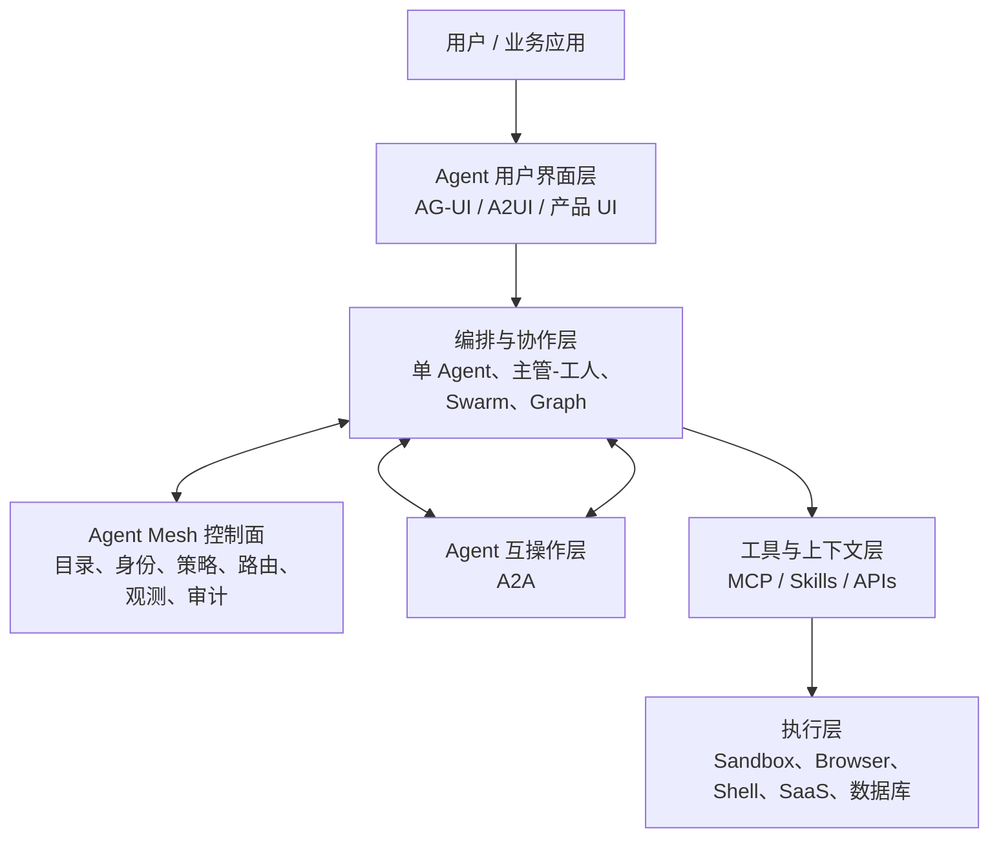
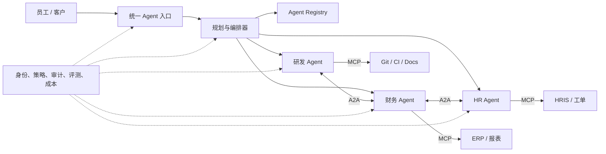

# MCP、A2A、Agent Mesh 与 Agent Swarm：概念、分层和架构关系

> 结论先行：MCP 是 Agent 到工具/数据，A2A 是 Agent 到 Agent，Mesh 是跨 Agent 的基础设施与治理平面，Swarm 是多个 Agent 的协作组织方式。四者处于不同抽象层，可以同时出现在一个系统中。

## 一、为什么这些概念容易混淆

它们都在解决“一个模型不再独立工作”之后的问题，但关注点不同：

- 接了外部 API，就有人把工具当 Agent；
- 一个总控 Agent 调用子 Agent，也可能被实现成普通函数调用；
- MCP 规范后来加入 sampling 和 durable tasks，使 MCP server 本身也可能具有 Agent 行为；
- A2A 可以做委派，但具体团队如何分工并不由 A2A 决定；
- “Agent Mesh” 目前更像架构范式和厂商产品类别，并非单一正式协议。

所以应按“通信双方是谁、交换的对象是什么、谁管理运行时”来分类，而不是按营销名称分类。

## 二、一张分层图

这不是强制标准栈，而是便于企业划分责任：前端团队处理人机协同，Agent 平台团队处理运行时和 Mesh，领域团队提供 Agent/工具，安全团队控制身份、策略和审计。

## 三、MCP：模型/Agent 与工具、数据、上下文之间的通用接口

### 1. 起源和定位

Anthropic 于 2024-11-25 [发布并开源 MCP](https://www.anthropic.com/news/model-context-protocol)，目标是用开放标准替代 AI 应用与数据源之间的重复定制集成。2025-12，MCP 被捐赠给 Linux Foundation 下的 Agentic AI Foundation，治理从单一厂商转向社区。

[MCP 架构](https://modelcontextprotocol.io/specification/2024-11-05/architecture/index)最初采用 host-client-server 模型，并使用 JSON-RPC 2.0：

- **Host**：Claude、Codex、IDE 或企业 Agent 应用，控制整体体验和安全边界；
- **Client**：Host 内与某个 MCP server 维持会话的协议组件；
- **Server**：暴露工具、资源、提示模板或其他能力的进程/服务。

### 2. MCP 核心原语

| 原语 | 提供者 | 含义 | 典型例子 |
|---|---|---|---|
| Tools | Server | 模型可选择调用的动作 | 查询数据库、创建 Jira 工单、操作 Figma |
| Resources | Server | 可读取、可寻址的上下文 | 文件、表结构、知识库条目 |
| Prompts | Server | 可复用的提示模板 | 代码评审模板、事故复盘模板 |
| Roots | Client | 告知 Server 可操作的文件/目录边界 | 当前仓库、指定工作区 |
| Sampling | Client | Server 请求 Host 所管理的模型推理 | 让 Server 用用户侧模型完成子推理 |
| Elicitation | Server→Client | 请求用户补充信息或在外部流程授权 | 选项确认、OAuth 页面 |
| Tasks（实验性） | 双方协商 | 持久、可轮询、可延迟取回结果的请求 | 批处理、长时间分析 |

2025-11-25 版规范的[变更记录](https://modelcontextprotocol.io/specification/2025-11-25/changelog)显示，MCP 已增加 OIDC/OAuth 发现、增量 scope 同意、URL 模式 elicitation、sampling tool call，以及实验性 tasks。这意味着它正从简单工具插座向更完整的 Agent 连接运行时发展。

### 3. MCP 解决什么

- 减少每个 Agent 客户端与每个业务系统之间的重复适配；
- 让工具具有可发现的名字、描述和输入输出 schema；
- 允许本地 stdio 与远程 HTTP 等部署模式；
- 把模型选择与工具实现解耦；
- 为工具授权、用户确认和审计提供共同集成点；
- 使同一个 MCP server 可以服务 Claude Code、Codex、OpenCode 等多个客户端。

### 4. MCP 不解决什么

- 不判断一个工具是否可信或返回是否正确；
- 不自动实现业务级授权、职责分离和数据分级；
- 不定义多个独立 Agent 如何协商目标、任务和制品；
- 不保证客户端完整支持最新规范；
- 不消除 prompt injection、密钥泄漏、越权调用和供应链风险。

[MCP 安全最佳实践](https://modelcontextprotocol.io/docs/tutorials/security/security_best_practices)特别提示 confused deputy、session hijacking、prompt injection 等风险。企业不能因为“走了 MCP”就把工具网关视为安全网关。

### 5. 对企业最实际的 MCP 建议

1. 把 MCP server 视作需要 SDLC、代码审查、漏洞管理的生产服务；
2. 读工具和写工具分开，默认只读；
3. 工具权限绑定最终用户/工作负载身份，不共用万能服务账号；
4. 高风险动作执行前生成可读预览并二次确认；
5. 对工具发现、参数、结果、授权主体和下游动作做结构化审计；
6. 用 allowlist 管理企业 MCP 目录，禁止任意安装未知 server；
7. 对外部文档、邮件、网页内容按不可信输入处理，避免间接 prompt injection。

## 四、A2A：独立 Agent 之间的发现、委派和异步任务协议

### 1. 起源和定位

Google 于 2025-04-09 [宣布 Agent2Agent Protocol](https://developers.googleblog.com/en/a2a-a-new-era-of-agent-interoperability/)，2025-06-23 将其贡献给 [Linux Foundation](https://www.linuxfoundation.org/press/linux-foundation-launches-the-agent2agent-protocol-project-to-enable-secure-intelligent-communication-between-ai-agents)。其目标是让不同厂商、框架、组织中的 Agent 在不暴露内部实现、记忆或工具细节的情况下协作。

### 2. A2A 核心对象

- **Agent Card**：Agent 的能力、服务地址、支持的交互能力、身份验证等公开描述，相当于 Agent 名片；
- **Message / Part**：用户或 Agent 之间的消息，多部分内容可包含文本、文件和结构化数据；
- **Task**：具有状态的工作单元，可经历 submitted、working、input-required、completed、failed、canceled 等生命周期；
- **Artifact**：任务产生的文档、数据、代码、图像等结果；
- **Streaming / Push notification**：支持实时更新或长任务 webhook 通知。

[A2A 最新规范](https://a2a-protocol.org/dev/specification/)强调异步任务，可通过轮询、流式连接或推送获取状态。因此 A2A 比“调用另一个聊天 API”更适合跨系统长期委托。

### 3. A2A 与普通 API 的差别

传统 API 暴露预先定义的确定性操作，如 `createTicket()`；A2A 暴露的是一个能理解目标、协商信息并持续产出制品的 Agent。调用方不需要知道对方内部使用哪个模型、如何规划或调用哪些工具。

但如果需求完全确定、输入输出稳定，普通 API 往往更便宜、更可靠、更易测试。不要把每个微服务包装成 Agent。

### 4. A2A 适合的场景

- 采购 Agent 把合规检查委派给法务 Agent；
- IT 服务 Agent 与 HR Agent 协调入职流程；
- 总承包方 Agent 向供应商 Agent 请求报价和进度；
- 主研发 Agent 向独立安全审查 Agent 提交制品并等待结论；
- 不同 SaaS 平台的 Agent 在各自权限域内完成跨系统流程。

### 5. A2A 的难点

- Agent Card 的能力声明如何验证，避免“能力广告”不实；
- 用户授权能否安全地跨 Agent 委派，避免权限放大；
- 跨组织的身份、信任、计费、SLA 和责任归属；
- 长任务取消、幂等、重试和重复副作用；
- Artifact 的数据分类、来源、签名和保留策略；
- 版本兼容与不同厂商的可选能力差异。

## 五、MCP 与 A2A 的关键区别

| 维度 | MCP | A2A |
|---|---|---|
| 主要关系 | Agent/模型 ↔ 工具、数据、上下文 | Agent ↔ Agent |
| 交互抽象 | 调用工具、读取资源、提示、采样 | 消息、任务、状态、制品 |
| 对端是否自治 | 通常不要求 | 默认对端是可独立工作的 Agent |
| 是否暴露内部能力 | 暴露具体工具或资源 schema | 主要暴露高层能力，不要求暴露内部工具 |
| 长任务 | 新版有实验性 tasks | 原生以异步 Task 为核心 |
| 典型拓扑 | Host 管多个 server | 跨主机、跨平台、跨组织 |
| 替代普通 API 吗 | 不替代；常包装现有 API | 不替代；适合目标级委派 |
| 最大治理点 | 工具权限与不可信内容 | 身份委派、责任、SLA、跨域数据 |

一个现实架构常是：销售 Agent 通过 A2A 请求报价 Agent；报价 Agent 内部再通过 MCP 调 ERP、定价规则和文档库。

## 六、Agent Swarm：协作模式，而不是一个统一协议

### 1. 定义

Agent Swarm 泛指多个相对自治的 Agent 围绕共同目标分工、通信、竞争或协作的系统。OpenAI 的 `swarm` 仓库只是这一概念下的一个早期实验框架，现已由 Agents SDK 取代；“Swarm” 本身不是 OpenAI 专有标准。

### 2. 常见组织拓扑

| 模式 | 工作方式 | 优点 | 主要风险 |
|---|---|---|---|
| Supervisor–Workers | 主管拆分并汇总，工人只向主管汇报 | 简单、责任清楚、易控制上下文 | 主管成为瓶颈和单点失败 |
| Pipeline | 研究→设计→实现→测试顺序传递 | 阶段清楚、易加质量门 | 上游错误层层放大 |
| Debate/Judge | 多 Agent 给出方案，由裁判选择 | 适合不确定分析和独立复核 | token 成本高，裁判也会错 |
| Blackboard | 共享任务板/制品库，Agent 自主领取 | 动态、适合松耦合任务 | 状态冲突、重复劳动、抢占 |
| Peer-to-peer | Agent 直接互相消息和委派 | 去中心、可适应复杂协作 | 难审计，容易循环和目标漂移 |
| Map–Reduce | 多 Agent 并行处理分片，再统一聚合 | 适合大规模检索和机械迁移 | 任务需可分割，聚合会丢细节 |

### 3. 什么情况下值得用 Swarm

- 任务可以按文件、模块、数据分片或独立假设自然并行；
- 单个上下文窗口容易被日志和检索结果污染；
- 需要独立视角减少单路径偏差；
- 不同子任务确实需要不同工具权限或专业知识；
- 产物能通过自动测试、schema、评分器或人工评审合并。

### 4. 什么情况下不要用

- 任务高度串行，下一步依赖上一步细节；
- 多个 Agent 必须频繁修改同一文件或同一业务对象；
- 没有明确完成定义；
- 只是为了营造“团队感”而复制角色提示；
- 单 Agent 尚未达到可靠基线；
- 成本、延迟或合规要求不允许倍增推理和上下文副本。

## 七、Agent Mesh：企业级连接与治理拓扑

### 1. 定义与类比

Agent Mesh 借鉴 service mesh：不让每个 Agent 各自实现发现、路由、身份、策略、遥测和重试，而由共享数据平面/控制平面提供这些横切能力。不同厂商对 Agent Mesh 的产品定义并不完全一致，因此本文把它视为**参考架构模式**，而不是一份固定规范。

### 2. Mesh 应包含什么

- Agent Registry / capability catalog；
- 身份、凭证、用户代理关系和委派链；
- 策略决策与执行点，最小权限和动态 scope；
- A2A/MCP/API 的协议网关与版本适配；
- 任务路由、限流、超时、熔断、幂等和重试；
- 消息、工具调用、制品和审批的可观测性；
- 成本、模型、延迟、质量和风险路由；
- 评测、回放、红队与 kill switch；
- 数据驻留、敏感信息脱敏和审计保留。

### 3. Mesh 与中央编排器的区别

中央编排器决定一个具体流程“下一步谁做什么”；Mesh 更像交通规则、身份系统和高速公路，确保任何流程中的 Agent 能被发现、允许、安全地通信并被观测。小规模系统可以只有编排器；跨部门、跨平台、跨组织时才逐渐需要 Mesh。

### 4. 何时建设 Mesh

不要从画一个大而全的 Agent Mesh 开始。出现以下信号时再平台化：

- 已有 10 个以上 Agent/工具网关且重复建设身份和日志；
- 跨两个以上 SaaS/云平台，需要统一 Agent 目录；
- 发生影子 Agent、权限不一致或成本失控；
- 同一能力被多个团队重复封装；
- 安全与审计团队无法回答“哪些 Agent 正代表谁做什么”。

## 八、邻近协议：别忽略客户端和用户界面层

### ACP（Agent Client Protocol）

[Zed ACP](https://zed.dev/acp)解决 Coding Agent 与代码编辑器之间的互操作。它使一个编辑器可承载 Gemini CLI、Claude Code、Codex 等不同 Agent。它与 A2A 名称容易混淆：ACP 的主体是 **client/editor ↔ coding agent**，A2A 的主体是 **agent ↔ agent**。

### AG-UI

[AG-UI](https://docs.ag-ui.com/)是事件驱动的 Agent ↔ 用户应用协议，处理文本流、工具事件、共享状态、人类介入和生成式 UI。它补足 MCP/A2A 不直接定义前端交互的问题。

### AP2

[AP2](https://cloud.google.com/blog/products/ai-machine-learning/announcing-agents-to-payments-ap2-protocol)面向 Agent 发起支付，重点是用 mandate 等机制证明用户意图和授权。它说明未来会出现更多金融、医疗、身份等垂直领域协议，而不是所有风险语义都塞进 MCP/A2A。

### AGENTS.md 与 Agent Skills

它们不是网络协议，但解决可移植配置：AGENTS.md 告诉 Coding Agent 如何在仓库工作；Skills 把按需加载的说明、资源和脚本封装成可复用能力。两者会成为 Agent 软件供应链的重要组成部分，也需要签名、来源和审查。

## 九、推荐的企业参考架构

建议把确定性步骤保留为普通 workflow/API，把开放式推理放入 Agent 节点。所有有副作用的工具在 Mesh/网关层执行权限校验；所有跨 Agent 委派携带可验证身份、目的、scope 和 trace ID。

## 十、最终判断

MCP 最可能长期保留为工具/上下文的通用接口，A2A 有望成为跨 Agent 委托的主流候选，ACP/AG-UI 会在各自客户端层发展。Agent Mesh 会先作为 Microsoft、Google、Salesforce、ServiceNow 等平台的产品能力出现，再逐步抽象成跨平台控制面。Swarm 不会成为一个单一标准，它会像微服务中的编排/协同模式一样，保留多种拓扑并按任务选用。

