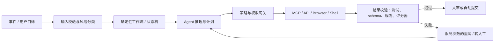

# Agent 落地架构与路线图：企业研发、办公与个人开发

> 本章把前述趋势转为可执行方案。基本原则是先做可验证的单 Agent 闭环，再做可复用能力平台，最后才做跨域多 Agent 与 Mesh。

## 一、先选择工作模式，而不是先选工具

### 模式 A：Pair（结对）

人和 Agent 同步工作，频繁对话、即时评审。适合陌生问题、架构设计、关键代码和学习场景。优化指标是人机交互质量与主动时间，而不是后台并发。

### 模式 B：Delegate（委托）

人定义目标、约束和验收，Agent 在隔离环境完成后提交结果。适合缺陷、测试、文档、依赖升级、数据整理等可验证任务。优化指标是一次通过率、周转时间和评审负担。

### 模式 C：Automate（自动化）

由事件/日程触发，Agent 无需每次手工启动，关键动作按风险审批。适合工单分诊、日报、监控调查、定期维护。优化指标是 SLO、异常率、成本和人工升级率。

### 模式 D：Orchestrate（编排）

多个领域 Agent/Workflow 跨系统协作。适合端到端流程，但必须在单 Agent 能力稳定、身份和审计完备后采用。

企业最常见的失败，是本应从 Pair/Delegate 开始，却直接购买 Orchestrate 平台并设计“数字员工组织图”。

## 二、任务适配度评分

对每个候选场景按 0—2 分评分：

| 维度 | 0 分 | 1 分 | 2 分 |
|---|---|---|---|
| 输入数字化 | 主要在线下/口头 | 部分数字化 | 全部可访问 |
| 成功可验证 | 主观且延迟 | 可人工快速判断 | 测试/schema/规则自动判断 |
| 动作可撤销 | 不可逆 | 部分可回滚 | 草稿、分支或完全可回滚 |
| 权限可限制 | 需要广泛管理员权 | 可按系统隔离 | 可到资源/动作/时间粒度 |
| 任务频率 | 偶发 | 每周 | 每天/大量队列 |
| 变体复杂度 | 完全确定，应做 workflow | 中等例外 | 非结构化且需判断 |
| 错误影响 | 高人身/法律/资金风险 | 中等业务影响 | 低风险 |
| 数据质量 | 来源冲突/缺失严重 | 可补全 | 来源清楚、结构稳定 |

高分任务适合 Agent；“变体复杂度”为 0 的任务应优先普通自动化；错误影响为 0 分时，即使总分高也只能做建议/草稿。

## 三、推荐技术架构：确定性外壳包住概率性核心

### 为什么不能把所有逻辑交给 Agent

模型擅长理解模糊输入、生成候选方案、选择工具和处理例外；状态机擅长幂等、超时、补偿、审计和确定性分支。将二者组合，可以保留 Agent 的灵活性而避免“整个业务流程是一段不可预测的对话”。

## 四、研发场景的标准闭环

### 1. Task contract

每个任务至少包含：

- 背景与业务目标；
- 明确 in-scope / out-of-scope；
- 相关文件/服务/文档；
- 不可违反的架构与安全规则；
- 可执行验收命令；
- 是否允许网络、安装依赖、改 schema、改 CI；
- 交付物：代码、测试、迁移、文档、风险说明；
- 超时、预算和升级人工条件。

### 2. 隔离执行

每个并行任务使用 worktree、分支、容器或云沙箱；凭证按任务短期发放；默认网络出站受限；不让多个 Agent 无协调地修改同一工作副本。

### 3. 多层验证

从便宜到昂贵：格式化→类型检查→单元测试→集成测试→安全扫描→UI/浏览器验证→独立 Agent 评审→人类评审。不要只要求 Agent 自己说“已验证”。

### 4. 合并与学习

人类评审不是只看 Diff，还要记录拒绝原因。稳定的纠正被写入 tests、AGENTS.md、Rules、Skill 或 Hook；不要把每次纠正都塞进无限增长的记忆。

## 五、办公场景的标准闭环

### 1. Grounding contract

明确哪些系统是事实源、时间范围、权限主体、引用要求和冲突处理。例如财务数值必须来自已批准数据集，邮件只能作为线索，模型推断必须显式标记。

### 2. Action contract

把动作分为：

- L0 只读/总结；
- L1 草稿，不对外发送；
- L2 低风险可撤销写入；
- L3 有业务影响，需单人批准；
- L4 资金、法律、生产或敏感人事，需职责分离/多人批准；
- L5 禁止 Agent 执行。

能力强不代表权限高。Agent 的技术能力等级与组织允许自治等级必须分开管理。

### 3. Artifact-first

复杂办公任务先产出可审查制品：计划、对比表、合同差异、待发送邮件、拟更新记录，而不是直接执行。制品是人、Agent、审计和下游系统之间最稳定的协作边界。

## 六、企业成熟度模型

| 级别 | 特征 | 技术重点 | 退出条件 |
|---|---|---|---|
| L0 Shadow AI | 员工自行使用，组织不可见 | 盘点、政策、允许工具 | 建立基本可见性 |
| L1 Assisted | 问答、补全、草稿 | 数据保护、培训、引用 | 有可量化高频用例 |
| L2 Delegated | 隔离环境完成任务，人工提交 | 任务合同、sandbox、tests、trace | 稳定成功率和可控成本 |
| L3 Automated | 事件/日程触发，低风险自动动作 | durable workflow、身份、审批、SLO | 可恢复、可审计、风险可接受 |
| L4 Multi-Agent | 跨领域 Agent 委派 | A2A、registry、委派链、Artifact schema | 跨域价值超过协调成本 |
| L5 Agent Mesh | 全企业能力目录和统一控制面 | 策略、路由、评测、成本、生命周期 | 只在规模确实需要时进入 |

目标不是尽快达到 L5。一个在关键业务上稳定运行的 L2/L3，通常比一个没有治理的 L4 更成熟。

## 七、90 / 180 / 365 天企业路线图

## 0—30 天：建立基线和边界

### 工作

- 盘点员工已使用的 AI/Coding Agent、MCP、插件和数据流；
- 选择 3—5 个研发任务、2—3 个办公任务；
- 定义数据分级、禁止动作和允许工具；
- 建立 baseline：无 Agent 的时间、质量、成本；
- 选 2—3 个不同路线工具做交叉试验；
- 建立项目级 AGENTS.md/Rules 与最小测试集。

### 交付物

- Agent 使用政策 v1；
- 场景/风险/价值矩阵；
- 评测集与仪表板草案；
- 允许产品与模型清单；
- 事故响应和紧急禁用流程。

## 31—90 天：做出受控闭环

### 工作

- 为每个试点建立隔离环境和任务级身份；
- 建设 3—10 个高质量 MCP/API tools，而不是接入数百个未知工具；
- 把 SOP 改写为 Skills/Workflows；
- 接入 trace、tool call、费用、人工介入和业务结果；
- 做 prompt injection、越权、错误副作用和成本循环红队；
- 每两周评审失败样本并更新 tests/Skills/政策。

### 90 天决策门

只有同时满足以下条件才扩大：

- 业务指标显著改善；
- 失败可发现、可回滚；
- 人工评审负担未抵消收益；
- 权限和审计覆盖完整；
- 单任务全成本可接受；
- 场景 owner 愿意承担结果责任。

## 91—180 天：平台化复用

### 工作

- 建企业 Agent/Tool/Skill registry；
- 建模型网关与任务路由，按质量/成本/数据域选模型；
- 统一短期凭证、secret、审批和 audit schema；
- 建通用 sandbox/worktree/cloud runner；
- 建离线回放、版本对比和 canary；
- 把能力 owner、版本、SLO、数据等级写入目录；
- 开始一个真正有价值的 parent-child 或跨领域 Agent 试点。

### 不应做

- 为“未来可能有用”先建设大而全 Mesh；
- 允许 Agent 自行安装任意 MCP/Skill；
- 用单一总体成功率掩盖高风险长尾；
- 把 vendor console 当作唯一审计源。

## 181—365 天：选择性自治与跨平台互操作

### 工作

- 对成熟低风险场景从 L2 升到 L3；
- 试用 A2A 连接两个明确边界的领域 Agent；
- 引入 Agent identity、委派链和目的绑定授权；
- 用历史任务训练路由和改善 Skills，而非盲目积累对话记忆；
- 建季度权限复审、Agent/Skill 供应链扫描和自动过期；
- 将业务 KPI、质量、安全和全成本纳入同一运营看板。

## 八、平台选型的十二项评分卡

每项 1—5 分，并按组织风险加权：

1. 真实任务完成质量；
2. 人类主动时间和评审体验；
3. 失败恢复、checkpoint、重试和回滚；
4. 本地/云/混合执行与数据驻留；
5. 模型可替换性、BYOK 和模型网关；
6. MCP/Skills/AGENTS.md/Hook 等可移植扩展；
7. 多任务、subagent、worktree 与冲突管理；
8. SSO、RBAC、短期凭证和审批；
9. 日志、trace、回放、评测和导出；
10. 组织策略、管理员控制和审计 API；
11. 价格可预测性、限额、预算和供应商锁定；
12. 中国/全球网络、法务、隐私、支持和生态适配。

禁止用“功能是否有”替代质量评测。MCP 旁边打勾不代表认证、密钥管理、连接稳定性和工具结果压缩都做得好。

## 九、Agent 配置的可移植资产策略

### 仓库层

- `AGENTS.md`：稳定的构建命令、架构边界、测试和禁区；
- tests/evals：把验收和历史失败固化；
- ADR/文档：让设计决策机器可读；
- Skills：按需加载的专项流程；
- MCP/API schema：外部能力的稳定合同；
- CI policy：不因 Agent 而绕开原有质量门。

### 避免

- 同一规则在 `.cursorrules`、CLAUDE.md、产品 memory 等十处手工复制；
- 把密钥放进配置和 Skill；
- 写数千行项目指令，让每次任务承担巨大上下文成本；
- 把供应商私有记忆作为唯一组织知识库。

### 建议

以 AGENTS.md + 开放 Agent Skills + 标准 API/MCP + tests 为主要可移植层，再为具体产品写薄适配。产品专有能力可以使用，但不应承载唯一关键知识。

## 十、评测与运营指标

### 研发

- 验收/隐藏测试通过率；
- 从任务开始到可合并 PR 的周转时间；
- 人类主动分钟数；
- 评审意见数、返工轮次、回滚率；
- 生产缺陷、漏洞和变更失败率；
- 新增代码与新增测试比、Diff 不必要膨胀；
- 每个被接受任务的全成本。

### 办公

- 任务完成率与 SLA；
- 来源引用正确率、事实错误率；
- 人工批准率、修改率、升级率；
- 重复工单、误发、误更新和客户投诉；
- 每个成功业务结果的全成本；
- 员工节省的主动时间，而非生成字符数。

### 平台

- 活跃 Agent/Tool/Skill 数与 owner 覆盖率；
- 权限过期、异常调用和数据策略拦截；
- trace 完整率、回放成功率；
- 模型/工具故障的降级成功率；
- token、并发、任务时长 P50/P95；
- 多 Agent 相比单 Agent 的净收益。

## 十一、个人开发者路线图

### 第 1 周：建立单 Agent 基线

选择 Claude Code、Codex 或 OpenCode 中两个，在同一个小项目完成修复、功能、测试、文档四类任务。要求每次先给 plan，修改后运行验收，最后看 Diff。

### 第 2 周：固化项目上下文

写一份精简 AGENTS.md，包含项目结构、命令、风格、禁区和完成定义；把反复提示变成 Skill；保持 Git 提交小而可回滚。

### 第 3 周：增加一个真实外部能力

只接一个可信 MCP，例如 GitHub、浏览器或设计工具。使用最小权限 token，观察工具描述是否明确、审批是否有效、日志是否可读。

### 第 4 周：尝试并行但保持边界

用 worktree 分配两个独立任务；不要让多个 Agent 修改同一模块。比较后台委托与同步结对哪个节省的是“主动时间”还是“墙钟时间”。

### 长期习惯

- 每个 Agent 任务先有验收，不从空泛提示开始；
- 关键代码必须能由自己解释；
- 对依赖、安全、数据库迁移和外部副作用保持人工门；
- 每月轮换一个对照工具，防止被单一 Harness 锁定；
- 用测试和文档积累能力，不依赖不可导出的聊天历史。

## 十二、反模式清单

1. 用 Agent 数量衡量先进程度；
2. 把所有 SaaS API 包成“专业 Agent”；
3. 允许 Agent 使用员工长期 token 或共享管理员账号；
4. 上线前只测 happy path；
5. 用 Agent 自评代替真实测试和独立评审；
6. 自动合并大 Diff，或者只看测试绿不看语义；
7. 把所有企业知识复制进模型上下文；
8. 记忆只增不删、不标来源和有效期；
9. 多 Agent 共用同一工作目录和数据库写权限；
10. 没有 owner、预算、超时和停止机制；
11. 采购平台后才寻找业务场景；
12. 只统计生成速度，不统计返工、评审与线上质量。

## 十三、最终建议

现在最值得投资的是可移植的组织资产：测试、事实源、权限模型、能力目录、Skills、工具 schema、trace 和评测集。它们不依赖某个模型在某个月排名第一，却决定任何 Agent 能否真正进入生产。

企业应追求的不是“全自动”，而是让每个任务在恰当自治等级下，以可验证、可恢复、可追责的方式完成。

