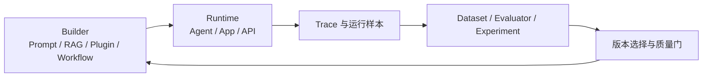

# LobeHub、Coze 与 Buzz：三种 Agent 工作空间的设计路线

> 调研基准日：2026-08-11  
> 范围：LobeHub（原 LobeChat）、Coze Studio、Coze Loop、Block Buzz。本文评价的是公开仓库和官方文档可验证的产品设计，不把路线图能力当作已投产能力。

## 一、结论先行

这几个项目并不是同一种产品的不同实现，而是在回答三个不同问题：

- **LobeHub** 回答“一个人或团队如何发现、创建、组织并持续使用一组 Agent”；
- **Coze Studio + Coze Loop** 回答“Agent 应用如何被低代码搭建、发布、评测和运营”；
- **Buzz** 回答“人、Agent、代码仓、工作流、审批和讨论如何共享身份、事件与审计语义”。

对部门级 ADD 最有价值的组合不是从中选一个整套照搬，而是吸收三种抽象：

1. 从 LobeHub 借鉴 **Agent 目录、团队、项目、调度和白盒记忆**；
2. 从 Coze 借鉴 **Builder / Runtime / Ops 分离，以及 Prompt、Workflow、Dataset、Eval、Trace 的完整闭环**；
3. 从 Buzz 借鉴 **人和 Agent 的一等身份、事件化协作、分支即工作空间、项目可跨多个仓库、所有结果可追溯**。

但三者都不能直接解决企业跨仓 ADD 的全部问题。真正缺失的仍是：跨仓变更的权威对象、服务依赖图、契约兼容性、PR 依赖图、跨仓集成验证、分阶段发布以及企业策略控制面。

## 二、能力定位总览

| 项目 | 核心产品隐喻 | 主要用户 | 已公开的核心能力 | 对企业 ADD 的直接价值 | 主要空白 |
|---|---|---|---|---|---|
| LobeHub | Chief Agent Operator / Agent 工作空间 | 个人、知识工作者、团队 | 多模型、多模态、Agent Builder、Agent Groups、Skills/MCP、Pages、Schedule、Project、Workspace、可编辑记忆、自托管 | 统一入口、Agent/Skill 目录、人与 Agent 团队交互、长期运行 UX | Git 变更事务、跨仓契约、CI/发布编排不是其公开设计中心 |
| Coze Studio | 一站式 Agent 应用工厂 | Agent 应用开发者、业务团队 | Prompt、RAG、Plugin、Database、Workflow、Agent/App 发布、API/Chat SDK、模型管理 | 低代码编排、资源模型、应用发布、业务 Agent 原型 | 更像 Agent 应用 PaaS，而非多仓软件交付控制面 |
| Coze Loop | Agent DevOps / LLMOps 平台 | Agent 平台和质量团队 | Prompt 调试与版本、数据集、评测器、实验、Trace、模型管理 | 统一评测、回放、观测、版本对比 | 不负责 Git、工作区、需求与跨仓合并 |
| Buzz | 人与 Agent 共用的事件化工程工作区 | 软件团队、自治社区 | 同一身份模型、签名事件、频道/线程、Git 事件、YAML 工作流、审批、搜索、审计、ACP/MCP、项目包含多仓、分支即频道 | 最接近“组织级 ADD 协作底座”的事件和身份模型 | 项目仍在快速建设；部分能力明确标注为 being wired up / vision；Nostr/Git 托管路线与多数企业现有栈差异大 |

## 三、LobeHub：把 Agent 从聊天配置提升为工作单元

### 1. 产品设计

LobeHub 当前将自己定位为“Chief Agent Operator”，公开 README 把能力分成 Operator、Create、Collaborate、Evolve 四组：统一管理 Agent，创建 Agent 与连接 Skills/MCP，使用 Agent Groups、Pages、Schedule、Project、Workspace 协作，以及维护结构化、可编辑的个人记忆。[LobeHub README](https://github.com/lobehub/lobehub)

它的关键转变是：**对话不再是一级对象，Agent 才是一级对象**。项目、工作区、共享页面和日程为 Agent 提供了比单次 chat 更长的生命周期；多模型和 MCP 市场则把模型与工具供应解耦。

LobeHub 早期的多 Agent RFC 采用 supervisor 决定下一位发言者和交接方式，并为群组建立独立数据实体。这说明它更偏向“以共享上下文为中心的多 Agent 协作”，而不是代码变更的 DAG 编排。[LobeHub 多 Agent RFC](https://github.com/lobehub/lobehub/discussions/8920)

### 2. 值得借鉴的设计

- **Agent 是可注册、可配置、可发现的组织资产**，而非每个员工本地配置中的匿名 prompt；
- **Agent Groups** 让任务选择合适成员并行协作，用户主要管理目标和结果；
- **Project / Workspace** 提供比聊天线程更稳定的边界，适合映射部门、领域和项目；
- **Pages** 把多人和多 Agent 的写作沉淀为共享制品；
- **Schedule** 让 Agent 从交互式助手变成持续运行的工作者；
- **白盒记忆** 强调记忆可查看、可编辑，这比不可解释的供应商私有记忆更适合企业治理；
- **多模型 + Skills/MCP** 证明用户入口、模型和工具可以分层演进。

### 3. 不应直接照搬的地方

LobeHub 的公开材料仍以 Agent 工作空间和知识协作为中心。企业研发所需的以下语义不能只靠 Project/Workspace 或群聊补齐：

- 一个跨仓特性对多个 repo 的修改集合；
- API、事件、数据库和配置契约的兼容性窗口；
- 多个 PR 的前后依赖与合并次序；
- 跨仓临时环境和端到端验收；
- 发布、回滚、证据与责任链。

另外，其公开仓库采用 LobeHub Community License，而不是常见的 Apache-2.0/MIT。企业若要深度二次开发或作为产品再分发，应先单独审查当前许可证文本和商业边界，不能只因为“源码公开”就按宽松开源许可处理。

## 四、Coze Studio + Coze Loop：Builder、Runtime、Ops 的完整产品闭环

### 1. Coze Studio 的资源与运行模型

Coze Studio 将 Prompt、RAG、Plugin、Workflow 作为 Agent 应用的核心构件，并提供 Agent、App、Workflow 的创建、发布和管理，以及知识库、数据库、提示词、OpenAPI 和 Chat SDK。其工作流是包含控制流和数据流的 DAG，后端用 Go，前端用 React + TypeScript，整体采用微服务和 DDD。[Coze Studio README](https://github.com/coze-dev/coze-studio/blob/main/README.zh_CN.md) [工作流节点设计](https://github.com/coze-dev/coze-studio/wiki/11.-Add-new-workflow-node-types-%28backend%29)

其代码结构进一步体现了边界意识：API、Application、Domain、Crossdomain、Infra 分层；agent、knowledge、memory、model、plugin、prompt、workflow 等是明确领域，跨领域调用经过防腐层和契约层，而不是任意相互依赖。[Coze Studio 项目架构](https://github.com/coze-dev/coze-studio/wiki/7.-%E5%BC%80%E5%8F%91%E8%A7%84%E8%8C%83)

### 2. Coze Loop 补齐运营闭环

Coze Loop 没有再造 Agent Builder，而是集中处理 Prompt 开发与版本、数据集、评测器、实验、Trace 和模型管理。公开架构把平台、SDK、LLM 分开，并将 Dataset、Evaluation、Observability、Prompt、LLM、Foundation 建成独立领域模块。[Coze Loop README](https://github.com/coze-dev/coze-loop) [Coze Loop Architecture](https://github.com/coze-dev/coze-loop/wiki/3.-Architecture)

Studio 与 Loop 组合后形成值得企业直接借鉴的闭环：

### 3. 对部门平台的启示

- Agent、Prompt、Workflow、Dataset、Evaluator 和发布版本必须都有稳定 ID、owner 和生命周期；
- “写出一个 Prompt”不等于生产能力，必须能把线上失败转为评测样本并回放；
- 确定性业务步骤应该放在工作流 DAG 中，开放式判断才交给 Agent；
- Tool/Plugin、Knowledge、Model 不是 UI 选项，而是需要独立治理的资源类型；
- 构建面与运行面应解耦，运行中的 Agent 不应拥有任意修改自身配置和工具的权限。

### 4. 边界与风险

Coze Studio 的开源版使用 Apache-2.0，但 README 明确提示公网部署前需要评估账号注册、Python 代码节点、监听地址、SSRF 和 API 越权风险；开源版与商业版能力也有差异。[Coze Studio README](https://github.com/coze-dev/coze-studio/blob/main/README.zh_CN.md)

更重要的是，Coze 的“Workflow”主要是一个 Agent 应用内部的数据/控制流，并不天然等于软件交付中的跨仓变更事务。把每个 repo 做成一个工作流节点，仍然无法自动得到契约兼容、PR 依赖、merge train 和部署回滚语义。

## 五、Buzz：把人、Agent、Git 和审批统一为事件

### 1. 核心设计

这里的 Buzz 指 Block 开源的 [block/buzz](https://github.com/block/buzz)，不是同名的音频转写应用。Buzz 把人和 Agent 视为工作空间内的一等成员；消息、反应、工作流步骤、审批和 Git 事件都写入同一种签名事件日志。Relay 是单一事实入口，负责认证、签名校验、持久化、订阅分发、搜索、审计和工作流触发。[Buzz README](https://github.com/block/buzz/blob/main/README.md) [Buzz Architecture](https://github.com/block/buzz/blob/main/ARCHITECTURE.md)

公开架构中：

- 人类客户端、Agent、CLI/脚本都通过 WebSocket/REST 连接 relay；
- Agent 经 `buzz-acp` 适配 ACP，工具经 MCP 解耦；
- Postgres 保存事件和全文检索，Redis 做 pub/sub，S3/MinIO 存媒体；
- 每个 Agent 有自己的密钥、频道成员关系和审计轨迹；
- 事件处理链包含认证、身份匹配、签名验证、成员权限、幂等写入、分发、搜索、审计和工作流触发；
- `buzz-agent` 与 `buzz-dev-mcp` 明确通过 ACP/MCP 协议组合，session 之间隔离，输出、进程寿命和上下文有界。[Buzz Agent Vision](https://github.com/block/buzz/blob/main/VISION_AGENT.md)

### 2. Buzz 最接近跨仓 ADD 的两个抽象

#### 一个项目可以包含多个仓库

Buzz 的项目设计明确指出“真实工作跨越多个仓库”。它没有让某个 repo 声称自己代表整个项目，而是引入独立的项目实体来引用成员仓库；项目签名者只能声明归组关系，不自动获得成员 repo 的写权限。这是非常重要的所有权分离。[Buzz Projects Vision](https://github.com/block/buzz/blob/main/VISION_PROJECTS.md)

#### 分支就是协作房间

Buzz 为特性分支创建频道，把 patch、CI、review、审批、merge decision 放在同一时间线上；合并后频道归档，成为“为什么存在这段代码”的永久记录。它把通常散落在 issue、PR、CI、chat 和发布工具里的证据统一起来。

### 3. 对企业平台的启示

- **Agent 必须有独立身份**，不能只复用员工 PAT 或共享管理员账号；
- **协作以事件和制品为边界**，不能依赖不可审计的对话记忆；
- **项目聚合不等于权限继承**，跨仓协调者不能自动拥有所有 repo 权限；
- **工作流负责协调，Worker 负责计算**，控制面不应成为重型构建服务器；
- **Branch / ChangeSet 可成为协作空间**，所有决策与证据围绕变更 ID 聚合；
- **协议应保持窄而清晰**：ACP 管客户端到 Coding Agent，MCP 管 Agent 到工具，不把所有东西耦合成一个内部 SDK。

### 4. 不应直接照搬的地方

Buzz README 清楚地区分 Works today、Being wired up 和 Strong opinions, pending code。例如 workflow approval gates 在公开说明中仍处于连接阶段；其 Forge、跨仓项目和主权 relay 的部分内容属于 Vision 文档。企业不能把愿景描述当作成熟平台能力。

同时，大多数企业已经以 GitHub/GitLab、Jira/飞书/钉钉、CI/CD、SSO 和制品库为事实系统。全面替换为 Nostr relay 和自建 Git forge 的迁移成本很高。更现实的路径是借鉴其事件模型，在现有系统之上建立 **Change Event Log + Agent Identity + Evidence Graph**，而不是重建所有协作产品。

## 六、三者共同揭示的新基础设施对象

综合三条路线，企业内部至少需要把下列对象从个人工具配置提升为部门级资源：

| 对象 | 必须具备的属性 | 主要来源启发 |
|---|---|---|
| Agent | ID、owner、版本、模型策略、权限、预算、SLO、可用入口 | LobeHub、Buzz |
| Skill / Tool | schema、版本、owner、风险级别、依赖、允许的 Agent/人群 | LobeHub、Coze |
| Workflow | 触发器、DAG、确定性状态、审批、补偿、幂等 | Coze、Buzz |
| Project / Domain | 目标、成员仓、owner、边界、公共契约 | LobeHub、Buzz |
| ChangeSet | 需求、影响仓、状态、依赖、审批、证据、发布窗口 | Buzz 的 project/branch/event 思路进一步抽象 |
| Prompt / Policy | 版本、适用范围、评测结果、生效窗口 | Coze Loop |
| Dataset / Eval | 样本、判定标准、版本、基线、结果 | Coze Loop |
| Trace / Event | actor、delegator、intent、tool、artifact、结果、时间、成本 | Coze Loop、Buzz |
| Memory | 来源、范围、有效期、可编辑/可删除、敏感等级 | LobeHub |

## 七、用于部门 ADD 的取舍建议

### 可以直接采用或二次开发

- 用 Coze Loop 或同类系统做 Prompt/Agent trace、评测集与实验管理；
- 用 Backstage 或类似目录做 repo/service/API/owner 目录；
- 用现有 Coding Agent（Codex、Claude Code、OpenCode）作为执行 Worker；
- 用 MCP/Skills 暴露统一的仓库、CI、文档、需求和服务目录能力；
- 借鉴 Buzz 的事件 envelope 和每 Agent 身份，但落在企业现有 IAM、消息总线和审计库上。

### 需要自主设计

- 跨仓 ChangeSet 和其权威模型；
- 中央变更与各 repo `.spec` 投影之间的双向校验；
- repo/contract/PR/deployment 的依赖图；
- 工作区租约、冲突预警、合并次序和跨仓 merge train；
- 临时集成环境、契约测试、端到端验收与发布证据；
- 个人 Agent 客户端接入部门控制面的统一 Task Envelope / Result Envelope。

### 暂不建议

- 立即建设全自治 Agent Mesh；
- 为了统一而替换现有 Git forge、IM、工单和 CI；
- 把所有知识复制到一个全局向量库；
- 把跨仓需求写进某个“主仓”的 `.spec` 并让其他仓被动服从；
- 依靠 Agent 群聊替代结构化的需求、契约、审批和验收状态。

## 八、最终判断

LobeHub、Coze 和 Buzz 共同指向一个趋势：**未来的 Agent 平台不是模型聊天壳，而是由身份、资源目录、工作流、项目空间、事件、评测和审计组成的工作操作系统。**

其中 Buzz 对你的问题给出了最接近的产品直觉：项目天然可以跨仓，分支/变更应成为协作空间，人和 Agent 应共享事件与审计。但企业落地时更应保留现有 Git 和协作系统，把这套思想实现为轻量的 Agent Control Plane，而不是复制一套新的全栈工作空间。
