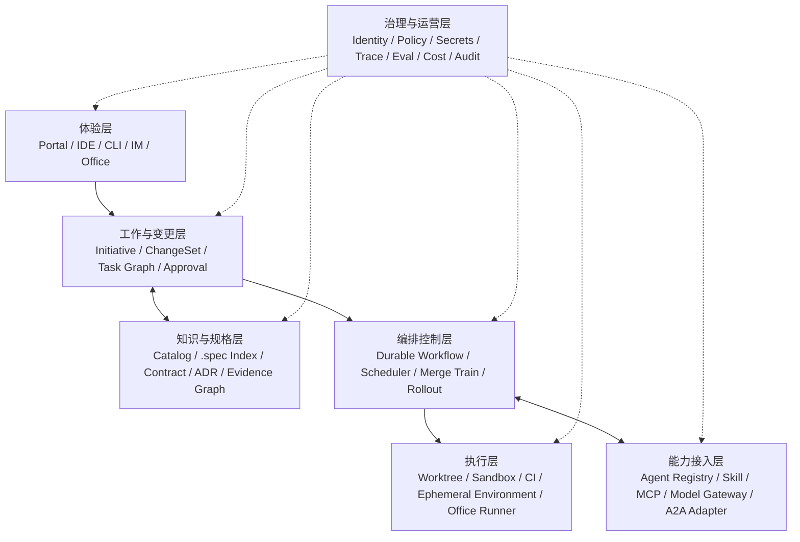
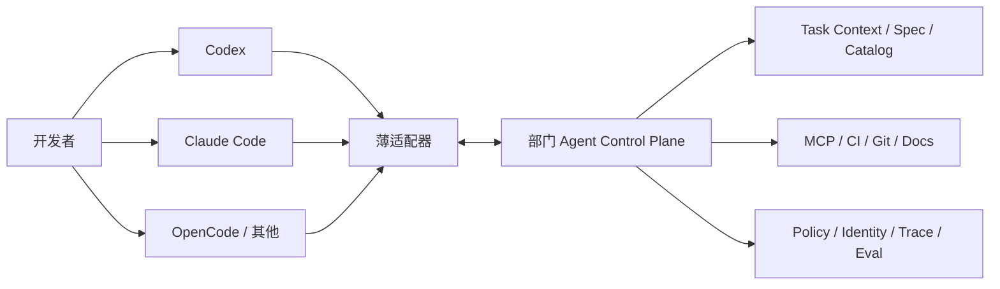

# 从“人人使用 Coding Agent”到部门级 ADD：Agent Control Plane 参考架构

> 面向：研发负责人、架构师、AI 平台团队、DevEx/研发效能团队  
> 基准日：2026-08-11  
> 核心场景：多个独立但相关的微服务仓库，每个仓库以 `.spec` 作为仓内设计权威来源，研发普遍使用 Codex、Claude Code 等 Agent 驱动开发。

## 一、技术结论

你们现在已经完成的是 **ADD 的个人执行层**：每个开发者可以让 Agent 理解单仓约束、修改代码、运行测试并提交 PR。缺失的是 **ADD 的组织协调层**：谁把一个业务意图拆成跨仓变更、如何共享上下文、怎样避免冲突、哪些制品分别由谁权威维护、怎样按依赖合并与发布，以及如何留下可运营和可审计的证据。

建议建设的不是一个“更大的全能 Agent”，而是一个部门级 **Agentic Delivery Control Plane（智能体交付控制平面，简称 ADCP）**。它不替代 Codex、Claude Code、Git、CI、工单或各 repo 的 `.spec`；它负责把这些工具和事实系统组织成一个可验证的跨仓交付闭环。

最关键的建模决策是：

> 跨仓需求不属于任何单一代码仓，因此它应拥有独立的一等实体 `ChangeSet`；各 repo 的 `.spec` 仍是服务局部设计的权威来源，并保存该 ChangeSet 在本仓的投影和实现说明。这里不是制造第二份“全局 `.spec`”，而是按作用域建立多级事实源。

## 二、为什么“父目录拉多个仓再 ADD”不是组织解法

把多个 repo 拉到一个父目录，确实能让某次 Agent 会话读取更多代码，但它只解决了 **临时上下文可见性**，没有解决下列问题：

1. 父目录不是可治理的业务对象，没有 owner、版本、审阅和生命周期；
2. 每位员工可能形成不同的目录组合和上下文快照，无法复现；
3. Agent 看到多个 repo，不代表知道 API、事件、数据库和部署的真实依赖；
4. 多仓修改仍会产生多个 PR，缺少前后依赖、兼容窗口和统一验收；
5. 会话里的计划和判断无法自动同步到各 repo 的 `.spec`；
6. 两个员工可同时对同一服务做语义冲突的修改，直到 PR 阶段才发现；
7. 父目录通常携带过宽文件、网络和凭证权限，放大 Agent 误操作范围；
8. 任务结束后，父目录中的临时文档没有明确的保留、归档和审计机制。

因此，多仓 checkout/worktree 应是 Control Plane 根据 ChangeSet 生成的 **执行视图**，而不是事实源本身。

## 三、权威来源不是一个文件，而是一组按作用域分工的事实源

“全局唯一权威来源”在单仓内可行，但一旦系统跨仓、跨团队、跨运行环境，就不能由一个文档承担所有权威。正确做法是为不同事实定义不同 authority。

| 事实类型 | 权威来源 | 说明 |
|---|---|---|
| 业务意图、范围、跨仓验收、发布策略 | ChangeSet / Initiative Registry | 跨仓变更的一等实体 |
| 服务职责、内部架构、仓内特性实现 | repo 内 `.spec` | 由该服务 owner 维护 |
| 同步 API 契约 | OpenAPI / Protobuf / IDL Registry | 机器可比较、可生成兼容性检查 |
| 事件契约 | AsyncAPI / Schema Registry | topic、message、版本和兼容规则 |
| 代码行为 | 代码 + 自动化测试 | 可执行事实，不能由文档单方面覆盖 |
| 服务、系统、领域和 owner | Software Catalog | 可由 repo metadata 汇聚，不等于运行时真相 |
| 部署版本和运行拓扑 | CD / Runtime Inventory | 当前真正运行了什么 |
| 决策原因 | ADR / Decision Record | 记录选择、替代方案和后果 |
| 工作状态 | 工单/项目系统 | 排期、负责人、状态和组织协作 |
| Agent 执行证据 | Trace / Evidence Store | prompt/config 版本、工具调用、测试、审批、成本 |

[Backstage Software Catalog](https://backstage.io/docs/features/software-catalog/)采用“metadata 与代码同库、中央采集展示”的方式管理组件和 owner；其文档也强调 Catalog 更适合作为聚合/缓存层，而不是所有现实状态的最终权威。[Catalog Graph](https://backstage.io/docs/features/software-catalog/creating-the-catalog-graph/) 这正是此处应采用的原则：**局部事实就近维护，中央控制面索引、关联并执行一致性检查。**

## 四、核心对象模型

### 1. Domain、System、Service

- `Domain`：业务域或组织能力边界，如支付、订单、会员；
- `System`：对外提供一组能力、内部可包含多个服务；
- `Service`：通常映射一个可独立构建/部署的 repo 或组件；
- `API/Event/Resource`：服务之间的边界和运行依赖。

这与 Backstage 的 Component、API、Resource、System、Domain 分层接近。[Backstage System Model](https://backstage.io/docs/next/features/software-catalog/system-model/)

### 2. Initiative 与 ChangeSet

- `Initiative`：较长周期的业务目标，可包含多个 ChangeSet；
- `ChangeSet`：一次可交付、可验收、可发布的跨仓变更事务；
- `RepoChange`：ChangeSet 在某个 repo 的局部实现单元；
- `ContractChange`：API/Event/Schema 变更及兼容性策略；
- `ReleaseWave`：按依赖和风险组织的上线批次；
- `Evidence`：测试、评审、审批、部署、回滚等证明。

一个 ChangeSet 至少要有：

```yaml
apiVersion: add.company/v1alpha1
kind: ChangeSet
metadata:
  id: PAY-2026-042
  title: 支付结果异步通知支持重试与幂等
  owner: team-payments
  createdBy: user:alice
spec:
  intent: 降低通知丢失并允许商户安全重放
  scope:
    systems: [payment-platform]
    repositories:
      - repo: payment-core
        role: producer
      - repo: merchant-gateway
        role: consumer
      - repo: ops-console
        role: operator-ui
  invariants:
    - 旧消费者在兼容窗口内继续工作
    - 同一通知重复投递不得产生重复入账
  contracts:
    - ref: asyncapi:payment-result/v2
      compatibility: backward
  acceptance:
    - contract-test: payment-result-v2
    - e2e: retry-and-dedup
    - slo: notification_success_rate >= 99.95%
  rollout:
    strategy: expand-migrate-contract
    featureFlag: payment_notify_v2
  risk: high
  approvals:
    - architecture
    - security
    - service-owners
status:
  phase: planned
  repoChanges: []
  evidence: []
```

这不是一份新的全局设计长文，而是一个结构化、可引用、可校验、有生命周期的变更清单。长篇设计仍可以挂在 `designRefs` 中；机器使用的是稳定 ID、关系和状态。

### 3. Task Envelope 与 Result Envelope

个人可以继续选择 Codex、Claude Code、OpenCode 或其他客户端，但 Control Plane 向它们下发统一的任务信封：

```yaml
kind: AgentTask
taskId: PAY-2026-042/payment-core/implement-producer
changeSet: PAY-2026-042
actor:
  requestedBy: user:alice
  delegatedTo: agent:codex/team-default@2026-08
workspace:
  repo: payment-core
  baseRef: main@4b2d...
  isolation: worktree
context:
  localSpec: .spec/
  linkedArtifacts:
    - changeset:PAY-2026-042
    - asyncapi:payment-result/v2
constraints:
  writablePaths: [src/notify, tests/notify, .spec/changes/PAY-2026-042]
  network: restricted
  maxDurationMinutes: 90
  maxCost: 20
verification:
  commands:
    - make lint
    - make test-notify
deliverables:
  - patch
  - local-spec-update
  - test-evidence
  - risk-note
```

结果信封不只说“完成了”，而要包含 base/head SHA、Diff 摘要、修改过的权威对象、测试命令与结果、契约差异、未解决风险、日志/trace 引用和人工审批请求。

## 五、建议的七层 Agent Control Plane



### 1. 体验层

提供统一任务入口和监督界面，但不要求统一所有员工的 Coding Agent。理想状态是：

- 开发者可从 Portal、IDE、CLI 或 IM 创建/接管任务；
- 同一个 ChangeSet 可看到所有 repo 的状态、Diff、阻塞和证据；
- 高风险动作显示“谁授权 Agent 做什么、将影响什么”；
- 人可以暂停、修改范围、重派 Worker 或接管本地 worktree。

LobeHub 的 Workspace/Project/Agent Group 和 Buzz 的 branch channel 都值得作为交互参考，但内部状态应来自结构化 ChangeSet，而非只来自聊天记录。

### 2. 工作与变更层

这是你们最缺的一层，负责：

- 将业务需求绑定到 Domain/System/Service；
- 自动影响分析并生成候选 repo/contract 清单；
- 把 ChangeSet 拆成 RepoChange DAG；
- 分配 owner、人类和 Agent；
- 管理状态、风险、审批、截止时间和升级路径；
- 汇总 PR、CI、部署和验收证据。

工单系统仍然是排期和责任状态源；ChangeSet 则是工程语义和跨仓交付状态源。两者用 ID 互链，不重复维护全文。

### 3. 知识与规格层

至少包含：

- Service Catalog：repo、服务、系统、域、owner、语言、构建命令、运行依赖；
- Spec Index：索引各 repo `.spec`，做 schema 校验和引用解析；
- Contract Registry：OpenAPI、Proto、AsyncAPI、事件 schema 及兼容规则；
- Decision Registry：ADR 与 ChangeSet 的关联；
- Evidence Graph：需求→设计→任务→commit→PR→测试→部署→运行指标的可追溯关系；
- Knowledge Retrieval：按用户权限动态检索，不把所有内容复制进单一向量库。

### 4. 编排控制层

核心流程使用持久工作流/状态机，不让一个 Agent 凭记忆维持数天事务：

- 任务 DAG、重试、超时、取消、补偿；
- 等待人工审批或外部 CI 回调；
- 多 repo PR 的依赖与 merge train；
- 发布波次、feature flag、扩缩容和回滚；
- 失败任务重派与上下文恢复。

Agent 负责理解、设计、实现和诊断；工作流负责状态、幂等、等待和责任边界。

### 5. 能力接入层

- `Agent Registry`：Codex、Claude Code、OpenCode、专用 Review Agent 等能力、版本和适用场景；
- `Skill Registry`：团队 SOP、脚本、模板、质量标准；
- `MCP Registry/Gateway`：Git、CI、Catalog、Docs、Issue、DB、浏览器等工具；
- `Model Gateway`：模型路由、数据域、预算、限流和降级；
- `A2A Adapter`：只有在跨平台/跨组织 Agent 需要目标级委派时使用。

MCP 解决 Agent 到工具，不承担 ChangeSet 编排；A2A 解决独立 Agent 间委派，不承担组织状态机；企业核心流程仍需要自己的工作与策略模型。

### 6. 执行层

- Workspace Manager：为每个 RepoChange 创建隔离 worktree/容器；
- Runner：本地、Kubernetes、云沙箱或员工机器上的受控执行；
- Credential Broker：按任务签发短期凭证；
- CI Adapter：统一读取和触发检查；
- Ephemeral Environment：按 ChangeSet 组装相关服务版本；
- Artifact Store：补丁、测试报告、截图、日志和构建产物。

Codex 已公开支持多 Agent、项目与 worktree 隔离，这适合做本地 Worker 控制台，但组织仍需在其上定义跨 repo 任务关系和事实源。[Introducing the Codex app](https://openai.com/index/introducing-the-codex-app/)

### 7. 治理与运营层

- 人、Agent、服务账号的独立身份与委派链；
- Policy-as-code 与策略决策/执行分离；
- 工具、数据、repo、路径、动作、时间和预算的最小权限；
- secret 代理和短期 token，不把员工长期密钥复制给 Agent；
- Prompt/Tool/Model/Agent 版本、trace、成本和质量指标；
- 离线评测、回放、canary、kill switch 和事故响应；
- 审计导出和保留策略。

[OPA](https://www.openpolicyagent.org/docs)一类策略引擎适合接收结构化输入并返回决策，但策略执行点仍需分布在 MCP Gateway、Workspace Manager、CI、Git 和办公连接器中。OpenTelemetry 提供跨服务 trace 的通用语义基础，GenAI 工具参数/结果可能包含敏感信息，默认不应无选择地全量记录。[OpenTelemetry Semantic Conventions](https://opentelemetry.io/docs/specs/semconv/) [GenAI Attributes](https://opentelemetry.io/docs/specs/semconv/registry/attributes/gen-ai/)

## 六、跨仓 ChangeSet 的标准执行协议

### 阶段 0：创建与分类

1. 从需求/事故/技术债创建 ChangeSet ID；
2. 标明业务 owner、技术 owner、风险、目标和非目标；
3. 关联工单，不复制工单中的排期与人员状态；
4. 定义可机器验证的验收和发布成功指标。

### 阶段 1：影响分析

Coordinator Agent 读取 Service Catalog、repo `.spec`、API/Event contracts、代码引用和运行依赖，输出候选影响图。所有推断带证据与置信度；服务 owner 确认后才锁定 scope。

### 阶段 2：契约先行

优先修改 API/Event/Schema 契约并运行兼容检查。跨仓变更默认采用 expand–migrate–contract：

1. 生产者先兼容新旧格式；
2. 消费者迁移并验证；
3. 观察兼容窗口；
4. 最后删除旧契约。

### 阶段 3：生成 repo 投影

每个相关 repo 新增轻量投影，例如：

```text
.spec/
├── service.yaml
├── architecture/
├── features/
├── contracts/
├── changes/
│   └── PAY-2026-042.yaml
└── releases/
```

投影包含中央 ChangeSet URI/摘要 hash、本仓职责、局部设计、修改路径、验收命令、依赖的其他 RepoChange 和完成状态。中央意图变更后，CI 可检测投影是否过期；repo owner 仍审批本仓实现。

### 阶段 4：隔离执行

Control Plane 为每个 RepoChange 创建独立 worktree/分支和最小权限任务。Coordinator 只传递 Task Envelope；Worker 不共享无限聊天历史，只通过结构化制品交换结果。

### 阶段 5：分层验证

按成本从低到高：

1. spec/schema 引用校验；
2. lint、类型和单元测试；
3. contract compatibility 和 consumer-driven contract tests；
4. 单服务集成测试；
5. 用候选 commit 组合临时环境；
6. 跨仓 E2E、迁移、回滚和安全测试；
7. 独立 Review Agent 与人类 CODEOWNER 审核。

### 阶段 6：合并与发布

RepoChange 形成 PR DAG：可以并行的 PR 并行，存在契约依赖的 PR 按顺序进入 merge queue。GitHub 的 merge queue 能验证一个 PR 与目标分支及队列前序 PR 的组合，但它的边界仍是单个 repo，因此 Control Plane 需要在其上维护跨 repo 的 merge train。[GitHub merge queue](https://docs.github.com/en/repositories/configuring-branches-and-merges-in-your-repository/configuring-pull-request-merges/managing-a-merge-queue)

CODEOWNERS 和 branch protection 继续生效；Agent 不能绕开 owner 审批。[GitHub CODEOWNERS](https://docs.github.com/en/repositories/managing-your-repositorys-settings-and-features/customizing-your-repository/about-code-owners) [Protected branches](https://docs.github.com/en/repositories/configuring-branches-and-merges-in-your-repository/managing-protected-branches)

### 阶段 7：闭环与归档

- ChangeSet 聚合最终 commit、PR、契约版本、测试、审批、部署和运行证据；
- 各 repo `.spec` 将临时 change 投影归档或折叠进稳定 feature/architecture/release 文档；
- 线上失败样本进入 eval dataset 或新的回归测试；
- 不再有效的临时上下文、凭证、worktree 和锁自动过期。

## 七、冲突不只有 Git 冲突

| 冲突类型 | 典型症状 | 应对机制 |
|---|---|---|
| 意图冲突 | 两个 ChangeSet 对同一业务规则给出相反要求 | 需求/领域 owner 仲裁，记录 Decision；不能由 merge 工具解决 |
| 规格冲突 | 中央意图与 repo 投影、不同 repo 的假设不一致 | schema、hash、引用和不变量检查 |
| 契约冲突 | producer/consumer 版本不兼容 | 契约注册、兼容检查、expand–migrate–contract |
| 代码冲突 | 同文件、同符号或相邻代码被修改 | 工作区隔离、早期 rebase、ownership、merge queue |
| 语义冲突 | 文件可自动合并，但行为相互破坏 | 影响图、跨分支测试、独立评审、临时环境 |
| 资源冲突 | 多 Agent 争用同一环境、数据库或发布窗口 | 租约、命名空间、沙箱、环境预约 |
| 发布冲突 | 多个变更组合后无法安全上线/回滚 | ReleaseWave、feature flag、组合验证、变更窗口 |

默认采用 **乐观协调 + 早期预警**，不要大面积硬锁仓库。只有数据库迁移、公共 schema、关键配置和共享测试环境等高冲突资源才使用短期租约；普通代码通过 owner、影响预测、worktree 和 merge queue 管理。

## 八、个人 Agent 与部门协作如何兼容

平台不应强迫员工放弃喜欢的客户端。正确关系是：



员工得到的是更强的上下文、工具和执行环境；部门得到的是统一的任务、权限、证据和质量。客户端可以不同，但以下内容必须可移植：

- Task/Result Envelope；
- repo 内 AGENTS.md、`.spec`、tests 和 commands；
- 组织 Skills 与 MCP schema；
- ChangeSet / Contract / Evidence 引用；
- trace 与政策事件。

不要试图同步不同 Agent 的全部隐藏上下文或 chain-of-thought。团队协作应交换 **目标、假设、决策、制品、测试和状态**。

## 九、项目运作和需求管理的改造

### 1. 需求不再直接变成“一个开发任务”

需求先形成 Initiative/ChangeSet，完成影响分析与验收定义后，再投影为各 repo 任务。项目经理关注业务状态，架构/服务 owner 关注变更图，开发者/Agent 关注 RepoChange。

### 2. 站会从“人汇报活动”转向“系统汇报异常”

平台自动展示：阻塞任务、过期契约、失败验证、长时间无进展、成本异常、等待审批、预计冲突。人只讨论需要判断和协调的例外。

### 3. 评审从“看 Agent 写了多少”转向“证据是否闭合”

PR 模板自动关联 ChangeSet、本仓投影、契约差异、测试、未验证项和上线计划。代码评审仍由 owner 承担，但评审入口拥有完整上下文。

### 4. 经验沉淀要进入正确介质

- 稳定工程规则 → tests、linters、policy、AGENTS.md；
- 专项流程 → Skill；
- 服务设计 → repo `.spec`；
- 跨仓意图 → ChangeSet；
- API/Event → contract；
- 选择原因 → ADR；
- 失败样本 → eval dataset；
- 临时讨论 → event log，完成后提炼而非永久塞进 prompt。

## 十、办公 Agent 如何复用同一基础设施

办公不需要另建一套 Agent 平台。它可以复用身份、策略、目录、工作流、trace、eval 和 Evidence，只替换领域对象和执行器：

| 研发对象 | 办公对应对象 |
|---|---|
| ChangeSet | Case / Campaign / Procurement / Hiring Process |
| RepoChange | 文档、邮件、表格、工单或业务系统的局部变更 |
| Contract test | Schema、审批规则、财务/法务校验 |
| Worktree | 草稿空间、文档副本、沙箱账号 |
| PR review | 文档审阅、邮件批准、职责分离 |
| Deployment | 发布、发送、提交、记账、更新系统 |
| Runtime evidence | 发送回执、审批记录、业务 KPI |

办公动作按风险分级：只读、草稿、可撤销写入、需单人批准、需职责分离、禁止 Agent 执行。相同 Task Envelope 必须携带用户身份、用途、数据范围、允许动作和到期时间。

## 十一、最小可行平台与建设顺序

### Phase 0：对象和规则（0—4 周）

- 定义 Domain/System/Service/ChangeSet/RepoChange/Contract/Evidence schema；
- 选 2 个真实跨仓特性回放，验证对象是否够用；
- 规定每类事实的 authority，禁止全文重复维护；
- 统一 ChangeSet ID、链接和状态机；
- 给现有 `.spec` 定义最小 schema 和引用规则。

退出条件：一位新成员只看 ChangeSet 与投影，就能说清跨仓范围、owner、契约、依赖和验收。

### Phase 1：目录和投影（第 2—3 个月）

- 建 Service Catalog 和 owner/依赖采集；
- 建轻量 Change Registry，可先用独立 GitOps repo + CI，不必立刻建复杂服务；
- 自动生成 repo `.spec/changes/<id>.yaml` 投影；
- 提供 Git/CI/Docs/Catalog 的只读 MCP；
- 统一 PR 模板和证据回填。

退出条件：跨仓需求不再依赖某个人的父目录和聊天记录。

### Phase 2：协调执行（第 3—6 个月）

- Workspace Manager 创建多 repo worktree；
- 统一 Task/Result Envelope，接 Codex/Claude Code/OpenCode adapter；
- 实现 RepoChange DAG、契约检查、临时集成环境；
- 加冲突预警和跨 repo merge train；
- 建短期凭证、审批和最小权限。

退出条件：至少一个高频跨仓场景能从 ChangeSet 到多 PR、集成测试和发布证据闭环运行。

### Phase 3：平台化运营（第 6—9 个月）

- Agent/Skill/MCP registry；
- 模型网关和按质量/成本/数据域路由；
- Trace、Eval、成本、回放与 canary；
- 基于历史失败更新 tests/Skills/Policy；
- 将办公场景接入同一控制面。

退出条件：可以回答“哪个 Agent 代表谁、基于哪个版本、访问了什么、改变了什么、为何被允许、结果如何”。

### Phase 4：选择性 Mesh（第 9—12 个月及以后）

只有跨部门/跨平台自治 Agent 已经真实存在时，再引入 A2A、能力路由和 federated registry。部门内部优先使用统一 Task API/事件总线和确定性工作流，避免过早协议化所有内部调用。

## 十二、衡量是否真的提升了团队效率

不要只统计 Agent 调用量或生成代码量。按 ChangeSet 测量：

- 从需求 ready 到所有必要 PR ready 的墙钟时间；
- 人类主动分钟数和等待时间；
- 首次跨仓集成通过率；
- 契约破坏在 merge 前被发现的比例；
- PR 返工轮次、重开率和回滚率；
- 冲突发现提前量；
- ChangeSet 到 commit/test/deploy 的 trace 完整率；
- 每个被接受 ChangeSet 的模型、计算和评审全成本；
- Agent 产生缺陷与人工产生缺陷的严重度/逃逸率；
- 平台异常、权限拒绝、人工升级和 kill switch 次数。

评价多 Agent 时必须与“一个强 Agent + 好工具”对照。只有净节省超过协调、上下文复制、评审和冲突成本时才保留多 Agent 拓扑。

## 十三、关键反模式

1. 把一个中央 `.spec` 变成所有系统设计的第二份副本；
2. 让某个“主仓”拥有其他服务的业务权威；
3. 让 Coordinator Agent 直接使用所有 repo、生产和办公系统的万能权限；
4. 用群聊/共享记忆替代 ChangeSet、contract 和 test；
5. 多 Agent 修改同一工作副本；
6. 把 MCP server 列表当作平台架构；
7. 用 A2A 取代普通 API、事件总线或工作流状态机；
8. 先建设大而全 Agent Mesh，再寻找真正跨域的任务；
9. 只做可观测性，不做可回放评测和业务结果闭环；
10. 允许 Agent 自动合并高风险跨仓变更，仅因为所有测试为绿；
11. 把供应商私有会话和记忆作为唯一组织知识；
12. 让所有员工各自维护一套 MCP、Skill、密钥和项目规则。

## 十四、最终建议

先把平台命题收敛为四个可交付能力：

1. **Spec Graph**：知道域、系统、服务、契约、owner 和 `.spec` 在哪里；
2. **Change Graph**：知道一个业务变更影响哪些 repo、PR、契约和发布波次；
3. **Execution Fabric**：安全地给不同 Coding Agent 创建隔离工作区、上下文和工具；
4. **Evidence & Governance**：知道谁授权、Agent 做了什么、如何验证、何时合并和上线。

这四个能力一旦存在，Codex、Claude Code、OpenCode、LobeHub 或未来新的 Agent 都只是可替换的 Worker/客户端。组织真正积累的是可移植的规格、契约、工作流、评测、身份和证据，而不是某个工具中的聊天历史。
