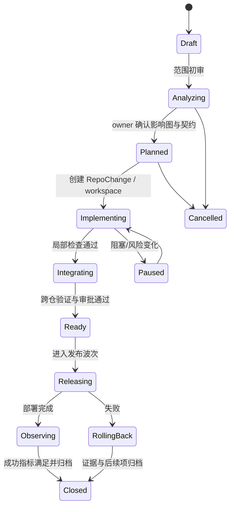
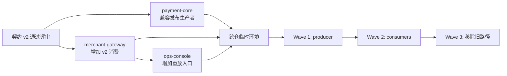

# 跨仓 ADD 运行手册：从一个业务需求到多仓发布

> 这是一份可用于内部 RFC 和试点的操作模型。它假设每个 repo 已维护 `.spec`，开发者已普遍使用 Codex、Claude Code 等 Coding Agent。

## 一、一句话方案

不要在某位员工的父目录里创建“临时超级仓”。为每个跨仓特性创建独立的 `ChangeSet`，由 Coordinator 维护跨仓意图和依赖；每个 repo 保留自己的 `.spec` 权威，并维护一个可校验的 `RepoChange` 投影。多仓代码仅在隔离工作区中临时组合，最终通过契约测试、PR DAG、临时集成环境和发布波次闭环。

## 二、范围与术语

### ADD

本文将 ADD 理解为 Agent-Driven Development：人定义意图、约束、验收和责任，Agent 参与分析、设计、实现、验证和文档同步。ADD 不表示跳过设计、测试、评审或 owner 责任。

### ChangeSet

跨一个或多个仓库、可以统一验收和发布的工程变更单元。它不是分支、PR、工单或设计文档的别名，而是关联这些制品的上层事务。

### RepoChange

ChangeSet 在单个 repo 内的实现单元。一个 RepoChange 对应一个明确 owner、base SHA、工作区、分支/PR、局部 spec 和验收集合。

### Projection

中央 ChangeSet 在某 repo `.spec/changes/` 下的轻量投影。它不复制完整跨仓设计，只保存稳定引用、摘要 hash、本仓职责和局部实现。

## 三、三条权威规则

1. **跨仓意图由 ChangeSet 权威维护**：目标、全局不变量、成员 repo、跨仓验收、发布和回滚。
2. **仓内实现由 repo `.spec` 权威维护**：本服务的设计、代码边界、测试、迁移和局部风险。
3. **接口行为由 machine-readable contract 权威维护**：OpenAPI、Proto、AsyncAPI、JSON Schema 或数据库迁移合同。

任何信息若在两个地方全文重复，必须指定一个 authority，并让另一处只保留引用、摘要和本地增量。

## 四、建议目录结构

### 1. 部门级 Change Registry

早期可以是一个有明确 owner 的独立 GitOps 仓库；成熟后可迁移为服务和图数据库，但 Git 中的可审阅 schema 仍可保留。

```text
engineering-change-registry/
├── domains/
│   ├── payments.yaml
│   └── commerce.yaml
├── systems/
│   └── payment-platform.yaml
├── changes/
│   └── 2026/
│       └── PAY-2026-042/
│           ├── changeset.yaml
│           ├── design.md
│           ├── decisions/
│           ├── rollout.yaml
│           └── evidence-index.yaml
├── contracts/
│   └── pointers.yaml
├── policies/
├── schemas/
└── templates/
```

这个仓库并不是“不属于任何项目的 `.spec`”。它属于部门级 **变更管理产品**，owner 是平台/架构治理团队，边界仅限跨仓元数据和全局设计，不接管各服务文档。

### 2. 服务 repo

```text
payment-core/
├── .spec/
│   ├── service.yaml
│   ├── architecture/
│   ├── features/
│   ├── contracts/
│   ├── changes/
│   │   └── PAY-2026-042.yaml
│   └── releases/
├── AGENTS.md
├── CODEOWNERS
├── src/
└── tests/
```

`AGENTS.md` 写稳定执行约束；`.spec` 写产品和架构事实；tests 写可执行验收；CODEOWNERS 写责任。不要把四者混成一个无限增长的 prompt 文件。

## 五、RepoChange 投影格式

```yaml
apiVersion: add.company/v1alpha1
kind: RepoChange
metadata:
  changeSet: PAY-2026-042
  repository: payment-core
  projectionOf: add://changes/PAY-2026-042
  sourceRevision: sha256:8d9a...
spec:
  role: 产生 payment.result.v2 事件并保留 v1 兼容投递
  localDesign: .spec/features/payment-notification-v2.md
  affectedPaths:
    - src/notification/**
    - tests/contract/**
  dependsOn:
    - contract: asyncapi:payment-result/v2
  blocks:
    - repoChange: PAY-2026-042/merchant-gateway
  acceptance:
    - make lint
    - make test-contract
  rollout:
    wave: 1
    featureFlag: payment_notify_v2_producer
status:
  phase: implementation
  pullRequest: null
  evidence: []
```

投影由平台生成骨架，由 repo owner 和执行 Agent 补充局部设计。CI 校验：中央对象存在、`sourceRevision` 未过期、repo 名称匹配、依赖可解析、验收命令存在。

## 六、标准生命周期



状态转换由确定性规则控制。Agent 可以建议转换，但不能私自跳过审批、验证或观察窗口。

## 七、一次完整的跨仓变更流程

### 1. Intake

输入：需求链接、业务 owner、目标、截止时间、风险。

Coordinator 输出 ChangeSet 草案，禁止立即开始改代码。草案必须明确：

- in-scope / out-of-scope；
- 成功指标；
- 不能破坏的不变量；
- 可能涉及的域、系统、repo 和 contract；
- 已知数据迁移、发布和回滚约束。

### 2. Impact Analysis

Agent 从 Catalog、`.spec`、契约、代码引用和部署图中构建候选影响图。每条边包含来源：

```text
payment-core --publishes--> payment.result.v1
merchant-gateway --consumes--> payment.result.v1
ops-console --calls--> merchant-gateway:/replay
```

推断边不能直接当事实边；服务 owner 确认后才升级为 accepted。

### 3. Design & Contract

跨仓设计只写：全局流程、契约、时序、不变量、失败与回滚。各服务内部算法和文件结构写入各自 `.spec`。

契约变更先于代码任务生成。每个 breaking change 必须声明：

- 兼容模式；
- 生产者/消费者先后顺序；
- 双写/双读或适配器；
- 旧版本停止条件；
- 数据迁移和回滚能力。

### 4. Planning

平台将变更图转换为 RepoChange DAG：



只有真正独立的节点并行。多个 Agent 不应因为“可以并行”而同时触碰同一契约和同一核心模块。

### 5. Workspace Provisioning

每个 RepoChange 创建：

- 固定 base SHA；
- 独立 worktree/容器；
- 唯一 branch 名，如 `add/PAY-2026-042/producer`；
- 只包含必要 repo 的上下文；
- 只允许必要路径和工具；
- 到期的短期凭证；
- 统一 task ID 和 trace ID。

如果一个 Worker 需要只读查看其他 repo，优先通过 Catalog/Code Search/MCP resource 提供按版本快照；只有需要运行跨仓组合时才 checkout 多 repo。

### 6. Implementation

Worker 在开始前必须回传 plan，包含将修改的 spec、contract、code 和 tests。执行中周期性写结构化 checkpoint：已完成、下一步、假设、失败、修改文件和剩余预算。

Coordinator 不应把所有 Worker 的聊天互相广播，只传播：

- 已批准的全局决策；
- contract 新版本；
- RepoChange 状态；
- 可消费 artifact；
- 阻塞和风险。

### 7. Validation

Repo 内验证通过后，Control Plane 以候选 commit 组合临时环境。组合必须由 manifest 固定：

```yaml
kind: IntegrationCandidate
changeSet: PAY-2026-042
repos:
  payment-core: 91be2d1
  merchant-gateway: a82c883
  ops-console: 22bd441
contracts:
  payment-result: v2.0.0-rc3
environment: ephemeral/PAY-2026-042/17
```

这样失败可以复现，不依赖“某人电脑上当时拉了哪些分支”。

### 8. Review & Merge

每个 PR 页面展示：

- ChangeSet 和本 RepoChange；
- 上下游 PR 状态；
- contract diff 和兼容结论；
- 本仓与跨仓测试证据；
- 未验证项；
- rollout wave；
- Agent/模型/Skill/工具版本；
- 人工审批人。

repo merge queue 负责单仓并发安全；跨仓 Coordinator 只在依赖满足后把对应 PR 放入队列。

### 9. Release & Observe

按 ReleaseWave 发布，不要求所有 repo 同时合并和同时部署。所有上线动作关联 ChangeSet，观察 SLO/业务指标后再推进下一 wave。失败时由预定义补偿执行回滚、关闭 feature flag 或恢复旧 consumer。

### 10. Close & Learn

ChangeSet 关闭前：

- 所有 RepoChange 已完成/明确取消；
- 中央与 repo spec 已同步稳定事实；
- 临时 projection 已归档；
- 旧 contract 删除条件已执行或转为后续项；
- 失败和人工纠正进入 tests/evals/skills/policy；
- workspace、token、租约已过期；
- 证据可按 ChangeSet ID 检索。

## 八、角色与责任

| 角色 | 负责 | 不负责 |
|---|---|---|
| Business Owner | 业务目标、优先级、成功指标 | 服务内部设计 |
| Change Owner | ChangeSet 完整性、跨团队协调、关闭条件 | 自动批准所有 repo |
| Domain Architect | 跨系统不变量、契约和演进策略 | 每行代码实现 |
| Service Owner / CODEOWNER | repo `.spec`、实现、PR 和服务风险 | 其他 repo 的内部决策 |
| Coordinator Agent | 影响分析、任务 DAG、状态汇总、冲突预警 | 最终业务/安全责任 |
| Worker Agent | 在 Task Envelope 内实现和验证 | 扩大 scope、绕过 owner、直接发布高风险变更 |
| Review Agent | 独立检查、测试和风险提示 | 替代人类 CODEOWNER |
| Platform Team | Control Plane、schema、runner、policy、trace | 代替所有领域团队维护知识 |

## 九、冲突预防协议

### 1. Change Intent Reservation

当 ChangeSet 进入 Planned 时，对核心 contract、schema、迁移目录、共享模块建立软预约。新 ChangeSet 命中时立即提醒双方，而不是阻止工作。

### 2. Workspace Lease

对共享临时环境、数据库迁移序号、发布窗口使用短期硬租约。租约有 owner、TTL 和自动释放，不能变成长久人工锁。

### 3. Semantic Hotspot Detection

平台根据活动 RepoChange 的 `affectedPaths`、符号索引、contract 和数据库对象计算潜在重叠。命中同文件不一定冲突；命中同业务规则或 contract 即使文件不同也应升级。

### 4. Continuous Rebase / Replan

长任务定期比较 base SHA 与主干。如果依赖变化，Coordinator 先重新验证计划与 spec，再决定 rebase、重做或等待，不能只让 Agent 机械解决文本冲突。

## 十、最小 API 与事件

### API

```text
POST   /changesets
GET    /changesets/{id}
POST   /changesets/{id}/analyze-impact
POST   /changesets/{id}/plan
POST   /repo-changes/{id}/provision-workspace
POST   /repo-changes/{id}/dispatch
POST   /repo-changes/{id}/submit-result
POST   /changesets/{id}/integration-candidates
POST   /changesets/{id}/approvals
POST   /changesets/{id}/release-waves/{wave}/execute
GET    /changesets/{id}/evidence
```

### 事件

```text
changeset.created
impact.proposed
scope.approved
contract.changed
repo_change.created
workspace.provisioned
agent_task.started
agent_task.checkpointed
agent_task.completed
validation.failed
pull_request.ready
conflict.predicted
approval.recorded
merge.completed
deployment.completed
rollback.started
changeset.closed
```

事件至少携带：event ID、ChangeSet ID、RepoChange ID、actor、delegator、trace ID、timestamp、artifact refs、结果和策略决定。可以使用现有消息总线或数据库 outbox；不需要为了“Agent 化”强制采用 Nostr。

## 十一、Control Plane 的最小内部服务

### 第一批必须有

1. Change Registry；
2. Service/Spec/Contract Index；
3. Impact Analyzer；
4. Workspace Manager；
5. Task Dispatcher + Codex/Claude/OpenCode adapters；
6. Evidence Collector；
7. Policy / Identity / Credential Broker；
8. CI/Git/Issue/Docs MCP Gateway；
9. Integration Candidate Builder；
10. Portal / ChangeSet View。

### 可后置

- 自研模型网关；
- 通用 A2A；
- 自建聊天/IM；
- 自建 Git forge；
- 全企业知识图谱；
- Agent reputation；
- 完全自治的动态 Agent marketplace。

## 十二、90 天试点建议

### 第 1—2 周：回放

选两个已完成的跨仓特性和一个正在进行的特性，手工创建 ChangeSet/RepoChange，验证 schema 能否表达真实依赖、契约、审批和发布。

### 第 3—4 周：GitOps Registry

建立 Change Registry repo、schema 校验、ChangeSet ID、repo projection 生成器和 PR 模板。此阶段不做 Agent 自动编排。

### 第 5—8 周：单一 Coordinator

开发只读影响分析 Agent，接 Catalog、代码搜索、`.spec` 和 contract。由人确认影响图后，自动生成 RepoChange 和 worktree；仍由员工手工选择 Codex/Claude Code 执行。

### 第 9—12 周：闭环一个场景

接 CI、临时集成环境、证据回填和跨 repo PR DAG。选择低风险但真实的三仓变更，跑完一次从需求到发布的闭环，对照原流程测量主动时间、周转时间、返工和冲突发现提前量。

## 十三、试点验收门槛

满足以下条件才继续平台化：

- ChangeSet/RepoChange 没有造成明显的文档重复负担；
- 新成员可以复现任一 Agent 任务的输入、base 和验收；
- 跨仓冲突和契约问题比原流程更早暴露；
- 人工评审时间没有因 Agent 大量 Diff 而上升；
- 至少 90% 的关键 artifact 能从 ChangeSet 追溯；
- 无共享万能 token，无 Agent 绕过 CODEOWNER/branch protection；
- 试点的净主动时间或交付周转有可测改善；
- 平台故障时仍可降级到正常 Git/CI/人工流程。

## 十四、最终判断

跨仓 ADD 的关键不是让一个 Agent 同时打开更多目录，而是让组织拥有一个稳定的 **变更协议**。目录是执行细节，ChangeSet 才是协作对象；聊天是交互，制品和事件才是团队记忆；模型是 Worker，事实源、契约、状态机和责任边界才是基础设施。
