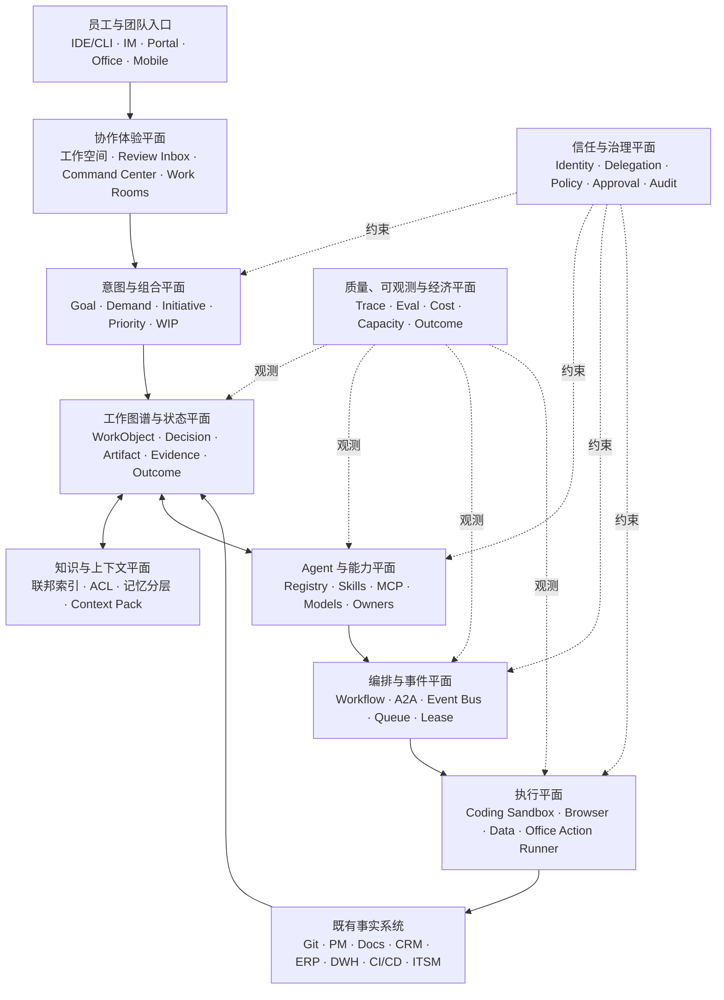
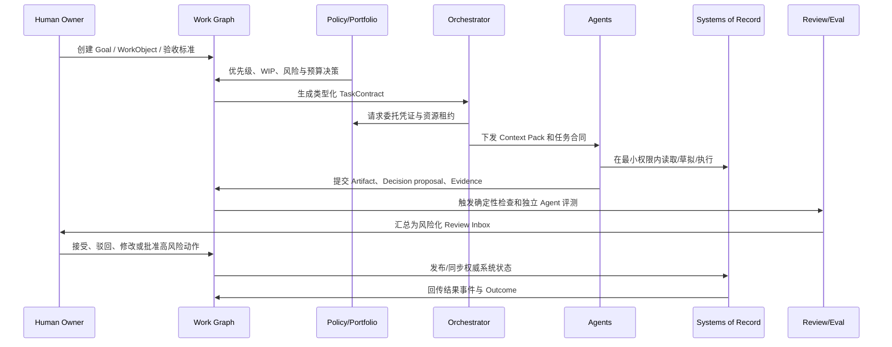

# Enterprise Agent Work Fabric：企业人机协作基础设施最终方案

> 基准日：2026-08-11  
> 定位：覆盖研发、项目、知识、数据、客户、运维与职能办公的企业级 Agent 工作基础设施  
> 简称：EAWF（企业智能体工作织网）

## 一、方案一句话

**EAWF 不是另一个超级 Agent，而是一层位于员工入口、Agent、现有 SaaS/研发工具和企业治理之间的“工作语义与控制层”：用统一工作图谱表达目标、任务、制品、决策、证据和结果，用可撤销委托驱动 Agent 行动，用策略、评测和审计把概率型执行收敛为可管理的企业过程。**

它保留员工对 Codex、Claude Code、OpenCode、Qoder、TRAE、LobeHub 或办公 Agent 的选择，也不取代 Git、Jira、飞书/Teams、Confluence、CRM、ERP、数据平台和 CI/CD；它让这些入口和事实系统围绕同一工作对象协同。

## 二、为什么已有 Agent 平台仍不能直接解决全部问题

当前产品已明显向企业控制平面收敛：

- [OpenAI Workspace Agents](https://help.openai.com/en/articles/20001143/)已经覆盖组织内创建、测试、发布、权限、应用连接、定时与 API 触发；
- [Microsoft Agent 365](https://learn.microsoft.com/en-us/microsoft-agent-365/overview)将跨来源 Agent 的注册、身份、安全与管理明确定位为控制平面；
- [Gemini Enterprise](https://cloud.google.com/gemini-enterprise/agents)强调发现、构建、市场、集中治理及 A2A 互操作；
- [ServiceNow AI Agent Fabric](https://www.servicenow.com/platform/action-fabric.html)通过 MCP、A2A 和工作流连接自有与第三方 Agent；
- [Atlassian Teamwork Graph](https://www.atlassian.com/platform/teamwork-graph)把人员、目标、工作、知识与外部应用关系提供给不同 Agent；
- LobeHub、Coze Studio/Loop 和 Buzz 分别展示了团队 Agent 空间、构建—运行—评测闭环，以及项目/分支/事件协作的产品方向，详见 [08-lobehub-coze-buzz-case-studies.md](./08-lobehub-coze-buzz-case-studies.md)。

这些平台证明方向成立，但企业仍需要自己的语义层，因为业务对象、职责分离、风险等级、权威来源、质量门槛和结果定义不可能完全由单一模型厂商或 SaaS 供应商决定。EAWF 的职责是成为供应商中立的“组织协议层”，不是重造所有应用。

## 三、设计原则

1. **目标优先于会话**：会话是交互记录，工作对象才有生命周期、owner 和结果。
2. **联邦事实源**：内容留在最适合的权威系统，中央只保存必要的索引、关系、快照和控制状态。
3. **共享制品，不共享隐式思维**：跨 Agent 交接使用类型化契约、制品、事件和证据。
4. **委托而非冒充**：每次行动都能区分请求人、责任人、执行 Agent、实际身份和授权来源。
5. **概率推理，确定性约束**：模型可以提出计划；权限、资金、生产变更、数据边界和发布门禁由确定性策略执行。
6. **风险决定自治度**：低风险可自动闭环，高风险必须分步批准或仅生成草稿。
7. **结果而非活动**：Agent 调用、token、代码行和文档数是成本/活动，不是业务价值。
8. **可替换执行端**：Codex、Claude Code 或办公 Agent 是客户端/执行器，不是企业语义的唯一所有者。
9. **先做薄控制层**：优先连接现有系统，避免一开始打造全能门户、统一知识湖或自研模型平台。

## 四、统一对象模型：Work Graph

### 1. 十一个基本原语

| 原语 | 含义 | 典型例子 |
|---|---|---|
| `Goal` | 希望改变的业务/组织结果 | 降低支付失败率、缩短入职周期 |
| `WorkObject` | 有生命周期的工作实体 | Initiative、ChangeSet、Case、Incident、Campaign |
| `TaskContract` | 可委托、可验收的最小工作合同 | 目标、输入、边界、预算、时限、验收 |
| `Actor` | 人、Agent、服务或团队 | user:alice、agent:code-reviewer、team:pay |
| `Delegation` | 谁授权谁在何范围内做什么 | Alice 委托 Agent 只读分析三份合同 |
| `Capability` | 可调用的技能、工具、数据或模型 | GitHub MCP、SQL skill、模型版本 |
| `Artifact` | 工作产生或使用的制品 | PR、文档、表格、合同、图表、补丁 |
| `Decision` | 被接受的选择及其依据 | 采用方案 B、延迟发布、批准退款 |
| `Evidence` | 支持验收或决策的可复核事实 | 测试结果、查询快照、审批、用户反馈 |
| `Event` | 状态变化或外部发生的事实 | PR 合并、会议结束、告警触发、合同签署 |
| `Outcome` | 已实现的结果及衡量窗口 | 缺陷率下降、回款周期缩短 |

`WorkObject` 不能退化成一个无类型 JSON 大桶。不同类型必须拥有不同状态机和策略。例如：

- `ChangeSet`：proposed → designed → implementing → verified → released → realized；
- `Incident`：detected → triaged → mitigated → resolved → reviewed；
- `CustomerCase`：received → qualified → committed → fulfilled → confirmed；
- `Decision`：draft → proposed → accepted/rejected → effective → superseded。

### 2. 权威来源按事实类型划分

| 事实 | 权威系统 | EAWF 中保存什么 |
|---|---|---|
| 代码、repo 内设计 | Git 与 `.spec` | 引用、版本、关系、验证状态 |
| 工单与排期 | 项目管理系统 | 稳定 ID、状态映射、目标关系 |
| 文档正文 | Wiki/网盘/文档系统 | ACL 感知索引、摘要、版本引用 |
| 客户与合同 | CRM/合同系统 | 授权引用、承诺与风险关系 |
| 指标与数据 | 指标层/数据仓库 | 口径 ID、查询/快照、决策引用 |
| 运行状态 | CI/CD、CMDB、可观测平台 | 部署版本、事件、SLO 证据 |
| Agent 运行 | Trace/Evidence Store | 配置、委托、调用、成本、输出、审批 |

这解决了“是不是还要维护一份不属于任何仓库的 `.spec`”的疑问：跨域层确实需要独立对象，但它不是复制所有局部设计的第二份总文档，而是保存跨域目标、关系、状态和验收；局部事实仍由原系统维护。

## 五、九个架构平面

### 1. 意图与组合平面

管理 Goal、Demand、Initiative、优先级、预算、依赖和 WIP。它的关键能力是阻止“Agent 便宜，所以所有想法都同时开工”。每项工作在启动前至少回答：目标是什么、谁负责、证据是什么、预期结果如何衡量、会占用哪些人类评审能力。

### 2. 工作图谱与状态平面

这是 EAWF 的核心。它通过稳定 ID 和关系连接现有系统中的对象，维护类型化状态机和变更日志。图谱不是全文数据湖，也不是为了做炫目的知识图谱；首先服务于影响分析、依赖发现、权限计算、状态聚合和审计。

### 3. 知识、上下文与记忆平面

按四层管理：

- 会话记忆：短期、可丢弃；
- 个人记忆：用户可见、可编辑、不能自动成为团队事实；
- 工作对象记忆：由被接受的决策、制品和事件组成；
- 组织知识：有 owner、版本、ACL、保留和失效规则。

向 Agent 下发的是任务相关 `Context Pack`，包含引用、版本和权限证明，而不是全量企业知识。

### 4. Agent 与能力平面

维护 Agent Registry、Skill/Plugin Registry、MCP Server Catalog、模型目录和兼容性。每个 Agent 必须有：

- 唯一身份、owner/sponsor 和用途；
- 允许的触发方式与服务对象；
- 工具、数据、模型、版本与供应链来源；
- 风险等级、最大自治级别和默认审批策略；
- 评测集、质量阈值、SLO、成本预算；
- 发布、变更、到期、暂停和退役流程。

### 5. 编排与事件平面

确定性工作流负责稳定流程；Agent 负责模糊理解、计划和内容生成。内部优先使用事件总线和工作流引擎；MCP 用于 Agent 调工具/数据；A2A 仅在独立 Agent 系统间需要发现、委托和制品交换时使用。不要让所有内部函数调用都绕成“Agent 对话”。

关键能力包括：队列、重试、幂等、补偿、超时、资源租约、并发限制、人工任务、长流程暂停/恢复和事件重放。

### 6. 执行平面

不同场景使用不同隔离执行器：

- Coding：临时 worktree/容器、路径白名单、网络策略、测试命令；
- 数据：只读语义层、受控 SQL、结果快照、隐私策略；
- 办公：文档/表格/演示沙箱，发布前审批；
- 浏览器与 SaaS：细粒度动作许可、页面/对象范围、写操作确认；
- 生产运维：JIT 权限、Runbook、双人批准、回滚点。

### 7. 协作体验平面

用户可以保留习惯入口，但共享四种体验：

- `My Delegations`：我委托了什么、等待什么、花了多少；
- `Review Inbox`：按风险、优先级和 SLA 合并评审，而不是被每个 Agent 单独打扰；
- `Work Room`：围绕一个 Initiative/ChangeSet/Case/Incident 展示统一时间线、成员、Agent、制品和决策；
- `Command Center`：看组合级吞吐、阻塞、风险、成本与结果，而不是逐条监控思维过程。

Buzz 的“项目包含多个 repo、分支即频道、事件形成共享时间线”适合成为 Work Room 的工程场景参考；LobeHub 的团队空间与 Agent 共享适合个人/团队入口参考；Coze Loop 的 trace/eval 适合质量运营参考。

### 8. 信任与治理平面

Agent 必须是一等身份，但不能获得模糊的“像员工一样”权限。[NIST AI Agent Standards Initiative](https://www.nist.gov/artificial-intelligence/ai-agent-standards-initiative)已把 Agent 身份、授权、安全评估和互操作列为重点；[Microsoft 的 Agent 最小权限指南](https://learn.microsoft.com/en-us/security/zero-trust/sfi/least-privilege-for-ai-agents)同样要求专用身份、owner、JIT 权限、可撤销凭证和完整审计。

推荐统一动作风险级别：

| 级别 | 例子 | 默认控制 |
|---|---|---|
| L0 观察 | 搜索、读取公开/已授权信息 | 自动，记录访问 |
| L1 草拟 | 生成文档、补丁、回复草稿 | 自动，不能对外生效 |
| L2 可逆内部写 | 建任务、更新草稿、创建分支 | 策略允许后自动，可撤销 |
| L3 重要内部变更 | 合并代码、改主数据、发内部公告 | owner/规则审批，完整证据 |
| L4 外部或生产动作 | 发布、客户回复、生产配置、合同流转 | 分步审批、JIT 权限、回滚 |
| L5 高影响/不可逆 | 付款、签署、解雇、删除关键数据 | Agent 仅准备材料；人类双重授权执行 |

委托凭证至少绑定：`principal`、`agent`、`purpose`、`workObject`、`allowedActions`、`resourceScope`、`validUntil`、`budget`、`approvalPolicy`。

### 9. 质量、可观测与经济平面

传统日志不足以解释概率型、多步骤 Agent。[微软关于 Agentic AI 可观测性的指南](https://learn.microsoft.com/en-us/security/zero-trust/sfi/observability-ai-systems)明确提出需要把 tracing、evaluation 和 governance 结合。EAWF 应记录：

- 任务、Agent/模型/提示/Skill/工具版本；
- 输入引用与权限快照，而非无边界复制敏感内容；
- 工具调用、策略决策、审批、异常和人工接管；
- 结果、验收证据、返工、事故与业务 Outcome；
- token、模型费用、运行时间、环境成本和人类评审时间。

评测分为发布前黄金集、历史回放、合成场景、对抗测试、生产抽样和结果反馈。评测对象应是“任务是否完成且遵守约束”，而不仅是最终文本相似度。

## 六、五类 Agent 角色

| 角色 | 归属与用途 | 权限特征 | 典型生命周期 |
|---|---|---|---|
| Personal Delegate | 服务单个员工，理解个人偏好 | 默认继承用户的受限委托，不能扩大权限 | 随用户存在，记忆可管理 |
| Team/Domain Agent | 代表某个领域能力，如支付知识、HR 政策 | 独立身份、团队 sponsor、明确服务边界 | 发布、版本、SLO、退役 |
| Process Agent | 推动固定业务流程 | 状态机清晰，动作范围窄 | 与流程版本绑定 |
| Assurance Agent | 独立审查代码、数据、合规、风险 | 通常只读，不能修改被审对象 | 与评测策略绑定 |
| Platform Agent | 路由、编排、资源与故障处理 | 无业务最终决策权 | 平台运维生命周期 |

不建议用“CEO Agent、经理 Agent、工程师 Agent”直接复制组织结构。角色名称不能替代权限、输入、验收和责任定义。

## 七、端到端闭环

这条闭环让 Coding、办公和运营共享同一骨架：不同的是 WorkObject 类型、执行器和策略，不同的不是治理原则。

## 八、关键产品模块

最小可行 EAWF 不是几十个微服务，建议先实现以下八项：

1. **Work Registry/Graph**：统一 ID、关系、状态机、owner、事件；
2. **Agent & Capability Registry**：Agent、Skill、MCP、模型、版本、owner、风险；
3. **Delegation & Policy Service**：身份、用途绑定、短时令牌、审批、吊销；
4. **Context Broker**：从权威系统组装最小 Context Pack，保持引用与 ACL；
5. **Task Orchestrator**：队列、暂停/恢复、重试、补偿、人工步骤、资源租约；
6. **Execution Runners**：编码、数据、浏览器、文档和受控 SaaS 动作；
7. **Evidence/Eval Store**：trace、测试、评测、审批、快照、成本；
8. **Work Room + Review Inbox**：统一协作与人类注意力入口。

首期不做：自研基础模型、替换全部办公套件、复制所有文档、全公司统一超级聊天入口、让 Agent 任意互聊、构建复杂“数字员工组织图”。

## 九、与现有 ADD 的关系

你们已有的 repo 内 `.spec` 和个人 Coding Agent 是很好的“局部设计与执行层”。升级关系如下：

| 当前能力 | EAWF 中的定位 | 需要补充 |
|---|---|---|
| repo `.spec` | Service/Repo 范围权威设计 | 稳定引用、变更投影、冲突检测 |
| Codex/Claude Code | Personal Delegate 或 Coding Runner | TaskContract、权限、证据回传 |
| PR/CI | Artifact 与确定性 Evidence | 与 WorkObject、跨仓 DAG、结果关联 |
| 项目工单 | 工作入口之一 | Goal、Decision、跨系统状态机 |
| Wiki/会议/IM | 知识与事件来源 | 接受机制、ACL、失效、工作对象关系 |

因此，ADD 的最终形态不是“所有人都让 Agent 写代码”，而是：**需求和决策机器可读、任务可委托、执行可隔离、证据可验证、跨团队状态可组合、结果可追踪、责任不可丢失。**

## 十、边界与失败模式

EAWF 不能自动解决组织目标冲突、糟糕的管理决策或缺失的领域知识。以下做法会使方案失败：

- 先建大一统数据湖，再寻找场景；
- 把所有协作数据永久写入 Agent 记忆；
- 只做 MCP 网关，没有工作对象和委托；
- 只记录调用 trace，不记录业务验收和结果；
- 用“人工审批”掩盖权限过宽，最终导致审批疲劳；
- 让平台团队成为所有业务 Agent 的 bottleneck；
- KPI 只看活跃用户、token 或自动完成任务数；
- 试图一次覆盖全公司，导致语义模型和流程都无法稳定。

EAWF 应采用平台产品模式：中央提供原语、控制与黄金路径，领域团队拥有自己的 WorkObject 扩展、Agent、评测集和 SLO。
