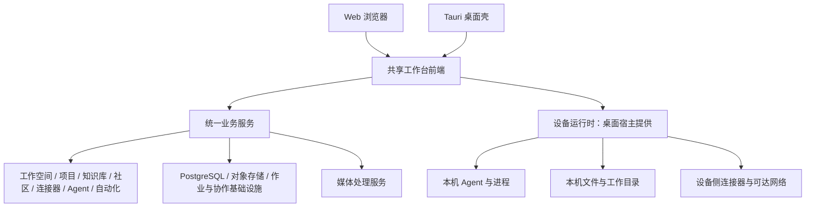

# Fouc 项目结构与代码架构设计

> 状态：设备/服务端工程边界已落地；统一访客主体、登录承接与全产品操作授权仍是待细化的目标设计。
> 适用范围：Fouc Web 与桌面双端、设备运行时、统一业务服务及共享工程。
> 本文确立项目组织与职责边界，不将目录规划、接口示意或验收目标表述为已实现功能。

## 1. 产品目标与设计约束

Fouc 是面向个人与团队的 AI 工作台，以人与 Agent 协作为核心，支持项目与需求迭代、个人与团队知识库、Agent/Skill 社区、连接器、任务执行与自动化等能力。知识库只是其中一个业务模块，不是整个产品的架构中心。

无论是否登录，用户都应能够使用产品的大部分功能。登录、资源授权、设备条件和服务权益分别限制具体操作，不能通过登录状态把整个产品或整个模块分成两套系统。

本设计遵循以下约束：

1. 一个产品、一套业务模型，Web 与桌面共享主要前端与交互逻辑。
2. 用户身份、资源归属、执行环境与服务权益相互独立。
3. 按实际业务操作授权，服务端及设备端在各自边界独立执行检查。
4. 明确数据的权威来源，不以本地与云端各存一份业务实体来模糊职责。
5. 保持模块化与最小复杂度，不提前引入微服务、通用插件内核或完整设备调度平台。
6. 项目尚未发布，重构直接形成当前唯一正确实现；不保留旧开发数据的迁移链、兼容适配器、双轨 schema 或过渡开关。开发测试数据按新的模型清理或重建。
7. 架构整理必须保持完整体验：保留用户输入、明确阻止原因、提供继续操作的路径，不以粗糙的登录拦截代替权限设计。

## 2. 架构决策

采用 **模块化单体业务服务 + 独立设备运行时 + Web/桌面共享前端 + 按操作授权**。

- 业务服务按领域模块组织，初期共享部署和数据库基础设施。
- 设备运行时作为独立进程，承担本机 Agent、文件、进程和设备执行能力。
- 桌面壳保持薄层，负责窗口、系统能力桥、更新、设备运行时的启动与看护。
- 前端消费公开业务契约与宿主能力，不直接访问数据库或依赖后端内部实现。
- API、协作和后台作业具有独立启动边界；只有实际负载与运维需求出现时才分开运行。
- 已有 Python 媒体处理 Worker 保持独立计算边界，不承担账户、业务状态或独立业务队列；独立依据见 6.2。



Web 和桌面都能调用统一业务服务。普通 Web 用户不需要安装设备运行时。Web 直接访问用户电脑上的本机能力不能作为默认能力；需要此类能力时，应通过明确的设备连接设计提供，而不是在生产环境回退访问固定的 localhost 端口。

### 2.1 工作空间是用户操作与资源隔离的一级边界

Fouc 的用户操作界面采用工作空间隔离式设计。一个用户可以创建多个工作空间，也可以加入其他用户创建的工作空间；用户拥有多个空间的成员身份，不表示这些空间的资源互通。

产品最左侧的工作空间侧栏是全局工作空间切换入口。当前工作空间由应用级资源上下文统一持有，项目、知识库、连接器、任务、通知及搜索等模块消费同一个明确的 `workspaceId`。模块内的资源选择不能暗中切换全局工作空间。

工作空间之间的 Fouc 业务资源彼此独立。用户处于一个工作空间时，原则上只能访问该空间内经授权的资源；即使用户同时属于另一个空间，也必须先显式切换操作上下文，不能在当前空间的搜索、引用、AI 检索或工具执行中隐式访问另一空间的资源。账户身份、个人界面偏好和平台公开目录不视为其他工作空间的私有资源。

隔离必须由服务端权威检查保障，不能只靠侧栏或列表筛选。每次资源读取、修改、订阅和执行都应校验当前主体、工作空间成员关系、资源的 `workspaceId` 与具体操作权限。数据库访问、对象存储、索引、缓存、协作连接、异步作业和连接器执行均携带空间范围；不能仅凭一个全局资源 ID 访问资源。

切换工作空间时，取消原空间未完成的读取，关闭原空间的事件/协作订阅，隔离或清除其可见缓存，并重置不属于新空间的资源选择。未提交输入按原资源保留或明确提示，禁止转存到新空间。延迟返回的请求不得覆盖新空间状态。空间内导航与 UI 状态按用户、工作空间和实际资源标识分区。

跨空间复制、导入、共享若未来成为明确产品能力，必须设计为显式、经过双方授权的独立操作，不以引用关系绕过默认隔离。访客与已登录用户遵循相同的资源范围模型；访客空间的成员、保留和登录承接规则需单独定义，不能退化为“未登录整个产品就是本机知识库”。

### 2.2 项目与知识库是工作空间下的同级资源

一个工作空间可以包含多个项目，也可以包含多个知识库。项目和知识库处于同一层级，二者不存在包含或父子关系：知识库不属于某个项目，项目也不属于某个知识库。

```text
工作空间
├─ 项目 A
├─ 项目 B
├─ 知识库 A
├─ 知识库 B
└─ 其他空间资源
```

资源主链分别为 `workspaceId → projectId → 项目内部资源` 与 `workspaceId → knowledgeBaseId → 知识库内部资源`。知识库中的文件夹和文档属于该知识库，不将文件夹或项目冒充知识库一级实体。

项目可以显式引用同一工作空间内经授权的知识库内容，但引用不改变资源归属，也不自动继承或授予目标资源权限。跨模块关系必须验证两端属于同一空间，并分别检查使用者对目标资源的访问许可。

因此，工作空间目录与成员关系归属平台工作空间能力；项目和知识库模块分别拥有自身实体、用例和状态。服务端应将 `workspace` 与 `knowledgeBase` 建模为不同实体，知识库拥有明确的 `workspaceId`；不能继续将一个旧知识 workspace 同时解释为全产品工作空间和知识库。

### 2.3 前端状态归属与当前实施边界

全局工作空间选择由应用级上下文提供，最左侧栏只呈现与触发选择；shell 负责布局、导航容器与模块组合。项目模块持有当前空间内的项目选择、收藏、管理面板与项目视图状态，知识库模块持有当前空间内的知识库、文件夹、文档选择和编辑状态。跨区域共享采用模块 provider 或公开状态接口，不将所有业务状态提升到 shell。

知识库页面不再由登录状态决定进入本机版或账户版：主要页面布局与文档展示复用，资源由用户明确选择；会话只影响所选资源和具体操作的可访问性。登录不自动上传本机内容，退出或会话异常不自动将另一种资源替换为当前资源。访问受账户保护的资源时，在同一工作台呈现登录或错误反馈，并保留资源选择。

当前知识库实现以独立实体落实资源链：工作空间拥有独立的 ID、成员关系和全局选择；知识库拥有另一个 ID 与必填的 workspaceId；文件夹（内部 Teamspace）拥有必填的 knowledgeBaseId；文档通过文件夹归属知识库。数据库以组合外键约束工作空间与知识库、文件夹的归属，并为知识库安装与其他租户资源相同的强制 RLS。不存在以工作空间 ID 冒充知识库 ID 的分支。

最左侧栏切换全局空间，知识库菜单只列出当前空间下的知识库。知识库切换重置文件夹、文档、搜索与筛选，并按空间、账户和知识库分别保存选择及个人导航偏好。“新建知识库”在当前空间创建知识库与初始文档文件夹，同一事务完成，不创建或切换工作空间。新建文件夹必须指定当前知识库；服务端拒绝不存在或属于其他空间的知识库。

工作空间目录使用公共 REST 路径 `/api/workspaces`；项目与知识库分别使用 `/api/workspaces/:workspaceId/projects` 和 `/api/workspaces/:workspaceId/knowledge-bases`。文件夹目录通过 `knowledgeBaseId` 过滤。前端工作空间客户端只负责工作空间与成员关系；知识库目录客户端属于 `features/knowledge/data`，项目客户端属于 `features/project`。页面正文、协作与既有页面授权继续使用工作空间范围；当前知识库列表、侧栏与回收站仅展示其所属文件夹下的页面，不修改已有编辑、评论、分享、导入导出与 Agent 用例的语义。

应用级 WorkspaceProvider 统一提供活动空间。空间切换卸载原资源、取消请求并关闭订阅，迟到结果不能覆盖新空间；无权限、未登录和服务错误准确反馈，不自动选择另一空间。已经识别为服务端的空间不会因退出或成员资格撤销而降格为无权限检查的设备空间，读取其设备副本同样需要空间成员权限。账户变化不会隐式上传设备文档或改选数据来源。

开发数据仅在开发环境提供，默认为三个工作空间：

| 工作空间 | 知识库数量 | 文档数量 | 知识库示例 |
| --- | --- | --- | --- |
| 产品研发 | 4 | 55 | 产品资料、设计规范、工程手册、新产品探索 |
| 个人工作台 | 3 | 27 | 研究笔记、学习资料、灵感收集 |
| 团队协作 | 5 | 63 | 团队知识、客户项目资料、市场与运营、入职指南、待整理资料 |

共 12 个知识库、145 份文档，包含空库、少量文档及较多文档，覆盖 PDF、Word、Excel、PPT、Figma、Markdown、纯文本、CSV、JSON、HTML 与图片类型，以及多种来源和索引展示状态。它们是用于交互验证的示例页面与预览内容，不代表对应格式的真实二进制文件或实际外部连接器同步结果。三个空间使用不同标识颜色，空间名称与知识库名称分开定义。

开发重建使用 `backend/server/scripts/seed-development-workbench.ts --reset`，直接重建本机开发库的 `workspace` 业务 schema 与数据，保留账户和会话。该命令显式拒绝生产环境与非本机开发库；生产启动和构建不自动写入示例数据。不保留旧模型迁移、双轨 schema 或兼容适配。项目现在拥有独立的服务端表、服务和前端模块状态；开发样例项目的详细内容仍是演示数据，新增项目显示空项目。自动化演示数据已按空间归属过滤，但自动化持久化、连接器实例绑定、统一访客主体及各模块细粒度操作规则仍需按各自需求落地，不能把现有演示能力说成完整的云端实现。

当前代码能力边界应按以下事实理解，不能从页面可见或同名状态推断服务端用例已存在：

| 能力 | 已实现的资源边界 | 尚未实现的产品能力 |
| --- | --- | --- |
| 工作空间 | 全局选择、成员关系、服务端租户事务与 RLS；开发样例三个独立空间 | 统一的访客服务端主体与登录后的资源承接规则 |
| 项目 | 服务端空间内项目目录与基础增删改查；前端项目状态按空间分区 | 项目任务、会话、成员和 Agent 的权威资源模型；现有详细项目工作台是样例项目专属演示 |
| 知识库 | 空间下多知识库；库内文件夹与文档；现有编辑及协作授权 | 跨宿主访客能力与操作权限规则仍需逐项收敛 |
| 自动化 | 演示定义和运行记录按当前空间筛选，切换后重建页面状态 | 服务端持久化、实际调度与执行；当前页面操作只是本次会话的演示状态 |
| 连接器与本机 Agent | 设备运行时提供本机连接、授权和执行能力；目录提供可见的服务能力 | 工作空间绑定的连接器实例、团队可见性和执行授权；设备凭据不能直接等同于空间资源 |
| 社区 | 当前页面为平台目录演示，不归某个工作空间私有 | 社区发布、安装和空间内资源实例化的权威流程 |

因此，“空间切换时某页面重新挂载”只能说明前端视图状态已重置，不能替代后端身份、归属和授权。新增模块应先明确资源归属及宿主，再决定列表、缓存和服务接口的作用域。

## 3. 四个独立维度

| 维度 | 回答的问题 | 示例 |
|---|---|---|
| 身份 | 谁在操作？ | 无会话的公开访问者、受限访客会话、已登录用户 |
| 资源归属与授权 | 可以对什么做什么？ | 访客工作范围、个人空间、团队项目、公开社区内容、资源 ACL |
| 执行环境 | 在哪里完成操作？ | 浏览器、当前设备、服务器执行环境 |
| 服务权益与额度 | 可以消耗哪些平台资源？ | 平台模型、存储、服务器执行额度 |

四个维度分别提供事实与决策，不能互相冒充：

- 未登录的桌面用户可以执行被允许的本机 Agent 任务。
- 未登录的 Web 用户可以使用开放给访客的服务端能力，并非只能使用浏览器存储。
- 已登录用户不一定拥有某个团队项目的访问或修改权限。
- 用户具有项目修改权限，不代表浏览器具备本机终端执行能力。
- 登录不改变已选择任务的执行位置。
- 连接外部服务可能需要该服务的授权，但不等于所有连接器操作都必须登录 Fouc。
- 设备通信令牌不是账户身份，更不能用于授予团队资源权限。

具体访客能力、额度和内容保留期限由产品规则定义。本文不凭架构推导固定的免费额度、默认期限或“所有 AI 功能必须登录”等规则。

## 4. 统一身份与操作授权

### 4.1 同一模块入口

每个业务模块使用一套主要页面和用例入口。禁止普遍采用“未登录进入访客版模块，登录进入账户版模块”的整模块分流。

推荐流程：

```text
进入同一个模块
  → 确定当前资源范围
  → 加载可访问资源与可用执行环境
  → 判断具体操作是否允许
  → 执行操作，或展示对应的继续路径
```

权限与能力信息用于页面呈现。每次实际执行仍必须在权威边界重新检查，不能信任前端按钮的可用状态，也不能将缓存的许可当作长期有效的授权凭据。

### 4.2 稳定的操作标识

围绕业务操作定义许可，例如：

- `project.read`、`project.update`、`project.member.invite`。
- `knowledge.document.read`、`knowledge.document.edit`。
- `community.read`、`community.publish`。
- `connector.authorize`、`connector.execute`。
- `run.start`、`run.cancel`。

这些名称是设计示例，不表示当前已有统一授权 API。操作标识需要有明确资源和上下文，不能只返回脱离资源的全局 `canEdit`。

模块拥有自己的业务授权规则；平台提供统一的身份上下文、决策结果格式与通用检查基础设施。避免把所有领域规则堆进一个不断扩大的全局权限函数。

### 4.3 阻止原因与交互闭环

| 原因 | 用户反馈与继续路径 |
|---|---|
| 需要登录 | 解释当前操作需要账户，登录后回到原操作 |
| 资源权限不足 | 说明所需权限，按产品能力提供申请入口 |
| 执行环境不可用 | 选择可用执行器，或连接需要的设备 |
| 缺少外部服务授权 | 打开对应服务的授权流程 |
| 平台额度不足 | 展示额度状态与实际可用的替代能力 |
| 服务暂不可用 | 保留输入与工作状态，提供重试 |

检查顺序与错误暴露必须兼顾资源保密：不能向无权用户泄露私人资源存在性。服务不可用不等于未登录；资源授权失败也不应清除有效账户会话。

登录续接只保留允许恢复的操作意图和必要输入，不保留或跳过旧授权结论。恢复时重新校验资源与条件；可重复提交的命令采用幂等机制。对需要用户最终确认的操作，登录完成后恢复确认步骤，不自动提交。

### 4.4 设备侧许可

业务服务负责账户与共享资源授权，设备运行时负责文件、命令、进程等设备操作的许可。需要两侧条件的操作必须同时满足两侧条件。

用户登录不能替代设备操作许可，服务器下发任务也不能绕过设备端的执行边界。设备运行时不能通过前端提供的用户 UUID 自行推定云端资源权限。

### 4.5 安全与证据边界

- Agent、连接器和远程环境凭据不进入模型上下文；仅传入当前任务需要的最小脱敏资料。Fouc 不复制 Agent 原生长期凭据。
- 本机执行与远程服务是独立信任域。Agent 的自然语言结论不能越过确定性权限、审批或验收状态机。
- 高风险操作需要可撤销的明确授权；记录请求人、执行主体、资源范围、实际动作和可复核证据。重要制品以版本或摘要固定。
- 不保存模型隐藏思维链作为产品证据；展示计划、结论、来源、操作及产物即可。

## 5. 访客资源与登录承接

### 5.1 访客不等于离线模式

公开读取可以无会话。需要服务端保存私有工作状态的访客用例，可由服务端签发受限访客会话，为其提供隔离的工作范围。

访客会话是明确的受限主体，不是隐藏注册账户：没有虚构邮箱、用户账户记录或团队成员资格。凭据由服务端签发和验证，不依赖客户端随意声明的访客 ID 证明所有权。

访客拥有私有状态时，身份边界需要明确会话有效期、资源保留规则、访问隔离、退出与清理行为，以及平台资源消耗限制。会话过期或浏览器凭据丢失后的恢复能力应当在产品中说明，不把临时资源宣称为永久可靠存储。

### 5.2 浏览器与设备存储的定位

浏览器存储用于缓存、未提交输入和明确的临时状态。未登录不能成为额外实现完整业务存储、CRUD 和权限体系的理由。

设备存储用于设备偏好、安装信息、执行日志、必要缓存和运行恢复状态。只有具有真实设备职责的数据才留在设备运行时；不建立另一套团队项目、共享知识库或社区数据库。

这不禁止产品提供明确的本地临时能力，但此类能力应由用例需求与宿主能力决定，不应作为登录失败时悄然切换的数据来源。

### 5.3 登录后的承接规则

登录不能直接替换整个模块，也不能造成当前工作内容消失。

对于需要承接的访客资源，服务端应验证当前账户与访客会话，通过明确的归属变更用例完成承接。归属变更必须原子化、可重复请求而不重复创建资源，并使旧访客凭据按规则失去访问已承接资源的能力。

将访客工作空间承接为个人资源，与把内容合并进已有个人空间或团队空间，是不同操作。后者需要明确目标与目标资源权限，不能自动混入团队数据。设备上的文件和私有凭据也不能因登录而隐式上传。

具体承接范围与保留规则属于待细化的产品设计，不在本次文档中假定为已实现。

## 6. 服务端与设备运行时职责

| 事项 | 统一业务服务 | 设备运行时 |
|---|---|---|
| 身份与资源授权 | 账户、访客会话、组织、团队和资源权限 | 设备访问与设备操作许可 |
| 项目与工作对象 | 项目、需求、迭代、任务定义和协作状态 | 执行任务所需的本机上下文 |
| Agent/Skill | 定义、目录、版本、发布、共享与策略 | 发现安装、实际调用和设备生命周期 |
| 连接器 | 共享配置、授权关系、外部资源引用 | 设备侧凭据与只能从设备访问的能力 |
| 执行 | 授权、任务状态、执行目标及结果引用 | 本机 Agent、进程、工作目录和运行恢复 |
| 数据 | 共享业务实体及平台拥有的内容 | 设备事实、执行记录与必要缓存 |

同一领域可以在两侧存在职责不同的模块。例如，服务端的连接器模块维护共享定义与授权范围，设备侧适配器执行当前设备可达的操作。两侧共享契约，不共享数据库或内部仓储实现。

凭据按执行位置与授权归属保存：平台凭据在服务端管理；本机凭据在设备侧管理。前端只消费必要的公开状态和引用，不成为密钥持久化中心。

### 6.1 执行目标与任务状态

工作任务与执行实例应区分。一个任务可以经历多次运行；每次运行关联明确的执行目标、执行器、输入范围和状态。

服务端记录平台任务与运行状态，设备运行时记录设备侧实际进程状态。二者通过运行标识、事件序号和公开协议对齐，不共享可写的底层存储。

运行状态不能将“已下发”当成“已执行”，不能将断开连接当成成功。取消、超时、失败与结果提交应有明确语义；重试不能意外重复执行同一具有外部副作用的命令。

当前阶段只实现已有执行场景需要的目标与协议。远程设备注册、任务中继和复杂调度在真实需求出现后再扩展。

### 6.2 媒体处理为何独立运行

现有 `services/media-worker/` 是无状态 Python/FastAPI 内容处理服务，使用 `faster-whisper` 转写音视频、使用 Docling 解析 PDF 与 Office 文档。它不是普通文件上传服务，也不是第二套业务后端。

保留独立运行边界的依据：

- **运行依赖不同**：Python、模型及文档解析依赖不应进入 Bun 业务进程或桌面 sidecar 的分发依赖。
- **资源与故障隔离**：解析和推理任务可能耗时且资源消耗较重，应独立控制并发、超时、子进程终止与临时文件清理；不因此阻塞普通业务请求。
- **部署条件不同**：按实际处理需求配置 CPU/GPU 与模型缓存，不要求 API 节点或每个桌面客户端安装完整处理环境。

调用边界保持如下职责：

```text
业务服务：授权 → 管理任务与重试 → 提供受限文件访问 → 调用 Worker → 保存结果
媒体 Worker：获取授权输入 → 解析或转写 → 返回派生结果 → 清理临时资源
```

现有 Worker 不拥有账户、资源 ACL、业务数据库或独立任务队列，其处理结果由业务服务管理。它通过短期签名资源地址读取输入，不持有对象存储长期凭据。服务应保持内部调用与独立认证，前端不直接获得其调用密钥。

独立进程有明确价值，但 HTTP 服务不是唯一可行方案。TypeScript 调用 Python 子进程也能实现基本功能，只是主服务需要承担 Python 环境和处理进程管理。当前已有受限 HTTP 契约与处理隔离实现，合并会增加主服务耦合且缺少明确收益，因此本阶段保留现有边界，不再额外拆出转写、PDF、Office 等多个服务。

文件上传与内容解析是不同操作。只需要保存原文件的流程，以及项目管理、社区浏览等无关功能，不应以媒体 Worker 就绪作为全局可用性前提。处理服务不可用时，依赖它的用例提供失败、等待或重试状态，不能假报解析完成。

媒体处理是可被业务模块调用的基础设施能力，相关用例仍留在所属业务模块。当前调用方位于知识库中；出现其他实际调用方时再抽取服务端共享适配器，不让其他模块依赖知识库内部实现，也不预建空的全产品媒体模块。

## 7. 数据归属与权威来源

| 数据类别 | 权威来源 |
|---|---|
| 账户、组织、团队成员、资源权限 | 统一业务服务 |
| Fouc 自身拥有的项目与协作状态 | 对应服务端业务模块 |
| Fouc 自身拥有的知识内容与社区发布内容 | 对应服务端业务模块 |
| 外部代码仓、工单、文档、流水线与运行事实 | 对应外部系统；Fouc 保存必要引用、关系与快照 |
| 本机 Agent 安装、进程、文件与设备运行记录 | 当前设备及设备运行时 |
| 浏览器缓存、未提交输入 | 当前客户端，不冒充服务端保存结果 |

执行环境与数据权威来源相互独立。本机执行可以使用经过授权的共享上下文；服务器执行也可以引用外部系统内容。

索引、缓存、预览和统计是派生数据，不成为第二套可独立修改的业务事实。更新与删除需要明确派生数据失效和重建路径。

## 8. 目标工程结构

保留单仓库、根目录前端工程及有效的现有目录，使用 pnpm workspace 分开后端运行、构建和依赖边界。根目录继续承载共享前端，`backend/` 承载两套独立后端包，`shared/` 继续承载公开契约。两套后端包已拆分；以下业务模块树是扩展参考，未实现的模块不创建空目录。实际启动命令见仓库 [README](../../../../../README.md)。

```text
src/                             Web 与桌面共享的 Next.js/React 前端
├─ app/                          路由及页面装配
├─ shell/                        工作台导航、布局与全局交互
├─ lib/                          传输、宿主能力与客户端基础设施
├─ components/                   通用 UI 与跨模块工作台组件
└─ features/                     沿用现有有效命名，按功能新增模块
   ├─ project/
   ├─ knowledge/
   ├─ community/
   ├─ connectors/
   ├─ identity/
   ├─ session/
   └─ automation/

src-tauri/                       Tauri 薄壳、打包、更新及进程看护

backend/
├─ device/                       独立设备运行时包
│  ├─ package.json
│  ├─ tsconfig.json
│  └─ src/
│     ├─ entrypoints/
│     ├─ agents/
│     ├─ execution/
│     ├─ connectors/
│     ├─ permissions/
│     ├─ platform/
│     └─ storage/
└─ server/                       独立统一业务服务包
   ├─ package.json
   ├─ tsconfig.json
   └─ src/
      ├─ entrypoints/            API、协作、作业的启动与装配
      ├─ platform/               身份、授权基础设施、数据库、作业
      └─ modules/                依据已实现的领域逐步组织
         ├─ workspaces/
         ├─ projects/
         ├─ knowledge/
         ├─ community/
         ├─ connectors/
         ├─ agents/
         └─ automation/

shared/                          公开 API、事件、设备通信及运行契约
services/
└─ media-worker/                 Python 内容处理 Worker

public/
docs/
scripts/                         仓库级开发与工程脚本
package.json                     根目录前端与仓库级命令
pnpm-workspace.yaml              注册 shared 与两套后端包
```

Web 与桌面共享前端源码，分别由宿主适配和构建配置处理差异。Web 服务与桌面静态产物的构建目标需独立验证，不把仅 Web 可用的服务端路由当作桌面运行的隐含依赖。

`src/lib/` 中的职责可按实际需要建立子目录，没有必要统一改名为 `platform/`。现有 UI 组件保留在 `src/components/`，模块私有组件保留在对应 feature 内。Web 与桌面使用同一前端源码，本身不构成拆出 `packages/ui` 的理由。树中的模块目录按实际业务建立，不提前创建空模块。

### 8.1 允许的依赖方向

```text
src/            → shared/ 的公开契约、前端组件与宿主适配
src/            → @fouc/server/knowledge-api 的公开类型契约（仅 type-only）
backend/server/ → shared/ 的公开契约、服务端模块及基础设施
backend/device/ → shared/ 的公开契约、设备模块及设备适配器
src-tauri/      → 宿主桥、设备进程看护与打包产物
```

约束：

- 前端禁止导入服务端或设备运行时的内部实现。
- 现有 tRPC 路由推导类型通过业务服务公开的 `@fouc/server/knowledge-api` 导出，包只提供 `types` 条件；前端使用 `import/export type`，运行时导入被边界检查拒绝。该类型入口避免复制路由定义，浏览器编译验证其输出不含后端运行时。
- 服务端禁止导入设备运行时内部代码，反向同样禁止。
- 设备运行时禁止直接连接共享业务数据库。
- 共享契约不依赖 React、Tauri 或具体数据库驱动；可以使用明确的契约校验库。
- 包之间通过公开导出访问，禁止深层路径绕过边界。
- 禁止循环依赖；宿主差异集中在适配层，不散布大量 `isTauri` 分支。
- 不建立无明确消费者的通用 `core`、`utils` 或业务引擎共享包。

### 8.2 结构选择的依据与取舍

保留根目录结构是工程判断，不是仅为减少文件移动：

1. 当前只有一套共享前端，根目录 `src/` 能准确表达其职责；迁入 `apps/workbench/` 不增加隔离或复用价值，却会牵动 Next.js、脚本、桌面打包及开发路径。
2. `src-tauri/` 已表达桌面薄壳职责，`shared/` 已是 workspace 包；重命名这些目录不能替代依赖检查。
3. 设备运行时与业务服务具有不同分发对象、运行依赖、配置和权限边界，必须拆成独立包。仅因沿用现有结构而继续共用一个后端包，会保留真正的混杂。
4. 多个前端应用需要独立构建、发布或消费同一 UI 包时，再评估 `apps/`、`packages/ui` 等组织形式。当前不提前引入该层级。
5. 不要求前后端内部目录命名完全相同。前端按交互功能组织，服务端按领域与用例组织；契约与职责一致比名称对称更重要。

目标是保留有效结构、重写错误边界，不追求目录形式的统一美观。后续结构调整必须由可验证的独立构建、复用或维护需求支撑。

## 9. 业务模块内部结构

复杂业务模块采用以下结构；简单模块只建立真实需要的层次。

```text
模块/
├─ api/                           请求解析、身份上下文与响应映射
├─ application/                   用例编排、授权调用、事务边界
├─ domain/                        业务规则与状态转换
└─ infrastructure/                存储及外部服务具体适配器
```

依赖由入口装配，业务规则不依赖 HTTP 框架、React、Bun 服务器对象或数据库连接。

- API 层不承担完整业务流程，也不绕过用例直接写表。
- Application 层组织操作、确定事务与外部副作用顺序。
- Domain 层只在存在值得独立表达的规则时建立，不制造空对象与空接口。
- Infrastructure 层实现具体存储、进程、模型和外部服务访问。
- 前端模块按页面、交互组件、查询与操作组织，不复制服务端授权规则。

跨模块需要立即返回结果的操作调用公开用例接口；索引、通知、解析等后续工作使用可靠作业或事件。在数据库写入与异步发布需要一致性时使用事务与 outbox 等已有可靠机制，不为每个简单交互引入事件总线。

每个模块拥有自己的表和写入规则。跨模块引用及事务通过明确的公开边界协调；不得由任意模块直接调用其他模块的内部仓储修改其数据。

## 10. 部署、运行时与开发配置

业务服务先保持模块化单体。业务模块不是必然的独立网络服务，初期不按项目、知识库、社区分别建设微服务。

API、协作与作业拥有明确运行职责；独立角色启动时只装配本角色需要的资源与监听器，不能依靠不同角色名称掩盖实际仍启动全部能力的行为。

TypeScript 后端以 Bun 为当前运行时，业务代码保持 Node 兼容 API 子集。Bun 服务器、SQLite 和其他运行时专属能力集中在适配器中，不宣称只替换命令即可运行于 Node。

桌面构建仅编译设备运行时和前端，随后由 Tauri 打包。Windows 的主要可执行程序仍是 `fouc.exe` 与 `fouc-backend.exe`；后者对应 `backend/device/`，不包含集中部署的业务服务。`backend/server/` 通过 `pnpm server:build` 独立构建和部署，前端引用其公开类型不意味着服务端运行时进入客户端。命令与产物对应关系见仓库 [README](../../../../../README.md)。

独立服务的协议不限定实现语言。即使从零开始，按当前产品目标也优先选择 TypeScript：核心复杂度在业务对象、操作契约、授权与 Agent/工具编排，双端前端与实时协作具有纯协议和 schema 的真实共享需求，计算处理则采用独立 worker 边界。已有代码重写成本不是选择依据；没有完整的工作负载和运行指标，不能宣称某语言适用于所有未来场景。语言与 Bun/Node 运行时分别评估。Python 媒体处理边界保持。若后续需要 Python/Go 独立能力，先定义语言无关契约并验证行为；现有前端公开 tRPC 类型仍有编译期耦合，不能把独立部署误解为可无成本替换语言。模块化单体仍是业务服务的当前部署方式。

生产部署：

- 业务服务集中部署，Web 与桌面使用明确配置的服务地址。
- 设备运行时随桌面应用分发，由桌面壳看护，并通过受保护的设备端接口访问。
- 服务端身份与设备通信分别认证，不能共用或混淆令牌。
- 外部服务通过标准适配器接入；共享业务不直接依赖当前开发电脑路径。

开发部署：

- Web dev 服务、设备运行时、业务服务分别启动与检查。
- 当前开发常用端口为 3000、8710、8711；这些端口不是业务契约。
- 聚合开发脚本应复用已运行的正确服务，校验工程归属与就绪状态，避免重复启动。
- 独立包具备明确的开发、类型检查、测试和构建命令。
- 环境配置区分客户端公开地址、服务端密钥与设备配置，禁止把秘密写入公开前端变量。
- 开发与验证遵循仓库 `AGENTS.md`：Web 服务常驻；仅在明确要求桌面验证或发布时构建 Tauri。

## 11. 验证要求

验证围绕真实边界和关键行为，不编写只镜像实现或验证目录存在的测试。

- 独立包类型检查、必要的契约测试与依赖方向检查通过。
- 访客、已登录用户及无资源权限用户的允许/拒绝行为符合规则。
- 前端隐藏按钮不能绕过后端授权；设备令牌不能调用账户资源接口。
- 登录、退出、会话过期、服务故障不会错误地切换业务数据来源。
- 登录续接保留输入，并重新校验权限和幂等条件。
- Web 与桌面共享流程成立；不具备设备能力的宿主提供完整替代或提示。
- 运行断连、重试、取消及恢复不误报成功，不造成非预期重复执行。
- 外部权威资源、平台业务状态与设备事实的归属明确。
- 开发服务与实际必要的构建产物可运行；未验证的平台和部署场景明确报告。

## 12. 待细化的产品规则

以下能力尚未有完整的产品规则与实现；新增功能前在对应主题设计中确定：

1. 各业务操作对访客开放的范围、额度与内容保留规则。
2. 访客登录后的承接范围、目标空间选择与冲突处理。
3. 任务、运行和执行目标的完整状态协议与副作用处理。
4. 各模块对共享数据与设备数据的逐项归属。
5. Web 是否及何时需要连接远程设备，以及对应的设备授权和通信方案。

这些事项不阻止先拆清运行包、依赖方向与模块边界，但在相关功能实施前必须形成明确规则。

## 13. 相关文档

- [产品愿景与定位](../../../vision-and-positioning.md)
- [P0 基础能力清单](../../p0-foundation-capabilities.md)
- [统一身份与授权](../identity/fouc-identity.md)
- [连接器架构](../connectors/connector-architecture.md)

本设计的长期约束是：**一个 Fouc 产品、一套业务模型；身份控制具体操作许可，宿主提供具体执行能力，业务模块维护自己的权威状态。**
