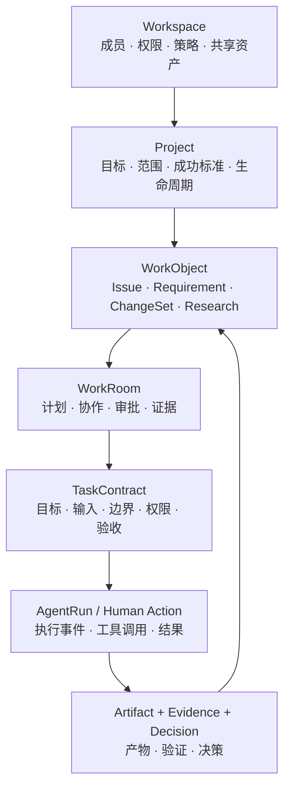

# Fouc 项目空间产品与 UX 设计

> 状态：产品与体验方案（V1 设计基线）  
> 日期：2026-09-01  
> 关联文档：[产品愿景与定位](../vision-and-positioning.md)、[V1 核心特性](../core-features.md)、[P0 基础能力](../p0-foundation-capabilities.md)、[架构与安全](../architecture-and-security.md)

## 〇、结论摘要

Fouc 的项目空间不是“带 AI 的项目管理器”，而是一个**以目标为中心、由人与 Agent 共同运行、以产物与证据完成闭环的项目操作系统**。

V1 设计确定以下产品决策：

1. `Workspace`、`Project`、`WorkObject`、`WorkRoom`、`TaskContract` 和 `AgentRun` 必须分层建模，不把空间、项目、任务和会话混成同一种容器。
2. 项目默认首页是“项目总览”，而不是任务表。首页优先回答目标、健康度、变化、阻塞、待判断事项和下一动作。
3. 项目只保留“总览、工作、产物、资源、时间线”五个一级页面；成员、Agent、自动化、权限和项目配置收进项目控制中心。
4. 右侧固定配置栏改为可折叠的“上下文检查器”，随当前选中对象变化。
5. Agent 不是头像式处理人，而是具有能力、权限、成本、状态和责任边界的一等执行身份。
6. 任务不是普通待办，而是包含目标、输入、约束、权限、验收条件和责任人的正式委托。
7. “完成”必须由验收条件和 `Evidence` 决定，Agent 的自然语言结论不能直接关闭工作对象。
8. Fouc 不复制 Git、工单、文档、CI/CD 或环境数据，只保存引用、关系、必要快照、流程状态和证据。

## 一、产品定位

### 1.1 一句话定位

> Fouc 项目空间让一个人或团队可以从目标出发，把上下文、工作、Agent、决策、产物与证据组织在同一条可执行工作流中。

### 1.2 与普通项目管理工具的区别

普通项目管理工具主要记录“谁要做什么、什么时候完成”；Fouc 还需要回答：

- Agent 为什么获得这些上下文和权限；
- 工作运行在哪个代码、文档、数据或环境边界内；
- 当前结论来自哪些来源，是否仍然有效；
- 哪些动作已经发生，哪些仍需人类批准；
- 产物是否通过验收，是否具备可复核证据；
- 项目暂停、恢复、转交或关闭时，如何不丢失工作事实。

因此，Fouc 的差异化不在于拥有更多看板视图，而在于建立**确定性流程包住概率性执行**的完整工作闭环。

## 二、核心对象与层级



| 对象 | 用户心智 | 生命周期与边界 |
|---|---|---|
| `Workspace` | 个人或团队的大空间 | 长期存在，承载成员、角色、策略和共享能力 |
| `Project` | 一个有明确结果的项目空间 | 有目标、负责人、成功标准、起止时间和关闭条件 |
| `WorkObject` | 一项真实工作的权威对象 | 需求、问题、变更、研究或交付物，拥有业务状态 |
| `WorkRoom` | 围绕一个工作对象的执行房间 | 汇集上下文、协作、运行、审批、产物与证据 |
| `TaskContract` | 一次正式委托 | 固定目标、输入、范围、权限、预算和验收条件 |
| `AgentSession` | 可持续交互的执行通道 | 绑定工作对象、Agent 与工作目录，不作为一级业务入口 |
| `AgentRun` | 一次可取消、可审计的执行 | 产生计划、工具调用、事件、用量、产物或失败信息 |
| `Resource` | 项目可使用的外部事实与能力 | 仓库、文档、环境、数据、连接器、Agent、Skill |
| `Artifact` | 工作输入或产出 | 文档、补丁、报告、表格、图表、PR、交付包 |
| `Evidence` | 支撑结论和验收的事实 | 测试、日志、引用、快照、审批、回归记录 |
| `Decision` | 被接受或拒绝的关键判断 | 包含选项、依据、责任人、影响与关联证据 |

## 三、目标用户与核心任务

### 3.1 项目负责人

- 快速了解整体健康度、里程碑、阻塞和资源风险；
- 看到需要本人判断的事项，而不是阅读全部 Agent 过程；
- 将项目状态转换为可信的周报、汇报或交付说明；
- 通过目标与证据判断工作是否真的完成。

### 3.2 执行者

- 进入项目后立即恢复背景，不重复复制文档、日志和历史结论；
- 在清楚的工作范围内委托 Agent，并观察必要过程；
- 处理异常、补充信息、评审结果或人工接管；
- 将结果交回 Git、工单、文档或其他权威系统。

### 3.3 审核人与协作者

- 在一个收件箱中查看需要判断的事项；
- 基于变更、风险、验证和证据进行批准或退回；
- 明确当前责任人、下一责任人和等待原因；
- 不需要安装本地执行环境也能通过 Web 查看团队权威状态。

## 四、体验原则

### 4.1 状态优先于动态

动态记录发生过什么；状态告诉用户现在意味着什么。项目首页优先呈现当前状态、风险和下一动作，完整事件进入时间线。

### 4.2 结果优先于过程

默认展示目标、里程碑、产物、验证和待判断事项。Agent 思考、原始日志和工具细节按需展开。

### 4.3 注意力是一等资源

所有请求用户判断的事项统一进入 `Review Inbox`，按风险、优先级、SLA 和阻塞影响排序，避免每个 Agent 分别打断用户。

### 4.4 渐进披露

普通用户先看到“发生了什么”和“要做什么”；需要控制时再进入权限、范围、版本、来源和执行细节。

### 4.5 事实有来源，记忆可治理

所有外部事实显示来源、采集时间、新鲜度和访问范围。只有被接受的决策、验证过的结论和正式产物才能进入项目记忆。

### 4.6 可逆动作减少打扰

只读和可逆的低风险动作可在策略允许时自动执行；远程写入、推送、发布和不可逆动作必须提升审批等级。

## 五、项目空间信息架构

```text
项目：Fouc 桌面端 V1
├── 总览        目标、健康度、里程碑、变化、待处理、下一动作
├── 工作        WorkObject 的列表、看板、时间线和依赖图
├── 产物        可交付内容、版本、评审、验证和证据
├── 资源        仓库、环境、文档、数据、连接器、Agent、Skill
├── 时间线      状态、消息、运行、审批、决策和交付事件
└── 项目控制中心
    ├── 项目章程与成功标准
    ├── 成员、角色与 Agent
    ├── 自动化与守护任务
    ├── 权限、预算与安全策略
    └── 集成、通知与生命周期
```

“总览、工作、产物、资源、时间线”是日常工作导航；项目控制中心是低频配置入口，不常驻占用主画布。

## 六、核心页面设计

### 6.1 项目总览

#### 页面目标

用户在 10 秒内回答：

1. 项目要达成什么；
2. 当前是否正常；
3. 离开后有什么重要变化；
4. 什么事情正在推进；
5. 哪些事情需要本人处理；
6. 推荐的下一步是什么。

#### 页面结构

```text
项目标题区
名称 · 状态 · 健康度 · Owner · 目标日期 · 控制中心

项目叙事区
一句话目标 · 成功标准 · 当前阶段 · 最新可信更新

注意力带（页面视觉中心）
需要你处理 · 风险与阻塞 · 建议下一动作

进度区
里程碑轨道 · 当前阶段 · 完成预测 · 关键依赖

进行中的工作
高价值 WorkObject · 负责人/Agent · 状态 · 等待原因

最新产物与证据
文档/变更/报告 · 评审状态 · 验证覆盖

紧凑项目指令台
描述目标 · @工作对象/资源/Agent · 范围 · 权限 · 执行器
```

#### 关键约束

- 不将每一项信息都做成卡片；优先使用留白、分组、排版与细分隔线。
- 项目健康度不能由 Agent 自由填写，应由规则信号与负责人更新共同产生。
- “建议下一动作”必须能解释依据，并区分自动建议和已接受计划。
- 首页不展示完整任务库存、完整资源目录或 Agent 原始日志。

### 6.2 工作页

工作页统一承载 `WorkObject`，用户可以切换：

- **列表**：高密度扫描、筛选和批量操作；
- **看板**：按工作流阶段观察流动与阻塞；
- **时间线**：观察里程碑、依赖和交付节奏；
- **依赖图**：观察跨仓、跨团队、跨工作对象的前后关系。

所有视图只是同一组结构化对象的不同投影，不维护互相独立的数据。

每一行或卡片至少表达：目标、类型、阶段、负责人、当前执行者、优先级、健康度、阻塞、验收进度和最近变化。Agent 的运行中状态只作为对象状态的一部分，不取代业务状态。

### 6.3 Work Room

Work Room 是 Fouc 最具差异化的执行界面，采用三层结构：

1. **工作合同头部**：目标、范围、验收、负责人、阶段、权限和工作环境；
2. **协作与执行流**：人与 Agent 的消息、计划、运行、审批、异常和交接；
3. **结果抽屉**：产物、Diff、测试、证据、风险与交付动作。

Work Room 的默认摘要应是“当前结论 + 当前计划 + 等待事项”，而不是从第一条聊天开始展示。用户可以切换到完整时间线、运行详情、终端、Diff 或浏览器等工作面。

### 6.4 产物页

产物页不是文件库，而是项目的交付与证据中心：

- 按“草稿、待评审、已接受、已交付、已失效”组织生命周期；
- 支持文档、代码变更、报告、表格、图表、媒体和外部链接；
- 显示创建者、来源、版本、关联工作对象、评审人与验证状态；
- 同一产物的版本形成明确演进关系，不通过复制文件名表达版本；
- 交付包聚合结果、变更、证据、风险、审批与回滚提示。

### 6.5 资源页

资源页管理项目可使用的事实与能力，而不是要求用户把全部内容上传进 Fouc。

资源分为：

- **事实源**：Git、工单、文档、环境、可观测平台、数据集；
- **执行能力**：Agent、Skill、MCP、连接器、自动化；
- **项目规则**：指令、约束、术语、验收规范、权限策略；
- **项目记忆**：已接受的决策、验证结论和可复用知识。

每个资源显示可用性、权限、新鲜度、适用范围和最近使用记录。任务执行前，上下文编译器从资源中选取必要内容，并让用户预览实际上下文，而不是把整个项目无差别塞入提示词。

### 6.6 时间线

时间线是审计与复盘视图，统一呈现：

- 工作对象状态变化；
- 人与 Agent 的委托、接管和转交；
- AgentRun、工具调用和异常；
- 审批请求与结果；
- 决策及其依据；
- 产物创建、评审、接受与交付；
- 外部事实同步和版本变化。

默认只显示高信号事件，原始事件可按对象、成员、Agent、风险、来源和时间过滤。

### 6.7 上下文检查器

右侧区域是随选择变化的上下文检查器，而不是永久项目配置栏：

| 当前选择 | 检查器内容 |
|---|---|
| 无选择 | 项目健康、关键风险、上下文新鲜度、项目团队 |
| WorkObject | 负责人、状态、依赖、验收、运行与关联资源 |
| AgentRun | Agent、模型、权限、工作目录、用量、工具与取消/接管 |
| Artifact | 版本、来源、评审、验证、证据和交付状态 |
| Resource | 权威来源、访问范围、新鲜度、同步状态和使用记录 |
| Decision | 选项、依据、责任人、影响范围与关联证据 |

检查器默认可折叠；折叠后主画布获得完整宽度。

## 七、关键工作流

### 7.1 创建项目

```text
描述目标
→ Fouc 草拟项目章程、成功标准和建议模板
→ 发现并建议关联资源
→ 建议成员、Agent、里程碑与首批 WorkObject
→ 用户确认范围、权限和预算
→ 创建项目并进入总览
```

首次创建不要求填写大型表单。只有名称是硬必填，其余信息由自然语言草稿和渐进补全完成；高风险资源和权限必须显式确认。

### 7.2 从项目恢复工作

用户重新进入项目时，Fouc 生成有来源的恢复摘要：

- 自上次访问后的关键变化；
- 已完成与失败的运行；
- 新产生或更新的产物；
- 新风险、阻塞与过期事实；
- 当前需要用户判断的事项；
- 推荐下一步。

摘要中的每个结论都可以展开查看来源，不生成无法追溯的“AI 总结”。

### 7.3 委托 Agent

```text
描述目标或选择 WorkObject
→ 自动建议相关上下文
→ 生成 TaskContract 草稿
→ 选择 Agent / Auto
→ 预览资源、目录、权限、预算和验收
→ 开始运行
→ 仅在异常或超出权限时请求注意
→ 产出结果与证据
```

指令台始终显示当前作用域，例如“Fouc 桌面端 V1 / Issue-128 / 仅本地修改”，避免用户误解 Agent 正在操作哪个项目或资源。

### 7.4 审核与批准

审核卡片必须同时提供：

- 请求执行的动作与风险级别；
- 影响的文件、环境、数据或外部对象；
- 触发原因和所属工作对象；
- 已有验证、剩余风险和回滚方式；
- 允许一次、在当前范围内允许、拒绝、退回补充等明确选项。

### 7.5 项目状态更新

项目守护 Agent 可以按规则生成状态草稿，内容来自里程碑、WorkObject、运行、产物、证据和外部事实。项目负责人确认后发布，未确认草稿不进入团队权威状态。

### 7.6 项目关闭

关闭项目前执行完整性检查：

- 成功标准是否满足；
- 未关闭工作对象如何处理；
- 产物是否已交付；
- 验证、审批和回归证据是否齐全；
- 临时工作区、凭据租约和自动化是否回收；
- 哪些决策和知识进入长期记忆；
- 哪些资源引用应归档或失效。

## 八、Agent 原生能力

### 8.1 上下文编译器

根据目标、工作对象、Agent 能力和权限，从项目资源中组装最小充分上下文。执行前提供上下文清单，执行后记录实际使用来源。

### 8.2 Next Action Engine

结合流程状态、阻塞、依赖、风险、SLA 和最近事件，生成可解释的下一动作建议。建议必须标记为“系统建议”，用户接受后才成为正式计划。

### 8.3 Review Inbox

将跨项目审批和人类判断合并到统一收件箱，以风险、阻塞影响、优先级和时限排序。低价值通知进入摘要，不抢占主界面。

### 8.4 项目守护 Agent

项目守护 Agent 可执行：

- 检测停滞、逾期、依赖阻塞和无人负责事项；
- 检测代码、环境、文档和数据版本偏离；
- 检测缺失验证、证据或审批；
- 生成日报、周报和里程碑更新草稿；
- 建议重排任务、补充资源或升级风险。

守护 Agent 只能在授权范围内行动，所有自动写操作必须可观察、可暂停、可重放并保留历史。

### 8.5 成本与自治

项目可以配置 Agent 预算、并发度、允许动作和审批策略。用户看到的是“本项目本周期成本、节省的人工等待、任务接受率和失败原因”，而不是只展示 Token 数量。

## 九、视觉设计基线

### 9.1 总体气质

关键词：**精密、克制、清澈、可信、轻盈、安静但有生命力**。

Fouc 项目空间延续现有桌面工作台：浅灰原生外壳、宽阔白色主画布、柔和青绿色品牌强调、低对比细分隔、彩色但克制的 Phosphor 图标。视觉升级不依赖强烈渐变、厚重阴影或大量玻璃卡片，而来自更好的排版、空间、层级、材质和动态状态。

### 9.2 桌面框架

- 原生标题栏：38px；
- 展开侧边栏：240px，折叠：60px；
- 主画布：白色，左上 16px 圆角，不增加多余外边框；
- 项目顶部信息区：72–88px；
- 可折叠上下文检查器：320–360px；
- 主内容最大阅读宽度随视图变化，总览避免无意义铺满超宽屏。

### 9.3 色彩

| 用途 | 建议值 |
|---|---|
| Shell | `#F3F4F4` |
| Main surface | `#FFFFFF` |
| Subtle surface | `#FAFAFA` |
| Primary ink | `#17191B` |
| Secondary ink | `#62686F` |
| Muted | `#8A9096` |
| Brand accent | `#0DA887` |
| Strong accent | `#078F73` |
| Focus ring | `rgba(13,168,135,.35)` |
| Divider | `rgba(23,25,27,.085)` |

状态色使用低饱和背景与高可读文字，不以红黄绿大面积填充界面。

### 9.4 字体与排版

- 拉丁与数字优先 `Geist` 或同类现代 Grotesk；中文使用 `PingFang SC`、`Microsoft YaHei UI` 或高质量系统无衬线；
- 正文 13–14px，主要列表 12–13px，项目标题 20–24px，关键数字 24–32px；
- 不使用全局超小字号承载关键信息；
- 通过字重、行高、灰阶和空间建立层级，少用描边标签；
- 同一页面最多两套字体，不使用装饰性字体制造“高级感”。

### 9.5 卡片、边界与材质

- 普通列表使用统一表面与行分隔，不把每一行做成独立卡片；
- 只有注意力事项、关键产物、审批和运行状态使用独立容器；
- 重要容器可采用极轻的双层边缘：半透明外壳 + 白色内核，但禁止卡片套卡片；
- 阴影只表达浮层和可拖动对象，基础内容依靠背景与分隔线；
- 圆角形成明确尺度：6px 控件、10–12px 轻容器、14–16px 主浮层。

### 9.6 动效

- 所有状态过渡使用具有质量感的弹性曲线，例如 `cubic-bezier(0.32, 0.72, 0, 1)`；
- 上下文检查器使用位移与透明度过渡，不改变主内容阅读位置时突然跳动；
- Agent 运行状态采用低频呼吸、细线进度和阶段变化，不使用持续旋转的大型加载器；
- 新产物和审批进入时只做轻微淡入上移，避免庆典式动画；
- 尊重 `prefers-reduced-motion`。

## 十、场景模板

所有模板复用统一领域模型，只改变默认 WorkObject 类型、资源、流程和视图，不建立平行产品。

| 模板 | 默认对象与资源 | 重点体验 |
|---|---|---|
| 软件交付 | Issue、Requirement、ChangeSet、Repo、环境、CI | 多仓工作区、Diff、验证、审核、交付 |
| 研究分析 | Research Question、Hypothesis、Source、Report | 来源质量、引用、证据矩阵、结论复核 |
| 数据分析 | Dataset、Metric、Notebook、Chart、Insight | 数据血缘、查询权限、可复现性、指标解释 |
| 办公协作 | Request、Document、Meeting、Approval、Publish | 文档制品、协作审批、对外发布与归档 |

V1 只把“软件交付”模板做深，其他模板验证领域模型的可扩展性，不进入完整实现。

## 十一、版本范围

### 11.1 V1 必须完成

- Workspace / Project / WorkObject / WorkRoom 基础层级；
- 项目章程、目标、成功标准、负责人和生命周期；
- 项目总览、工作列表/看板、产物、资源、时间线；
- 人员、Agent 和最小角色权限；
- 仓库、环境、工单和文档的引用绑定；
- TaskContract、AgentRun、暂停/取消/接管和审批；
- Artifact、Evidence、Decision 与验收门禁；
- 恢复摘要、Review Inbox 和基础项目状态更新；
- 桌面端执行与 Web 端查看/审核的权威状态同步。

### 11.2 V1 明确不做

- 通用关系数据库或低代码页面搭建器；
- 多人实时文档编辑器；
- 完整企业组织树与复杂 SSO 管理台；
- 自由多 Agent 群聊和无限自治；
- 通用自动化画布与任意脚本市场；
- 替代 Git、工单、文档、CI/CD 或可观测平台；
- 跨项目组合管理和复杂资源容量预测。

### 11.3 后续演进

- P1：项目模板、守护 Agent、自动状态更新、依赖图、项目记忆治理；
- P2：跨项目 Initiative、Command Center、容量与成本优化、流程模板市场；
- P3：研究、分析与办公模板正式产品化，形成跨领域 Work Graph。

## 十二、价值指标

项目空间的成功不能用创建任务数或 Agent 消息数衡量。

### 12.1 北极星指标

> 在无需重新收集背景的前提下，一个 WorkObject 从受理到具备可接受结果与完整证据的周期时间。

### 12.2 核心指标

- 项目恢复到明确下一动作的中位时间；
- 用户每个 WorkObject 手工复制上下文的次数；
- Agent 结果一次验收通过率；
- 人类评审等待时间与实际评审时间；
- 因权限、环境版本或上下文错误导致的失败率；
- 关闭时具备完整验收证据的 WorkObject 比例；
- 被退回、重开和重复执行的比例；
- 自动化触发后无需人工干预完成的低风险步骤比例；
- 项目状态更新的准备时间和来源完整度。

### 12.3 反指标

- Agent 运行次数越多不代表价值越高；
- Token 消耗越高不代表工作越复杂；
- 自动化数量越多不代表项目越成熟；
- 页面、字段和视图数量越多不代表功能越完整。

## 十三、V1 验收场景

1. 用户创建一个“测试环境问题修复”项目，绑定团队、代码仓、测试环境和问题系统。
2. 从外部问题单创建 `Issue`，Fouc 形成项目内 WorkObject 和 Work Room。
3. 用户在 Work Room 中委托本地 Agent 获取代码与远程只读快照，查看上下文与权限后运行。
4. Agent 提出计划并请求本地修改权限；用户在 Review Inbox 审批。
5. Agent 在隔离 worktree 生成跨仓变更，产出根因报告、Diff 和测试结果。
6. 审核人通过 Web 查看风险、证据和变更，批准或退回。
7. 测试人员完成回归，证据进入 Work Room，Issue 满足关闭门禁。
8. 用户重新进入项目时，总览准确展示变化、结果、风险和下一动作，不需要阅读完整聊天。
9. 项目关闭时生成交付包、回收临时工作区并沉淀被接受的知识。

## 十四、视觉概念生成说明

ImageGen 视觉概念以以下两张参考图为共同输入：

- Fouc 当前工作台视觉基线：`design/fouc-workbench-reference.png`；
- WorkBuddy 项目空间参考：用户提供的项目计划界面截图。

三套方向均保持 Fouc 的品牌与桌面壳层一致，只改变项目总览的信息层级、布局策略和交互重心。生成图是视觉方向，不是最终实现截图；选定方向后，仍需为工作页、Work Room、产物页和上下文检查器补齐同一设计系统下的详细界面与交互状态。

<!-- IMAGEGEN_CONCEPTS_BEGIN -->

视觉概念图与最终提示词将在生成和审阅完成后记录在此处。

<!-- IMAGEGEN_CONCEPTS_END -->

## 十五、实现顺序建议

```text
M1 领域对象与项目壳层
→ M2 项目总览 + 工作页
→ M3 Work Room + AgentRun
→ M4 产物/证据/决策
→ M5 Review Inbox + 状态更新
→ M6 资源与上下文编译器
→ M7 守护 Agent 与项目关闭闭环
```

每个里程碑必须使用真实场景数据验证；不以静态演示页面替代领域状态、权限、运行和证据闭环。
